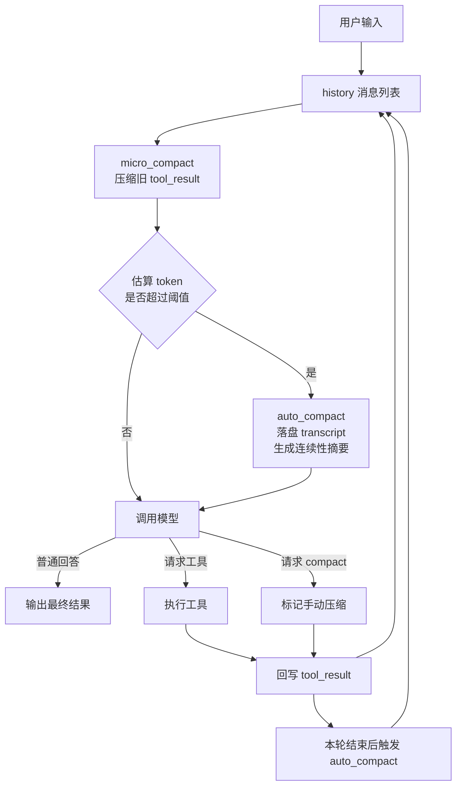
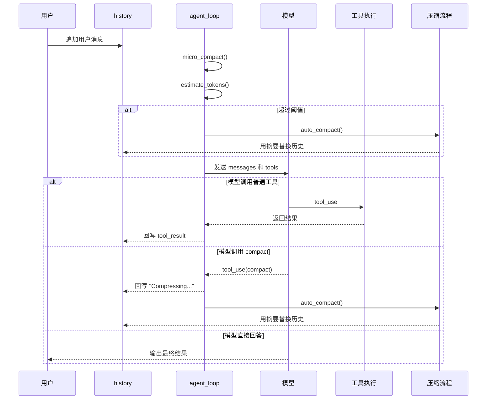

# 上下文压缩设计：为什么 Agent 想长期工作，必须学会分层遗忘

很多人刚开始做 Agent 时，会先关注两件事：模型够不够强，工具够不够多。

但任务一旦拉长，很快就会发现，真正先出问题的往往不是“能力不够”，而是“脑子装不下了”。

`agents/s06_context_compact.py` 这一节最有价值的地方，就在于它没有把上下文爆炸理解成一个简单的 token 限制问题，而是把它当成了一个长期运行系统里的记忆管理问题。

换句话说，这一节讨论的不是“怎么删点历史”，而是：

> Agent 想持续工作，就不能只会记，还得会有策略地忘。

链接： [s06_context_compact.py](https://github.com/lichangke/to-learn-learn-claude-code/blob/main/agents/s06_context_compact.py)

## 先说结论

这份实现的核心不是摘要本身，而是把记忆分成三层来管理：

- 第一层，随手清理，把很久以前的长工具输出压成短占位符
- 第二层，超过阈值就做正式压缩，把完整历史先存档，再整理成摘要
- 第三层，让模型自己也能主动请求压缩，而不是只能被动等到爆掉

如果用一句更通俗的话来概括，我会这样理解这节：

**上下文不是硬盘，而是工作台；工作台乱了，先收拾再继续干活，效率反而更高。**

## 为什么长会话里的 Agent 很容易“越做越钝”

短会话里，这个问题不明显，因为上下文里大多只有用户提问和模型回答。

可一旦 Agent 开始读文件、跑命令、写草稿、改内容，真正吃掉上下文的就不再是聊天文本，而是大量工具结果。

比如：

- 读一个大文件，可能就是几千 token
- 连续跑几条命令，日志和报错会持续堆积
- 一轮轮 `tool_result` 回写之后，历史消息会迅速膨胀

这里有个特别容易被忽略的点：

> 对 Agent 来说，上下文窗口不是“知识仓库”，而是“当前工作内存”。

工作内存的特点不是能装多少，而是需要把最有用的东西放在最显眼的位置。已经完成使命的旧日志、旧文件内容，如果还一直原样挂着，就会拖慢后面的判断。

所以 `s06` 真正做的事情，不是单纯节省 token，而是重新定义哪些信息应该继续保留在活跃上下文里。

## `s06` 的核心思路：把记忆分成热区、摘要区和归档区

如果只看代码，很容易觉得它只是“多了一个压缩函数”。但把流程串起来看，会发现它实际是在搭一个三层记忆系统。



这张图里最关键的，不是“三层”这个名字，而是每一层处理的对象不同：

- 第一层处理的是旧工具结果
- 第二层处理的是整段历史
- 第三层处理的是压缩触发时机

也正因为这三层各管一段，整个系统才不会一上来就用最激进的方式把所有历史都摘要掉。

## 第一层：`micro_compact` 不是删历史，而是给旧工具输出减肥

`micro_compact(messages)` 每次调用模型前都会跑一次。它做的事情很克制：不动整体消息结构，只处理老旧的 `tool_result` 内容。

关键片段很值得看：

```python
if len(tool_results) <= KEEP_RECENT:
    return messages

to_clear = tool_results[:-KEEP_RECENT]
for _, _, result in to_clear:
    if isinstance(result.get("content"), str) and len(result["content"]) > 100:
        tool_id = result.get("tool_use_id", "")
        tool_name = tool_name_map.get(tool_id, "unknown")
        result["content"] = f"[Previous: used {tool_name}]"
```

这里我觉得有三个细节特别好。

第一，它压缩的是工具结果，不是整轮对话。

这是非常工程化的判断。因为在长任务里，最容易膨胀的通常不是用户问题和模型总结，而是工具返回的大段文本。所以它先对最肥的部分下手，而不是一上来就全量摘要。

第二，它不是直接删掉，而是换成一个带工具名的占位符。

像 `[Previous: used read_file]` 这样的内容虽然很短，但保留了一个很关键的信息：模型之前做过什么动作。很多时候，后续推理不需要知道当时读出的每一行细节，只需要知道“前面已经查过这个文件”。

第三，它只保留最近 `KEEP_RECENT = 3` 个完整结果。

这个选择背后的直觉很实用：真正会影响下一步决策的，通常是最近几次观察。更早的结果如果还重要，往往也应该已经被模型吸收到自己的中间结论里了。

所以这一层压缩的本质不是“遗忘”，而是把旧原文改写成行动轨迹。

## 一个容易忽略但很关键的细节：它会先把 `tool_use_id` 重新映射回工具名

`tool_result` 自己只带 `tool_use_id`，并没有直接保存工具名。

于是代码会先回头扫描 assistant 的内容块，建立 `tool_use_id -> tool_name` 的映射：

```python
tool_name_map = {}
for msg in messages:
    if msg["role"] == "assistant":
        content = msg.get("content", [])
        if isinstance(content, list):
            for block in content:
                if hasattr(block, "type") and block.type == "tool_use":
                    tool_name_map[block.id] = block.name
```

这个动作看起来像小事，其实很有价值。

如果只是把旧内容替换成 `[Previous output omitted]`，模型能知道“有东西被省略了”，但不知道省略的是什么。现在保留了工具名，历史轨迹的可读性会好很多。

这就是一种很典型的 Agent 工程思路：

> 真正应该保留的，不一定是原文，而是足以支撑下一步决策的结构化线索。

## 第二层：`auto_compact` 的重点不是摘要，而是“先存档，再大胆压缩”

如果第一层只是给旧内容减肥，第二层就是正式做记忆迁移了。

当 `estimate_tokens(messages) > THRESHOLD` 时，主循环会触发：

```python
if estimate_tokens(messages) > THRESHOLD:
    print("[auto_compact triggered]")
    messages[:] = auto_compact(messages)
```

很多人看这一步时，注意力会放在“让模型生成摘要”上。但我觉得真正更值得学的是前半步：**完整历史先落盘**。

源码里先把整个会话写进 `.transcripts/`：

```python
TRANSCRIPT_DIR.mkdir(exist_ok=True)
transcript_path = TRANSCRIPT_DIR / f"transcript_{int(time.time())}.jsonl"
with open(transcript_path, "w") as f:
    for msg in messages:
        f.write(json.dumps(msg, default=str) + "\n")
```

这一步的意义非常大，因为它把系统里的记忆真正拆成了两类：

- 活跃记忆：当前 messages 里保留的摘要版上下文
- 冷存档案：`.transcripts/` 里的完整逐条历史

这就像把办公桌上的旧材料归档到文件柜里。桌面上不再铺满纸，不代表资料消失了，而是它们退出了“当前思考区域”。

我觉得这也是 `s06` 最成熟的一点：

> 它不是为了压缩而硬删，而是先给历史找好去处，再放心地让活跃上下文变轻。

## 为什么摘要提示词里会强调 3 件事

`auto_compact()` 里给模型的要求很明确：

```python
"Summarize this conversation for continuity. Include: "
"1) What was accomplished, 2) Current state, 3) Key decisions made. "
```

这三个点其实就是长会话压缩时最不能丢的三类信息：

1. 已经做完了什么
2. 现在走到哪一步了
3. 过程中做过哪些关键判断

这不是普通意义上的“摘要得简短一点”，而是在定义一个连续性契约。

因为 Agent 后面还要继续干活，所以摘要不是给人复盘看的，而是给下一阶段推理接力用的。只要这三件事保住了，大部分任务都还能顺着做下去。

## `messages[:] = ...` 这行代码，很容易被低估

我特别想单独提一下这行：

```python
messages[:] = auto_compact(messages)
```

它没有直接写成 `messages = auto_compact(messages)`，原因是前者会原地替换列表内容，后者只是让当前局部变量指向一个新列表。

在这个脚本里，`history` 是从 `__main__` 传进 `agent_loop(history)` 的，整个会话共享的是同一个列表对象。所以这里必须原地改写，外面的 `history` 才会同步变成压缩后的状态。

这个细节本身不复杂，但很能体现这份代码的完整性：它不仅考虑“怎么压”，还考虑“压完以后，主循环里的上下文引用能不能保持一致”。

## 第三层：让模型也能主动喊一声“该收拾桌面了”

如果只有自动压缩，系统会比较被动，必须等到估算 token 超过阈值才会整理。

`s06` 又补了一层 `compact` 工具，让模型自己也能发起压缩请求。

工具声明和分发表都很简单：

```python
{
    "name": "compact",
    "description": "Trigger manual conversation compression.",
    "input_schema": {
        "type": "object",
        "properties": {
            "focus": {
                "type": "string",
                "description": "What to preserve in the summary",
            }
        },
    },
}
```

```python
"compact": lambda **kw: "Manual compression requested.",
```

真正有意思的是主循环里的处理方式：

```python
if block.name == "compact":
    manual_compact = True
    output = "Compressing..."
...
messages.append({"role": "user", "content": results})
if manual_compact:
    messages[:] = auto_compact(messages)
```

也就是说，`compact` 本身不是摘要器，它更像一个信号。

模型一旦判断“当前上下文虽然还没爆，但已经够乱了”，就可以先发起 `compact`，然后由主循环在本轮工具结果回写后统一执行正式压缩。

这一步的价值在于，系统开始允许模型参与管理自己的工作记忆，而不是只做一个被动消费上下文的角色。

## 把整个执行链路放到时序图里，会更容易看懂



从这个链路看，三层压缩其实分别卡在三个不同位置：

- 第一层卡在“调模型之前”
- 第二层卡在“上下文超阈值时”
- 第三层卡在“模型主动请求时”

这就是为什么我会觉得它不是单一功能点，而是一套记忆调度机制。

## 这一节和上一节连起来看，会更有感觉

上一节处理的是知识怎么按需进入上下文，这一节处理的是旧信息怎么有序退出上下文。

如果把这两节合起来看，整个学习主线就非常顺：

- 前面在解决“什么信息该进来”
- 这里在解决“什么信息该留下”

Agent 工程走到这一步，讨论的已经不只是“会不会调工具”，而是在处理一个更底层的问题：

> 上下文应该像流水一样流动，而不是像仓库一样只堆不清。

## 我觉得这份实现最值得带走的 5 个判断

### 1. 先压工具结果，而不是先压整段会话

这说明系统知道真正的噪声主要来自哪里。最膨胀的地方先处理，收益最高。

### 2. 保留行动轨迹，比保留所有原文更重要

`[Previous: used read_file]` 这种占位符看似简单，但足够支撑后续判断“前面已经做过哪些事”。

### 3. 压缩前先落盘，系统才敢激进

如果没有 `.transcripts/` 这层完整存档，整段摘要替换会让人很不踏实。有了归档，压缩就不再像“丢东西”，更像“转存”。

### 4. 自动压缩和手动压缩要同时存在

只靠阈值会太迟，只靠模型主动判断又不稳。两条路径同时存在，系统才更像一个可靠的长会话 Agent。

### 5. 摘要不是为了好看，而是为了继续工作

把“已完成事项、当前状态、关键决策”保住，本质上是在保留任务连续性，而不是在写会议纪要。

## 最后总结

`agents/s06_context_compact.py` 表面上是在讲上下文压缩，实际上是在讲一件更大的事：**长期运行的 Agent，必须把记忆管理做成机制，而不是临时补丁。**

第一层把旧工具输出压成行动轨迹，第二层把完整历史转存并抽成摘要，第三层又把压缩时机的一部分控制权交还给模型。这样做的结果不是“让 Agent 少记一点”，而是“让 Agent 把真正该记的东西记得更久”。

如果要我用一句话概括这一节，我会写成：

**真正能长期工作的 Agent，不是从不遗忘，而是知道什么时候该保留原文，什么时候该只保留结构，什么时候该把历史归档。**

## 致谢

学习主线受益于：

- [shareAI-lab/learn-claude-code](https://github.com/shareAI-lab/learn-claude-code)
