# 从 Agent Loop 到 Agent Harness：一篇讲透智能体工程的架构、流程与设计取舍

刚接触 Agent 工程时，最容易把注意力放在“模型会不会调工具”上。可把 `agents/` 这一组脚本从 `s01` 读到 `s11`，再回头看 `s00_full.py`，就会发现难点从来不是某一个工具，而是怎么把循环、状态、记忆、任务、并发、协作和自治拼成一台能持续工作的运行时。

`s00_full.py` 的意义，恰恰不在于它“功能最多”，而在于它第一次把前面 11 个主题放进了同一个进程里。到了这里，我们看到的已经不是零散技巧，而是一台完整的 Agent Harness 是如何把模型包起来、如何和外部世界交换状态、又如何在长任务里保持连续性的。

如果前面每一篇文章讲的是一个局部器官，那这一篇要做的，就是把整套系统的骨架、血管和神经一次性讲清楚。

> 源码入口：[s00_full.py](https://github.com/lichangke/to-learn-learn-claude-code/blob/main/agents/s00_full.py)
>
> 阅读建议：如果你第一次接触这一组内容，建议先看后面的“系列文章导航”；如果你已经读过 `s01-s11`，那这篇更适合作为整机复盘。

## 这篇文章适合怎么读

| 你的阅读状态 | 建议读法 |
| --- | --- |
| 第一次接触这一组内容 | 先看“系列文章导航”，建立章节顺序，再回到本文看整机结构 |
| 已经读过 `s01-s11` | 直接把本文当成总复盘，重点看“5 个子系统”和“8 个问题” |
| 想自己动手搭一套 Agent Harness | 重点看执行闭环、任务状态、记忆管理、协作自治这四部分 |

这篇文章最适合带着下面 3 个目标去读：

1. 看清 Agent Loop 是怎么一步步长成 Agent Harness 的。
2. 看清 Todo、Task、Skill、Compact、Team 之间到底是什么关系。
3. 看清哪些是模型能力，哪些更多是运行时能力。

## 先说结论

如果只记一句话，我会这样概括这套实现：

> Agent 不是“会调用工具的模型”，而是“被放进一个可持续运行系统里的模型”。

这个系统至少要解决 6 件事：

1. 给模型一个稳定的执行闭环，而不是一问一答后就结束。
2. 给模型一组可控的工具接口，而不是把所有事情都丢给一条 Bash。
3. 给模型能持续维护的外部状态，而不是只靠聊天历史硬记。
4. 给模型处理长任务的记忆机制，而不是等上下文爆掉再崩盘。
5. 给模型扩展执行能力的手段，包括上下文隔离和异步执行。
6. 给多个模型协作时的身份、消息、协议和自治规则。

前面 11 个主题，一直在做同一件事：把“模型本身”逐步放进一个越来越完整、越来越工程化的外部运行时里。`s00_full.py` 则把这条演进线收束成了一个整机视角。

## 把前面 11 个主题连成一条演进线

先不要急着盯代码。更重要的是先看清楚，这 11 个主题到底是怎样一步一步长成 `s00_full.py` 的。

| 阶段 | 核心主题 | 补上的关键能力 | 在 `s00_full.py` 里的落点 |
| --- | --- | --- | --- |
| s01 | Agent Loop | 让模型进入“思考 -> 调工具 -> 读结果 -> 再思考”的闭环 | `agent_loop()` 的基本骨架 |
| s02 | Tool Use | 把工具声明和本地执行分开，能力扩展不必重写循环 | `TOOLS`、`TOOL_HANDLERS`、`safe_path()` |
| s03 | TodoWrite | 给复杂任务一份会话内的短计划和进度提醒 | `TodoManager`、todo reminder |
| s04 | Subagent | 用上下文隔离换清晰思路，让主循环别被局部探索拖乱 | `run_subagent()` |
| s05 | Skill Loading | 知识目录常驻，技能正文按需进入上下文 | `SkillLoader`、`SYSTEM` |
| s06 | Context Compact | 把记忆拆成热区、摘要区、归档区，支持长跑 | `microcompact()`、`auto_compact()`、`.transcripts/` |
| s07 | Task System | 让任务状态、依赖关系和所有权脱离聊天历史 | `TaskManager`、`.tasks/` |
| s08 | Background Tasks | 把慢命令改成异步执行，避免主循环原地堵住 | `BackgroundManager` |
| s09 | Agent Teams | 给队友稳定身份、邮箱和独立上下文 | `MessageBus`、`TeammateManager` |
| s10 | Team Protocols | 在消息层之上再补一层结构化协作协议 | `shutdown_requests`、`plan_requests` |
| s11 | Autonomous Agents | 让队友空闲时能继续找活，而不是只是等待 | idle 阶段、`claim_task()`、自动认领 |
| s00 | Full Harness | 把前面所有能力拼成一个能持续工作的整机 | 全文件的整合运行时 |

如果用一张路线图来看，会更直观：


看到这里，`s00_full.py` 的定位就会很清楚：它不是把之前的内容重复一遍，而是把前面零散的“能力点”压缩成一张“系统图”。

## 系列文章导航

如果你想按主题逐篇回看，可以直接顺着下面这张表读下去：

| 章节 | 主题 | 核心关键词 | 跳转 |
| --- | --- | --- | --- |
| s01 | 智能体循环入门 | Agent Loop、闭环、工具结果回写 | [点击阅读](https://blog.csdn.net/leacock1991/article/details/159771916) |
| s02 | 工具调用拆解 | Tool Use、分发表、能力扩展 | [点击阅读](https://blog.csdn.net/leacock1991/article/details/159772161) |
| s03 | 待办清单驱动执行 | TodoWrite、计划更新、进度维护 | [点击阅读](https://blog.csdn.net/leacock1991/article/details/159806202) |
| s04 | 子代理拆分任务 | Subagent、上下文隔离、摘要回传 | [点击阅读](https://blog.csdn.net/leacock1991/article/details/159806222) |
| s05 | 技能按需加载 | Skill Loading、技能目录、按需注入 | [点击阅读](https://blog.csdn.net/leacock1991/article/details/159828816) |
| s06 | 上下文压缩设计 | Context Compact、归档、摘要重建 | [点击阅读](https://blog.csdn.net/leacock1991/article/details/159829103) |
| s07 | 任务系统设计 | Task System、持久任务、依赖关系 | [点击阅读](https://blog.csdn.net/leacock1991/article/details/159834397) |
| s08 | 后台任务设计 | Background Tasks、异步执行、通知回流 | [点击阅读](https://blog.csdn.net/leacock1991/article/details/159834627) |
| s09 | 智能体团队协作设计 | Agent Teams、持久队友、文件邮箱 | [点击阅读](https://blog.csdn.net/leacock1991/article/details/159859664) |
| s10 | 团队协议设计 | Team Protocols、request_id、结构化协作 | [点击阅读](https://blog.csdn.net/leacock1991/article/details/159859823) |
| s11 | 自主代理设计 | Autonomous Agents、idle、自动认领 | [点击阅读](https://blog.csdn.net/leacock1991/article/details/159860986) |

## 整机视角：`s00_full.py` 到底整合了什么

把注释和代码放在一起看，这份实现有一个很清楚的分层思路：模型只负责判断下一步做什么，负责保证系统连续性的，是外面的这套壳。

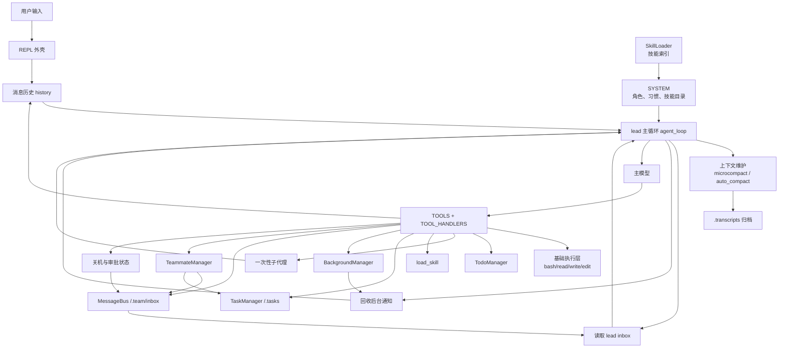

这张图里最关键的一点，是 `agent_loop()` 并不直接拥有所有能力。它主要做三件事：

1. 在每轮调用模型前，先把外部状态重新灌回上下文。
2. 在模型发出工具请求后，充当分发器，把工具名映射到本地实现。
3. 在工具执行后，把结果重新写回消息历史，形成新的推理起点。

也就是说，主循环本身并不花哨，复杂的部分在于主循环周围那一圈“外部部件”。

## 完整主流程：一轮调用到底怎么跑

`s00_full.py` 里最值得反复看的，是 `agent_loop()` 注释里的那五步。因为整份文件大部分能力，最后都会回流到这里。

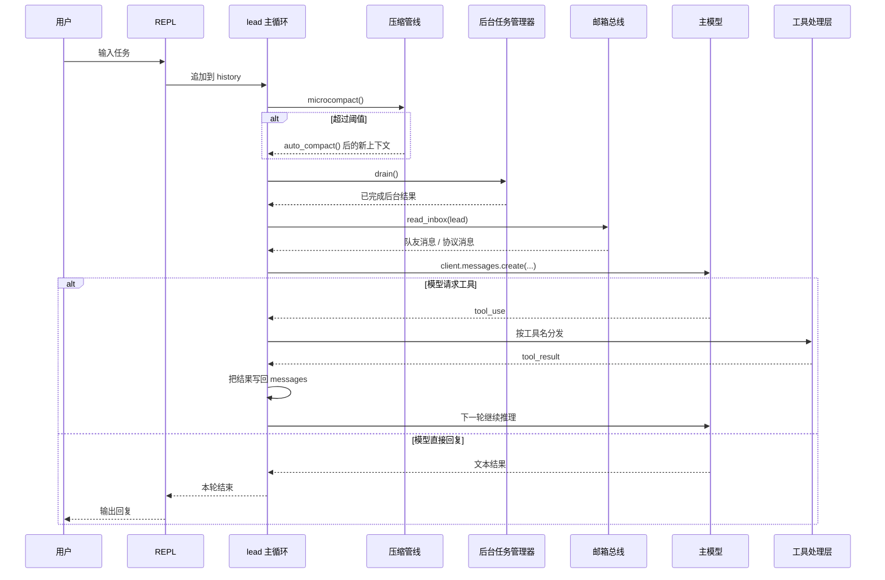

这一轮时序里有个很容易被忽略、但决定整个系统成立与否的点：后台结果、队友消息、任务状态变化，并不会主动闯进模型脑子里，它们都要等到下一轮进入 `agent_loop()` 时，被统一注入消息历史后，模型才“看见”。

这背后有个很朴素但很工程的思想：**模型不是系统时钟，主循环才是系统时钟。**

## 第一部分：执行闭环与工具系统

前面从 `s01` 到 `s02`，建立起来的是最基本的一层：模型如何通过一个固定闭环接触真实世界。

### 1. 为什么闭环比工具数量更重要

如果没有闭环，模型就算知道 100 个工具，也只是一次性调用器。只有当工具结果被重新塞回消息历史，它才会从“会调用工具”变成“能根据结果继续推进任务”。

`s00_full.py` 里，这个核心动作仍然没有变：

```python
response = client.messages.create(
    model=MODEL, system=SYSTEM, messages=messages,
    tools=TOOLS, max_tokens=8000,
)
messages.append({"role": "assistant", "content": response.content})

if response.stop_reason != "tool_use":
    return

results = []
for block in response.content:
    if block.type == "tool_use":
        handler = TOOL_HANDLERS.get(block.name)
        output = handler(**block.input) if handler else f"Unknown tool: {block.name}"
        results.append({"type": "tool_result", "tool_use_id": block.id, "content": str(output)})

messages.append({"role": "user", "content": results})
```

这几行代码看起来很普通，但它定义了整套系统最重要的因果链：

模型决定动作 -> 运行时负责执行 -> 运行结果重新进入上下文 -> 模型再决定下一步。

### 2. 工具系统更重要的不是“更多工具”，而是“工具分层”

`s02` 解决的关键问题，到了 `s00_full.py` 依然成立：让模型看到的是工具 schema，让本地程序拿到的是执行函数，两者中间用一个分发表连接。

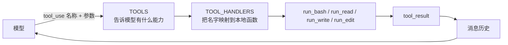

这一层的设计价值非常高，因为它把“能力可见性”和“能力实现”拆开了：

1. `TOOLS` 决定模型能看见什么。
2. `TOOL_HANDLERS` 决定程序到底怎么做。
3. 循环本身完全不用因为工具增减而重写。

这也是为什么后面 `TodoWrite`、`task`、`load_skill`、`background_run`、`spawn_teammate` 等能力，都能沿着同一条通道接回主循环。

### 3. 工具边界为什么要前置到基础执行层

很多人第一次写 Agent，最容易忽略的是安全边界。`s00_full.py` 虽然是教学实现，但还是刻意把边界放在基础工具层，而不是等模型自己“克制”。

```python
def safe_path(p: str) -> Path:
    path = (WORKDIR / p).resolve()
    if not path.is_relative_to(WORKDIR):
        raise ValueError(f"Path escapes workspace: {p}")
    return path
```

这个函数本身不复杂，但它说明了一件很重要的事：**能力不是只靠提示词约束的，能力更要靠接口边界约束。**

`run_bash()` 里对危险命令做了粗粒度拦截，`run_read()`、`run_write()`、`run_edit()` 都先走 `safe_path()`，都在表达同一个设计判断：先把模型放进一个有限的操作面里，再让它自由决策。

### 4. 我对这一层最在意的 4 个判断

1. 主循环应该尽量稳定，变化应该尽量落在工具层。
2. 好的工具不是越万能越好，而是越清楚、越可控越好。
3. 工具结果写回消息历史不是实现细节，而是 Agent 成立的前提。
4. 安全边界应该写在程序里，而不该只写在提示词里。

## 第二部分：计划系统为什么要分成 Todo 和任务板两层

前面很多人读到 `s03` 和 `s07` 时会有一个疑问：为什么已经有 Todo 了，还要再搞一个 `.tasks` 任务板？

理解 `s00_full.py` 后，这个问题就不难了。因为它们解决的根本不是同一类问题。

### 1. Todo 管短期工作记忆，任务板管长期外部状态

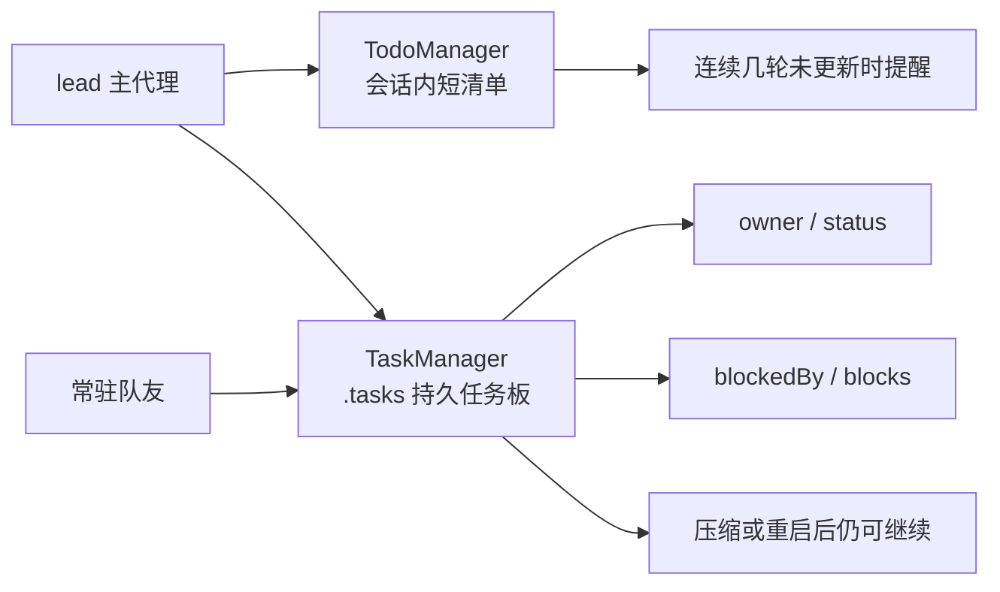

把两者放在一起看，职责就很清楚了：

1. Todo 是“我当前脑子里要盯的几个步骤”，偏轻量、偏会话内、偏提醒。
2. 任务板是“系统外部真实存在的工作单”，偏持久、偏协作、偏恢复。

所以 `s03` 和 `s07` 不是替代关系，而是上下两层关系。

### 2. `TodoManager` 为什么说是“轻计划”，不是“强编排”

`TodoManager.update()` 做了结构校验，只允许 1 个 `in_progress`，同时要求 `activeForm` 必填。这里的思路很有意思，它并没有替模型决定计划内容，而是只约束计划必须可读、可追踪、可检查。

这正是 Agent 系统里很常见的一种设计风格：

1. 不替模型规划。
2. 但要求模型把规划结果写成结构化状态。
3. 如果状态长时间不更新，再轻提醒一下，而不是强行接管。

这比传统流程引擎柔软得多，但又比纯聊天稳定得多。

### 3. `TaskManager` 补上的关键能力，是“会话外连续性”

`TaskManager` 的价值，不是把 Todo 换成 JSON 文件，而是把长期任务的核心字段从对话里拿了出来：

1. `status` 说明任务当前处于什么阶段。
2. `owner` 说明任务现在归谁。
3. `blockedBy` 和 `blocks` 说明依赖关系。

更关键的是，`task_update(..., status="completed")` 时，还会顺手清掉其他任务里对它的阻塞引用。这说明 `.tasks` 已经不只是记账面板，而开始像一个最小可用的任务图了。

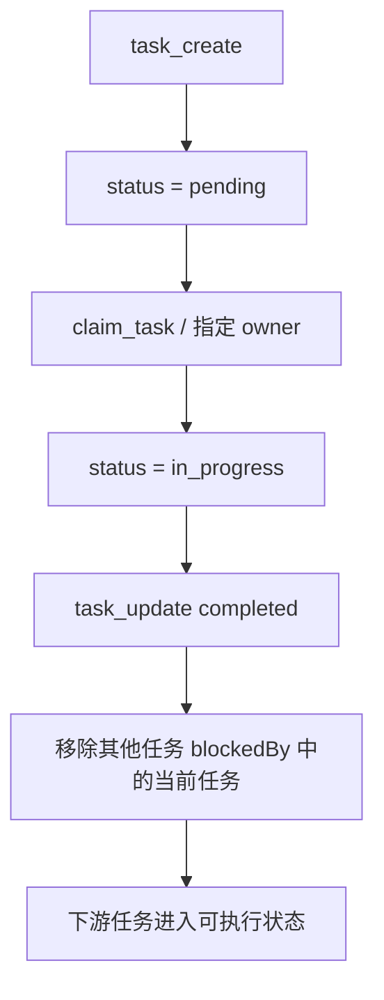

### 4. 为什么 `s11` 的自治一定要建立在 `s07` 上

到了 `s11`，队友在 idle 阶段会自动扫描 `.tasks`，找到没人认领、且没有被依赖阻塞的任务，然后直接 `claim_task()`。这说明任务板又多了一层新身份：它不仅是状态存储，还是系统统一的工作源。

没有 `TaskManager`，自治就只剩“等消息”。

有了 `TaskManager`，自治才变成“自己找下一份工作”。

### 5. 我对计划层的理解

如果让我用一句话概括，我会说：

> Todo 解决的是“别忘了现在在做什么”，任务板解决的是“系统以后还能不能接着做”。

很多 Agent 系统不稳定，不是因为模型不会规划，而是因为所有计划都只存在聊天里，压缩一次、重启一次、切会话一次，整个执行连续性就断了。

## 第三部分：知识与记忆为什么都不能只塞进上下文

前面 `s05` 和 `s06` 分别讲技能加载和上下文压缩，看起来像两个话题，但在 `s00_full.py` 里，它们都在解决同一类问题：**上下文是贵的，也是脆弱的。**

### 1. `SkillLoader` 解决的是“知识别默认全带着”

`SkillLoader` 启动时扫描 `skills/**/SKILL.md`，从 frontmatter 里抽 `name` 和 `description`，然后只把技能目录描述挂进 `SYSTEM`。正文内容，等模型明确调用 `load_skill` 时才包进 `<skill>` 标签注入上下文。

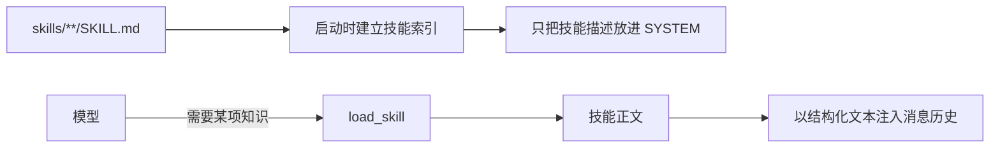

这背后的设计判断很成熟：**让知识默认“可发现”，但不是默认“常驻”。**

这样做有三个直接好处：

1. system prompt 不会越来越肿。
2. 模型能先看目录再决定要不要加载。
3. 技能正文进入上下文后，也能像普通工具结果一样被压缩和清理。

### 2. `microcompact()` 和 `auto_compact()` 解决的是“记忆别默认全保留”

`s06` 的精华，在 `s00_full.py` 里依然非常清楚：上下文压缩不是简单删历史，而是分层处理。

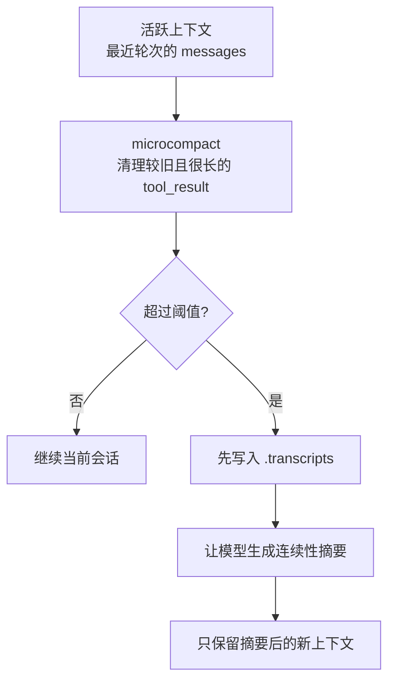

这里最值得注意的不是“摘要”两个字，而是压缩前先写 `.transcripts`。这一步意味着系统不是在赌“以后绝不会再需要原文”，而是在说：“我可以把热上下文缩短，因为完整转录已经落盘了。”

这就把“大胆压缩”和“可追溯”同时保住了。

### 3. 一段关键片段，能看出这一层的设计重点

```python
def auto_compact(messages: list) -> list:
    TRANSCRIPT_DIR.mkdir(exist_ok=True)
    path = TRANSCRIPT_DIR / f"transcript_{int(time.time())}.jsonl"
    with open(path, "w") as f:
        for msg in messages:
            f.write(json.dumps(msg, default=str) + "\n")

    conv_text = json.dumps(messages, default=str)[:80000]
    resp = client.messages.create(
        model=MODEL,
        messages=[{"role": "user", "content": f"Summarize for continuity:\n{conv_text}"}],
        max_tokens=2000,
    )
    summary = resp.content[0].text
    return [
        {"role": "user", "content": f"[Compressed. Transcript: {path}]\n{summary}"},
        {"role": "assistant", "content": "Understood. Continuing with summary context."},
    ]
```

注意这个返回值，它不是“继续保留原历史再附一个摘要”，而是直接重建新的会话起点。这说明压缩在这里不是附属动作，而是真正意义上的上下文重组。

### 4. 为什么这部分和自治又能连起来

`TeammateManager` 的 idle 自动认领逻辑里还有一个很漂亮的细节：如果队友消息历史因为压缩等原因变得很短，会先插入一段 `<identity>`，提醒模型“你是谁、你属于哪个团队、你现在要继续干什么”。

这说明长跑系统里，记忆问题从来不只是“记不记得用户说过什么”，还包括“记不记得自己是谁”。

### 5. 我对知识层和记忆层的一个总体判断

1. 技能解决的是“需要什么知识时再加载什么知识”。
2. 压缩解决的是“已有上下文太长时，怎样保住连续性”。
3. 这两件事本质上都在保护上下文预算。

所以，成熟的 Agent 系统，不会默认“把更多东西塞进上下文”，而会主动管理“什么该常驻、什么该临时注入、什么该压缩、什么该落盘”。

## 第四部分：能力扩展为什么要分成子代理和后台任务两条路

前面 `s04` 和 `s08` 都在讲“别让主循环什么都自己做”，但它们处理的是两种完全不同的压力。

### 1. 子代理解决的是“思维压力”，后台任务解决的是“时间压力”

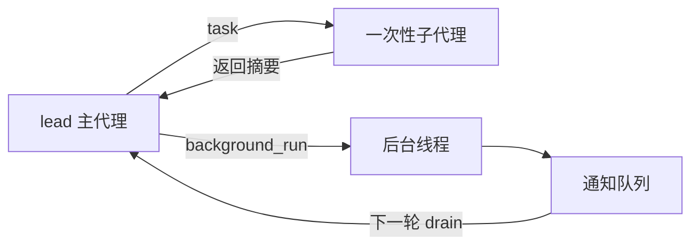

这张图很关键，因为它说明了两件事：

1. 子代理的核心价值是隔离上下文，让主循环别被一段局部探索拖乱。
2. 后台任务的核心价值是隔离等待时间，让主循环别被慢命令卡住。

一个是在隔离“思考负担”，一个是在隔离“执行等待”。

### 2. 子代理为什么只返回摘要

`run_subagent()` 里，子代理有自己的 `sub_msgs`，走的仍然是“模型 -> 工具 -> 工具结果”的小闭环，但结束后只把文字总结交回主代理，而不把整段子上下文搬回来。

这是一个非常典型的架构判断：**主循环需要的，通常不是子过程的全部细节，而是足够继续决策的结果摘要。**

如果整段探索历史都回灌回来，那上下文隔离的收益就会被重新吃掉。

### 3. 后台任务为什么不直接打断模型

`BackgroundManager` 用线程去执行慢命令，完成后把结果写进 `tasks` 状态表，再推一条简短通知进 `notifications` 队列。把结果交给模型，则是等下一轮 `agent_loop()` 调用前统一 `drain()`。

这样做的好处有两个：

1. 不会在模型思考到一半时被异步结果强插。
2. 所有外部事件都沿着统一入口进入主循环，系统更容易推理，也更容易调试。

### 4. 一条完整时序，最容易看清这两种扩展方式的差别

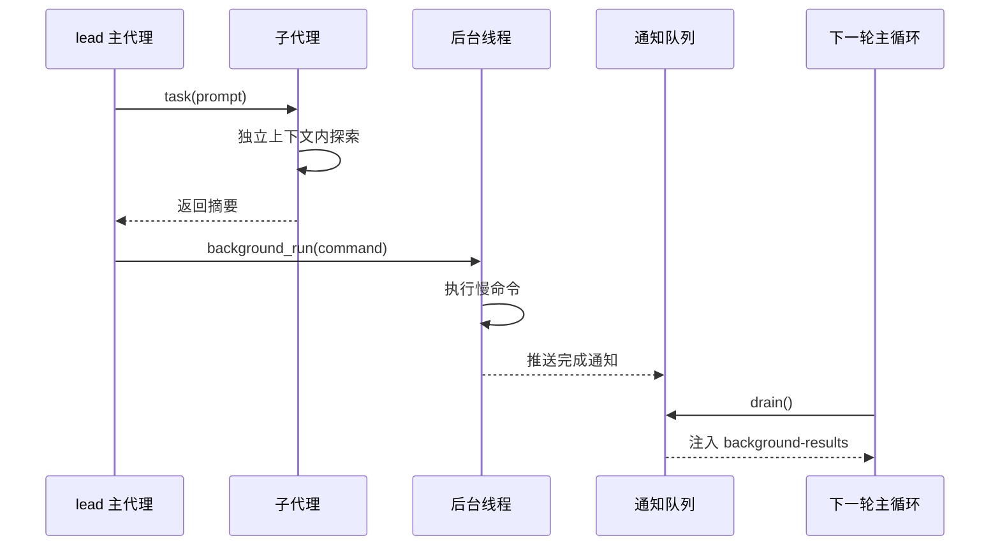

### 5. 我对这一层最深的感受

很多人一开始以为“扩展 Agent 能力”就是多挂几个工具。走到这里就会发现，更高级的扩展不是新增能力点，而是新增能力的**承载方式**：

1. 子代理是“给任务新开一个脑子”。
2. 后台任务是“给任务另开一个等待通道”。

这两条路都没有破坏主循环，反而都在保护主循环。

## 第五部分：多智能体协作为什么最后一定会走向协议和自治

如果只看到 `spawn_teammate()`，很多人会觉得多智能体无非就是“再开几个模型”。但把 `s09`、`s10`、`s11` 连在一起看，就会发现协作最难的部分不在模型数量，而在组织结构。

### 1. 为什么 s04 的子代理还不算团队

子代理是一次性委派，做完就结束。它没有长期身份，没有 inbox，没有会话外状态，也不会在空闲时自己继续找活。

而团队至少要有四样东西：

1. 稳定身份。
2. 可持续的消息通道。
3. 与身份绑定的状态。
4. 明确的协作规则。

这四样东西，正是 `MessageBus`、`TeammateManager`、协议状态和 idle 机制一起补上的。

### 2. 协作层的总体结构

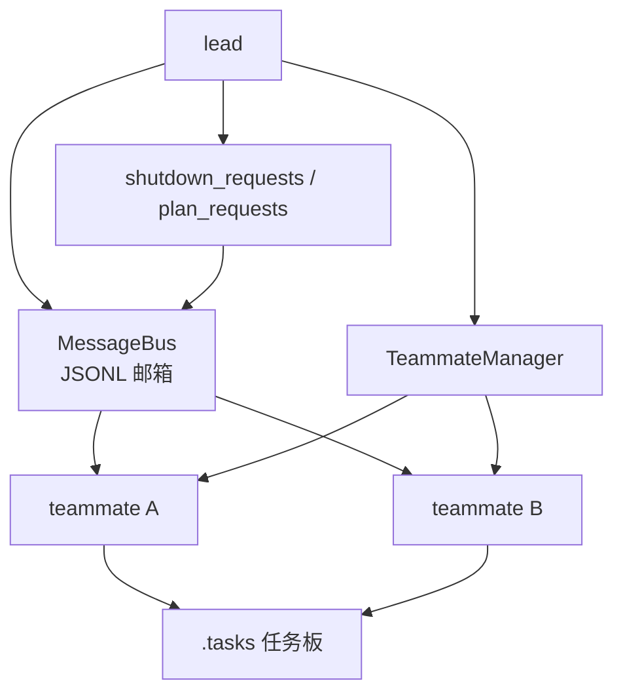

这张图里的核心不是“有两个队友”，而是“消息、状态、任务、协议”开始拆成了几层：

1. `MessageBus` 负责异步通信。
2. `TeammateManager` 负责队友生命周期。
3. `TaskManager` 负责共享工作源。
4. 协议状态负责让某些交互从“说过了”变成“有记录、有 request_id、能追踪”。

### 3. `MessageBus` 为什么值得单独理解

`MessageBus` 设计得非常朴素：每个人一个 JSONL inbox，发送就是追加一行，读取就是读完清空。它没有消息中间件那么复杂，但对讲清楚协作本质特别够用。

因为协作的第一步，从来不是高性能，而是先把语义切清楚：

1. 谁给谁发。
2. 发了什么类型的消息。
3. 对方什么时候读取。
4. 读完以后这条消息算不算已经消费。

这也是为什么 `s09` 看起来只是“文件邮箱”，但它实际上是在给多智能体系统建立最小可用的异步消息语义。

### 4. 协议层为什么是消息层之上的第二层骨架

`s10` 的关键价值，不是多了 `shutdown_request` 和 `plan_approval` 这几个工具，而是提醒我们：能发消息，不等于能稳定协作。

比如关机请求，如果只是发一句“你先停一下”，那对方停没停、是不是响应了、这次协作对应哪一轮请求，全部都不清楚。加上 `request_id` 和独立状态表后，这类动作才开始像协议。

所以这一层补上的不是消息内容，而是协作关系的可追踪性。

### 5. 自治为什么是团队的自然下一步

到了 `s11`，队友 `_loop()` 被拆成两个阶段：

1. 工作阶段：处理当前上下文里的任务。
2. 空闲阶段：轮询新消息，或者自动认领 `.tasks` 里的待执行任务。

这说明 lead 的角色已经发生了变化。它不再是唯一派工者，而更像一个调度者、协调者和审批者。

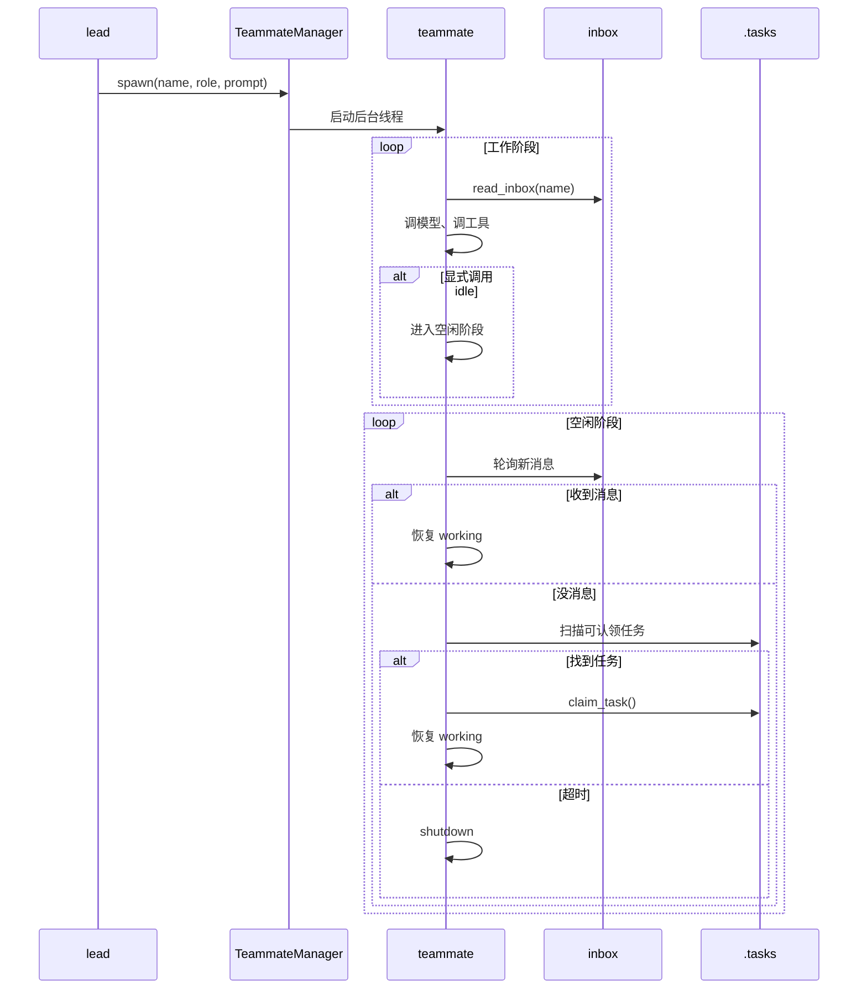

### 6. 一段关键片段，最能体现自治的含义

```python
if unclaimed:
    task = unclaimed[0]
    self.task_mgr.claim(task["id"], name)
    if len(messages) <= 3:
        messages.insert(0, {"role": "user", "content":
            f"<identity>You are '{name}', role: {role}, team: {team_name}.</identity>"})
        messages.insert(1, {"role": "assistant", "content": f"I am {name}. Continuing."})
    messages.append({"role": "user", "content":
        f"<auto-claimed>Task #{task['id']}: {task['subject']}\n{task.get('description', '')}</auto-claimed>"})
```

这段代码很值得细看，因为它把自治讲得非常具体：

1. 队友不是随机找点事做，而是从统一任务板里认领工作。
2. 认领后会把所有权写回外部状态。
3. 继续工作前，还会先把身份重新灌回上下文。

所以自治不是“让 Agent 自己折腾”，而是“让 Agent 在明确状态边界内自己继续推进”。

### 7. 我对协作层最核心的 5 个判断

1. 多智能体系统先要解决组织问题，再解决智能问题。
2. 团队不是多开几个模型，而是让模型拥有稳定身份和共享规则。
3. 消息只是运输层，协议才是协作层。
4. 自治不是无限自由，而是空闲时也有明确的下一步行为。
5. 一旦多个 Agent 共用任务源，就必须开始正视 ownership、竞争条件和恢复语义。

## 把整套系统重新压成 5 个子系统，会更容易真正记住

如果前面的内容已经很多了，我建议把 `s00_full.py` 在脑子里重新压成下面这 5 个子系统：

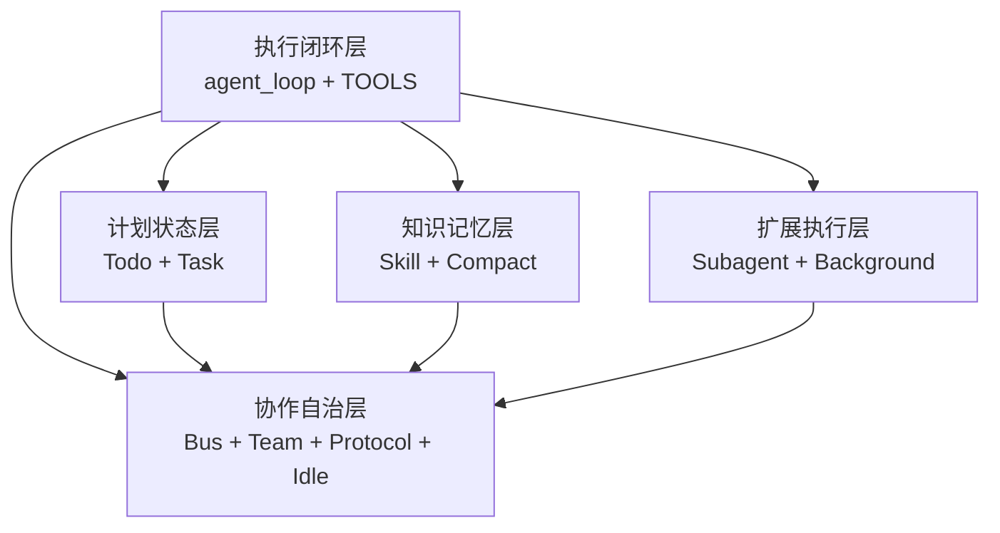

| 子系统 | 代表组件 | 解决的核心问题 |
| --- | --- | --- |
| 执行闭环层 | `agent_loop()`、`TOOLS`、`TOOL_HANDLERS`、基础工具 | 模型如何稳定接触外部世界并持续推进 |
| 计划状态层 | `TodoManager`、`TaskManager` | 当前步骤怎么盯，长期任务怎么记 |
| 知识记忆层 | `SkillLoader`、`microcompact()`、`auto_compact()` | 什么知识常驻，什么记忆该保留、该压缩、该落盘 |
| 扩展执行层 | `run_subagent()`、`BackgroundManager` | 如何把思维压力和等待压力从主循环里拆出去 |
| 协作自治层 | `MessageBus`、`TeammateManager`、协议状态、idle 自动认领 | 多个 Agent 如何长期共事，而不是一次性互相调用 |

这张表最大的价值，是帮我们避免把 `s00_full.py` 看成一堆零散功能。它非常像一个小型操作系统：

1. 主循环像调度中心。
2. 工具层像系统调用接口。
3. 任务板和 inbox 像外部状态存储。
4. 子代理、后台线程、常驻队友像不同形式的执行单元。
5. 压缩和技能加载像内存管理与按需装载。

也正因为这样，`s00_full.py` 的“整机感”才会比前面任何一篇都强。

## 这套实现最值得带走的设计思路

读完整套内容后，我觉得最值得带走的，不是哪几个 API，而是下面这些设计思路。

### 1. 模型负责决策，运行时负责连续性

这是整套实现最底层的分工原则。模型擅长判断下一步，但不擅长自己保证长任务的状态稳定、历史恢复、任务依赖和消息协议，所以这些事情必须外置。

### 2. 先把状态拿出对话，再谈长期工作

只要任务、协议、所有权、消息这些信息还只存在聊天里，系统就很难长期稳定。能让 Agent 长跑的，不是更长上下文，而是更清楚的对话外状态。

### 3. 简单文件结构比过早引入复杂基础设施更有教学价值

`.tasks/`、`.team/inbox/`、`.transcripts/` 都是非常直白的文件结构。它们当然不是终极方案，但特别适合把核心语义讲清楚。很多时候，先把语义做对，比先把技术栈做复杂更重要。

### 4. 上下文预算要被主动管理，而不是被动挨打

技能按需加载、微压缩、自动压缩、身份重注入，本质上都在说明一件事：上下文不是“放得下就多塞一点”，而是必须被精心管理的稀缺资源。

### 5. 协作不能只靠“大家约好”

有 request_id、有状态表、有 inbox、有 owner，这些设计都在把“口头约定”改写成“程序看得见的结构化状态”。这恰恰是系统从 demo 走向工程的分水岭。

### 6. 扩展能力时，优先保护主循环

无论是加工具、加子代理、加后台任务，还是加队友，前面所有设计几乎都在围绕一个目标：别把主循环搞坏。因为只要主循环仍然稳定，系统就有持续演化的基础。

## 这套实现还有哪些边界，反而更值得记住

讲清楚优点不难，更能提升判断力的，往往是边界。

1. `claim_task()` 现在不是严格原子操作，多队友同时抢同一任务时仍然可能出现竞争。
2. `shutdown_requests` 和 `plan_requests` 还是进程内状态，不是持久化状态，进程重启后会丢。
3. `BackgroundManager` 目前只是在单进程里开线程，离真正稳定的作业系统还有很远。
4. 队友的完整消息历史没有系统级持久化，长期恢复能力还不算完整。
5. `run_bash()` 的安全限制仍然比较粗，真实生产环境需要更强的沙箱和权限边界。
6. 技能 frontmatter 解析比较轻量，适合教学，不适合直接拿去承载复杂知识治理。

也正因为这些边界是明确暴露出来的，所以这套实现特别适合学习。它没有假装自己已经是完整产品，而是把“核心思想已经成立”和“工程化还可继续加深”这两件事分得很清楚。

## 读完 `s00_full.py`，最该想清楚的 8 个问题

如果你想快速判断自己有没有读懂这一篇，先看下面这张总表就够了：

| 问题 | 一句话答案 |
| --- | --- |
| 为什么 Agent 一定要有“工具结果回写上下文”的闭环？ | 因为没有反馈回写，模型就只是一次性调用工具，而不是持续执行任务。 |
| 为什么工具系统要把 schema 和 handler 分开？ | 因为模型关心“能用什么”，程序关心“怎么执行”，两层拆开后系统才好扩展。 |
| 为什么短期 Todo 和长期任务板不能混成一个东西？ | 因为一个服务当前工作记忆，一个服务长期外部状态，时间尺度完全不同。 |
| 为什么技能应该按需加载，而不是默认全进 system prompt？ | 因为上下文预算有限，知识应该默认可发现，而不是默认常驻。 |
| 为什么长任务的关键不只是摘要，而是“先归档，再重建上下文”？ | 因为只有先保住原始记录，系统才敢大胆压缩而不丢连续性。 |
| 为什么子代理和后台任务看起来都在“分担工作”，但本质上是两类不同扩展？ | 因为前者隔离思维压力，后者隔离等待压力。 |
| 为什么多智能体协作必须同时拥有消息层、状态层和协议层？ | 因为能发消息不等于能稳定协作，协作还要可见、可追踪、可恢复。 |
| 为什么自治的前提不是“更自由”，而是“更清楚的外部状态和身份边界”？ | 因为没有边界的自主只会把系统带向失控。 |

如果你希望把这 8 个问题吃透，下面再逐条展开。

### 1. 为什么 Agent 一定要有“工具结果回写上下文”的闭环？

因为没有这一步，模型和外部世界之间就只有“发命令”这半条链路，没有“读结果”这半条链路。模型可以调用工具，但不会真正根据执行结果修正判断、继续拆步骤、识别失败、决定下一步，所以它本质上还是一次性问答，而不是持续执行。

Agent 的关键不在于会不会调工具，而在于能不能形成“决策 -> 执行 -> 反馈 -> 再决策”的循环。`s01` 和 `s00_full.py` 最重要的贡献，都是把 `tool_result` 重新写回 `messages`。只有这样，模型才能把刚刚发生的外部事实纳入工作记忆，任务才会从“调用一次工具”升级成“沿着结果持续推进”。

### 2. 为什么工具系统要把 schema 和 handler 分开？

因为模型和程序关心的不是同一件事。模型需要知道“有哪些工具可以调用、每个工具接收什么参数”；程序需要知道“这个工具名最终对应哪段本地逻辑”。把这两层混在一起，工具一多，循环就会越来越乱，能力扩展也会越来越难维护。

把 `TOOLS` 和 `TOOL_HANDLERS` 分开之后，系统就有了非常稳定的扩展点。新增工具时，只需要补一份 schema，再补一个 handler，不需要重写主循环。这样做的价值，不只是代码整洁，而是让 Agent 的能力扩展变成插件式增长，而不是每次加能力都去动发动机。

### 3. 为什么短期 Todo 和长期任务板不能混成一个东西？

因为它们服务的时间尺度不同。Todo 面板解决的是“当前这几步别丢”，它更像主代理当下的工作记忆，强调的是轻量、即时、可提醒。任务板解决的是“压缩之后、重启之后、换代理之后，系统还能不能接着干”，它强调的是持久、协作、可恢复。

如果把两者混在一起，轻量计划会越来越重，长期任务又会越来越依赖会话上下文，最后两头都做不好。`s03` 和 `s07` 放在一起看的核心意义，就是把短期执行感和长期连续性拆开建模。前者帮模型盯住眼前，后者帮系统跨过轮次、上下文和进程边界。

### 4. 为什么技能应该按需加载，而不是默认全进 system prompt？

因为上下文是贵的，system prompt 更贵。把所有技能正文都长期放进 system prompt，看起来像是“知识更全了”，实际上会带来三个问题：一是上下文被静态知识吃掉，二是大量当前用不上的内容会稀释模型注意力，三是技能越多，系统越难持续扩展。

按需加载的思路更像现实工作：先给模型一个技能目录，让它知道“有什么可用”，需要某项知识时，再通过 `load_skill` 把正文临时注入。这样既保留了发现能力，又控制了上下文成本。换句话说，好的知识系统不是“默认全背在身上”，而是“知道什么时候该翻哪本手册”。

### 5. 为什么长任务的关键不只是摘要，而是“先归档，再重建上下文”？

因为只做摘要，很容易把系统变成一场不可逆的信息赌博。摘要总会丢细节，如果压缩前没有完整归档，那一旦后续需要回看原始上下文，系统就没有退路了。这样模型就会越来越不敢大胆压缩，最后仍然会被长上下文拖垮。

先归档、再摘要、再重建上下文，这三步合在一起，才构成完整的长跑记忆方案。归档解决的是可追溯性，摘要解决的是连续性，重建上下文解决的是继续运行的成本控制。所以长任务需要的不是“写一段总结”，而是一套分层记忆机制，让系统既敢压缩，又不失去历史。

### 6. 为什么子代理和后台任务看起来都在“分担工作”，但本质上是两类不同扩展？

因为它们分担的是两种完全不同的压力。子代理分担的是思维压力，适合把局部探索、代码阅读、方案比较这类容易污染主上下文的工作隔离出去，最后只带回摘要。后台任务分担的是等待压力，适合把慢命令、长耗时外部操作从当前回合里拆出去，让主循环别被堵住。

所以子代理是在解决“主代理脑子别太乱”，后台任务是在解决“主代理别原地干等”。一个是上下文隔离，一个是时间隔离。两者共同点只是都在保护主循环，但保护的维度完全不同。把这两件事混成一种能力，就很容易在设计时把问题看浅。

### 7. 为什么多智能体协作必须同时拥有消息层、状态层和协议层？

因为“能通信”不等于“能协作”。只有消息层，大家只是能互相发话；没有状态层，就不知道谁在做什么、任务归谁、系统现在处于哪个阶段；没有协议层，一些关键动作就只能靠口头约定，无法追踪、无法核对、也无法恢复。

消息层负责把信息送到，状态层负责把协作关系落到对话外部，协议层负责把关键交互变成结构化流程。`s09`、`s10`、`s11` 连起来看，展示的就是这三层是怎么逐步叠起来的。多智能体工程难的从来不是“多开几个模型”，而是怎么让多个执行体在同一套可见、可追踪、可恢复的结构里稳定共事。

### 8. 为什么自治的前提不是“更自由”，而是“更清楚的外部状态和身份边界”？

因为没有边界的自由，不叫自治，叫失控。一个队友如果不知道自己是谁、不知道当前角色、不知道任务从哪里来、不知道什么情况下应该继续、什么情况下应该停，那它越自由，系统越不稳定。

`s11` 的关键不在于让队友“自己找事做”，而在于它找事的范围、认领方式、状态切换和身份重注入都是明确的。也就是说，自治不是放弃约束，而是把约束从人工盯防，变成清晰的外部规则。只有身份、任务源、所有权和生命周期都清楚了，Agent 的自主行为才会从“随机动作”变成“可预期推进”。

如果这 8 个问题你都能回答清楚，那前面 11 个主题就不再是零散知识点，而会连成一套完整的方法论。

## 最后总结

回头看整条学习路线，会发现前面的每一篇文章其实都只做了一件事：在“模型会思考”之外，再给它补上一层运行时能力。到了 `s00_full.py`，这些能力终于第一次完整合流。

所以理解这份实现，最重要的不是记住有哪些工具，而是记住它背后的整机逻辑：

1. 主循环负责驱动。
2. 工具层负责接触外部世界。
3. Todo 和任务板负责把计划变成状态。
4. 技能加载和上下文压缩负责管理知识与记忆。
5. 子代理和后台任务负责扩展执行方式。
6. 队友、邮箱、协议和自治负责把单体 Agent 扩成组织化系统。

如果把这些层之间的关系想明白，你看到的就不再是“一个会调工具的聊天机器人”，而是一台开始具备持续执行、状态恢复、分工协作和长期演化能力的 Agent Harness。

## 致谢

这一组学习内容的主线整理和启发，受益于 [shareAI-lab/learn-claude-code](https://github.com/shareAI-lab/learn-claude-code)。
