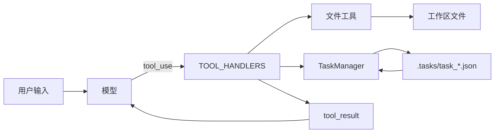
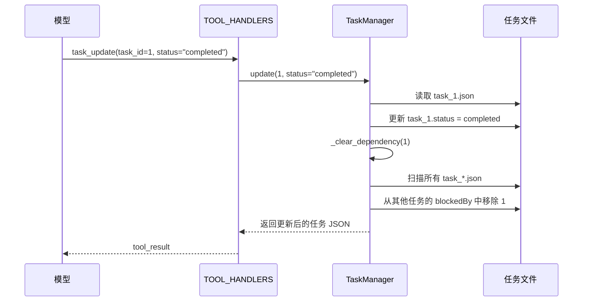

# 任务系统设计：为什么 Agent 不能只靠聊天记录推进长期工作

刚开始做 Agent 时，很多人都会有一个很自然的想法：

既然模型已经能对话、能调工具、还能写 Todo，那是不是让它一边聊一边记，就足够支撑复杂任务了？

短任务里，这样往往没什么问题。可一旦任务开始跨很多轮、很多步骤，麻烦就会冒出来：

- 用户说的是一个长期目标，不是一句问答
- 中间会穿插读文件、跑命令、改代码、补文档
- 会话可能被压缩，甚至直接重启
- 有些事必须先做完，后面的事才能继续

这时候如果任务状态还只存在聊天记录里，系统就会越来越不稳。

`agents/s07_task_system.py` 这一节真正解决的，不是“怎么多加几个任务工具”，而是：

> **怎么把 Agent 的长期目标，从会话里的临时记忆，升级成对话外部的持久化状态。**

这一步很关键，因为它意味着任务不再依赖“模型这次还记不记得”，而是依赖一份真实存在于磁盘上的任务图。

链接： [s07_task_system.py](https://github.com/lichangke/to-learn-learn-claude-code/blob/main/agents/s07_task_system.py)

## 先说结论

我会把这一节理解成一句话：

**聊天记录适合交流，任务系统适合接力。**

为什么这么说？

因为聊天记录的本质是“过程”，它会变长、会被压缩、会被摘要；而任务系统的本质是“状态”，它应该稳定、可查询、可更新、可恢复。

`s07` 的实现正是在做这件事：

- 用 `.tasks/` 目录保存任务 JSON 文件
- 用 `blockedBy` 和 `blocks` 显式描述依赖关系
- 用 `pending / in_progress / completed` 表示任务状态
- 把这些能力包装成工具，重新接进原有 agent loop

这样一来，Agent 就不只是“会说接下来该做什么”，而是真的拥有了一套能跨轮次延续的任务面板。

## 为什么只靠聊天历史记任务，迟早会失控

如果任务只是写在会话上下文里，至少有三个问题很难绕过去。

第一，任务状态不稳定。

上下文一长，历史会被压缩；一旦压缩做得激进，前面规划好的细节就可能只剩一句摘要。人类读摘要还可以靠常识脑补，Agent 不行，它需要的是明确、可读取、可更新的结构。

第二，任务关系不明确。

“先做 A，再做 B，C 和 D 可以并行，E 要等 C 和 D 都做完”这种结构，单靠自然语言对话当然也能表达，但每一轮都靠模型重新理解，成本高，也容易漂。

第三，任务无法真正接力。

如果脚本退出再重开，或者上下文换了一轮，Agent 想继续推进工作，就得重新从聊天记录里捞上下文。这个成本很高，而且会越来越不可靠。

所以 `s07` 实际上是在回答一个非常工程化的问题：

> 长期任务应该放在哪里，才能不受会话生命周期影响？

它给出的答案很直接：放到文件系统里。

## 核心变化：把任务从“会话内容”搬成“磁盘状态”

这一节的主角是 `.tasks/` 目录。每个任务都对应一个独立的 JSON 文件，比如：

```text
.tasks/
  task_1.json
  task_2.json
  task_3.json
```

文件里的内容大致长这样：

```json
{
  "id": 2,
  "subject": "实现登录接口",
  "description": "",
  "status": "pending",
  "blockedBy": [1],
  "blocks": [3],
  "owner": ""
}
```

只看这个结构，就能读出很多关键信息：

- 这是什么任务
- 当前做到哪一步了
- 它是不是被别的任务卡住
- 它做完之后会不会影响后续任务

这和之前那种“在对话里维护一个待办清单”的思路已经完全不同了。现在任务不再依附于消息历史，而是有了自己的存储位置和生命周期。

## 从架构上看，`s07` 多的不是几个工具，而是一层持久化状态

如果把整个结构画出来，会更容易看清它和前几节的差别：



这张图里最重要的一点是：任务系统没有绕开原来的 agent loop，而是顺着原来的工具调用通道接了进去。

也就是说，`s07` 不是另起一套框架，而是在原有闭环里增加了一种新的“外部状态来源”：

- 文件工具操作工作区文件
- 任务工具操作 `.tasks/` 里的任务状态

从模型视角看，它们都是工具；但从系统视角看，任务工具在悄悄给 Agent 增加长期记忆能力。

## `TaskManager` 才是这一节真正的骨架

`agents/s07_task_system.py` 里最关键的类是 `TaskManager`。它的职责很集中：**把任务的创建、读取、更新和依赖维护都收口到一个地方。**

类初始化时，先做了两件很重要的事：

```python
class TaskManager:
    def __init__(self, tasks_dir: Path):
        self.dir = tasks_dir
        self.dir.mkdir(exist_ok=True)
        self._next_id = self._max_id() + 1
```

第一件事是确保 `.tasks/` 目录存在。

第二件事是扫描现有任务文件，推算下一个可用 ID。

这个细节看似普通，但意义很大。因为它说明任务系统从一开始就不是“只活一次的内存对象”，而是默认会重启、会续跑、会继续往已有任务集合上追加内容。

## 为什么每个任务要单独存成一个 JSON 文件

很多人看到这里，第一反应可能是：为什么不把所有任务都存在一个 `tasks.json` 里？

当然也可以，但这一节选择“一任务一文件”，我觉得有三个实际好处。

第一，读写简单。

要改哪个任务，就只读写哪个文件，逻辑非常直接。

第二，天然适合局部操作。

以后如果扩展到多 Agent 或后台任务，不同角色可以围绕不同任务文件工作，冲突面会比单大文件更可控。

第三，更接近真实工作目录的感觉。

任务不再像一坨抽象数据，而像工作区里持续存在的一组状态文件。这种“外部化”感觉很强，也更容易让人建立系统直觉。

## `blockedBy` 和 `blocks` 为什么要同时存在

这一节里最有意思的设计，不是任务状态，而是依赖关系的双向表示。

每个任务里都有两个字段：

- `blockedBy`：我被哪些任务卡住
- `blocks`：我会卡住哪些任务

先看 `update()` 里的关键逻辑：

```python
if add_blocked_by:
    task["blockedBy"] = list(set(task["blockedBy"] + add_blocked_by))

if add_blocks:
    task["blocks"] = list(set(task["blocks"] + add_blocks))
    for blocked_id in add_blocks:
        try:
            blocked = self._load(blocked_id)
            if task_id not in blocked["blockedBy"]:
                blocked["blockedBy"].append(task_id)
                self._save(blocked)
        except ValueError:
            pass
```

这里最值得注意的是后半段。

如果任务 A 新增了 `blocks = [B]`，代码会自动把 A 写进 B 的 `blockedBy`。这意味着依赖关系不是只改一边，而是会同步成双向一致。

我觉得这个设计很实用，因为它解决了两个现实问题：

第一，查询方便。

系统既可以从“当前任务会影响谁”的角度看，也可以从“当前任务被谁卡住”的角度看，不用每次现算。

第二，不容易漂。

如果只维护单向边，后续很多判断都要靠推导；一旦更新漏一处，图就会慢慢失真。现在把关系显式写在两端，可读性和可维护性都更好。

## 真正让任务图动起来的，不是创建任务，而是“完成时自动解锁”

任务系统最怕的不是任务太多，而是状态一直卡着不动。

所以 `s07` 里最关键的一步，其实是：**某个任务完成后，要自动解除它对后续任务的阻塞。**

代码在 `update()` 里这样处理：

```python
if status == "completed":
    self._clear_dependency(task_id)
```

而 `_clear_dependency()` 做的事情也非常直接：

```python
def _clear_dependency(self, completed_id: int):
    for f in self.dir.glob("task_*.json"):
        task = json.loads(f.read_text())
        if completed_id in task.get("blockedBy", []):
            task["blockedBy"].remove(completed_id)
            self._save(task)
```

这段逻辑的工程意义非常明确：

一个任务一旦完成，它就不应该继续占着别人的前置条件位置。

所以系统会扫描所有任务，把这个已完成任务从别人的 `blockedBy` 里摘掉。这样下游任务就能自然从“被卡住”变成“可以开始”。

把这段过程画成时序图，会更直观：



这就是任务系统和普通清单系统的分水岭。

普通清单只是在记录“有没有做完”；
而这里已经开始显式维护“一个任务完成之后，会怎么改变其他任务的可执行性”。

## `list_all()` 看起来简单，其实是在给模型提供任务面板

很多人会觉得 `list_all()` 只是个打印函数，但我觉得它的作用比表面上更重要。

它返回的不是完整 JSON，而是更容易扫读的任务摘要：

```python
marker = {"pending": "[ ]", "in_progress": "[>]", "completed": "[x]"}.get(t["status"], "[?]")
blocked = f" (blocked by: {t['blockedBy']})" if t.get("blockedBy") else ""
lines.append(f"{marker} #{t['id']}: {t['subject']}{blocked}")
```

这相当于给模型提供了一个轻量任务看板。

为什么这很重要？

因为模型并不总需要读每个任务的完整 JSON。很多时候，它只需要快速回答几个问题：

- 现在总共有多少任务
- 哪些任务正在进行
- 哪些任务还被阻塞
- 下一步最有可能该做什么

`task_list` 就是在服务这种“先总览，再深入”的工作流。

## 任务工具是怎么接回 agent loop 的

这一节的另一个关键点，是任务系统没有脱离原来的模型工具调用协议。

本地分发表里直接新增了四个工具：

```python
TOOL_HANDLERS = {
    "task_create": lambda **kw: TASKS.create(kw["subject"], kw.get("description", "")),
    "task_update": lambda **kw: TASKS.update(
        kw["task_id"],
        kw.get("status"),
        kw.get("addBlockedBy"),
        kw.get("addBlocks"),
    ),
    "task_list": lambda **kw: TASKS.list_all(),
    "task_get": lambda **kw: TASKS.get(kw["task_id"]),
}
```

这四个工具刚好对应任务系统最核心的四种动作：

- 建任务
- 改任务
- 看列表
- 看详情

然后主循环还是原来的节奏：

1. 把历史发给模型
2. 模型决定要不要调工具
3. Python 执行工具
4. 把结果包装成 `tool_result`
5. 模型基于新状态继续决策

也就是说，`s07` 真正厉害的地方，不是“新增了任务系统”，而是“新增之后没有破坏原来的运行骨架”。

这也是 Agent 工程里一个特别值得学习的思路：

> 新能力最好不是重写主循环，而是顺着原有闭环稳稳接进去。

## 如果把 `s03`、`s06`、`s07` 连起来看，会更容易看懂它的位置

我自己会把这三节理解成一条很顺的演进路线。

`s03` 解决的是：复杂任务不能只靠一轮对话，需要有一个显式的待办结构。

`s06` 解决的是：上下文不是无限的，长期会话必须学会压缩和归档。

`s07` 则更进一步：既然对话历史会被压缩，那长期任务状态就不能继续只活在对话里，而是应该搬到对话外部。

换句话说，`s07` 其实是在给 `s06` 兜底。

因为一旦上下文压缩变成常态，真正重要的长期状态就必须拥有独立存储。任务系统正是第一批被搬出去的核心状态。

## 我觉得这一节最值得带走的 5 个判断

### 1. 任务是状态，不是聊天内容

聊天内容更像沟通过程，而任务更像项目面板。两者都重要，但不应该混在一起依赖同一种生命周期。

### 2. 长期目标必须出对话

只要系统存在上下文压缩、脚本重启、多轮续跑，任务状态就应该持久化到对话外部。

### 3. 依赖关系必须显式建模

“先做什么、后做什么、谁被谁卡住”不能长期靠自然语言脑补，最好变成结构字段。

### 4. 完成任务的价值，不只是改状态

真正有用的是完成之后自动解锁后续任务，让任务图自己往前流动。

### 5. 好的扩展不是重写闭环，而是接入闭环

`s07` 最漂亮的地方就在这里：任务系统虽然是新增能力，但没有推倒重来，而是继续复用原有的工具调用流程。

## 最后总结

`agents/s07_task_system.py` 表面上是在讲任务管理，实际上讨论的是一个更底层的问题：**长期运行的 Agent，到底应该把“持续状态”放在哪里。**

这一节给出的答案很清楚：

- 对话负责交流和推理
- 工具负责行动
- 任务系统负责保存长期目标和依赖关系

当任务被真正持久化之后，Agent 才不再只是“会规划一下”，而是开始具备连续推进复杂工作的基础设施。

如果要我用一句话概括这一节，我会写成：

**真正能长期推进复杂任务的 Agent，不是把计划反复说一遍，而是把任务状态写到对话外部，并让依赖关系自己驱动下一步行动。**

## 致谢

学习主线受益于：

- [shareAI-lab/learn-claude-code](https://github.com/shareAI-lab/learn-claude-code)
