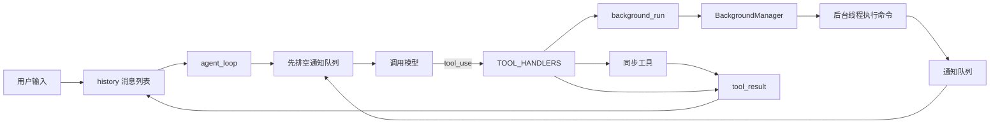
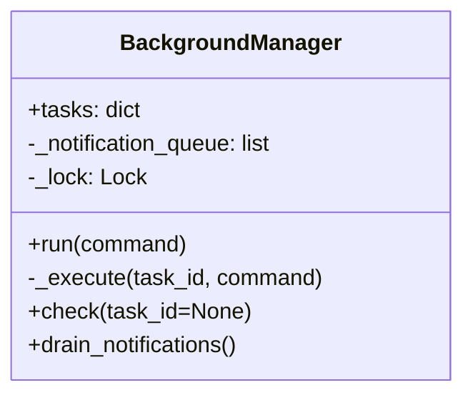
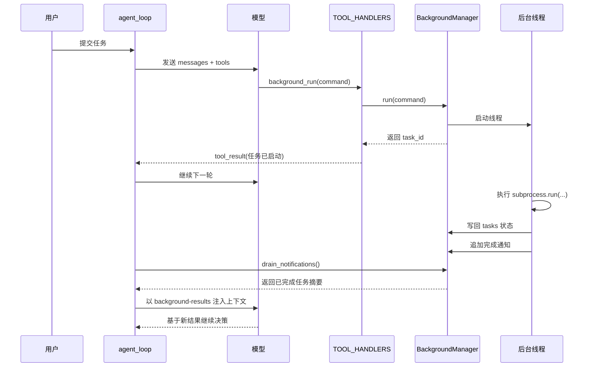

# 后台任务设计：为什么 Agent 遇到慢命令时不该原地干等

刚开始做 Agent 时，很多人都会先把注意力放在“模型能不能调工具”上。

只要工具能调通，看起来事情就已经成了大半。模型读文件、跑命令、改代码、写文档，整个闭环也确实能跑起来。

但这个阶段很容易忽略一个问题：

**工具能调用，不代表系统能高效推进。**

比如用户让 Agent 一边装依赖，一边顺手补配置；或者先跑一轮测试，再去检查另一个目录里的文件；又或者启动一个比较慢的构建任务，同时继续整理别的内容。

如果整个系统还是最传统的阻塞式循环，那么只要 Agent 发出去的是一个慢命令，它接下来的动作就会全部停住。模型没法继续判断下一步，宿主程序也只能原地等结果回来。

`agents/s08_background_tasks.py` 这一节真正解决的，就是这个问题。

它做的并不是把整个 Agent 变成一个复杂的异步系统，而是把一件很具体的事拆了出来：

> **慢命令可以放到后台跑，主循环不要跟着一起卡住；等结果出来后，再在合适的时机把它补回模型上下文。**

我觉得这是 Agent 工程里非常值得单独理解的一步，因为它第一次把“工具执行”和“模型等待”明确拆开了。

链接： [s08_background_tasks.py](https://github.com/lichangke/to-learn-learn-claude-code/blob/main/agents/s08_background_tasks.py)

## 先说结论

如果让我用一句话概括这一节，我会这样说：

**后台任务的关键，不是让模型会并发，而是让模型不必为等待付出整个思考链路。**

这句话里有两个重点。

第一，真正被并行化的不是模型推理，而是外部命令执行。

第二，主循环依然保持简单，后台任务只是给它增加了一条“先发出去，稍后再收结果”的支线。

也就是说，`s08` 的价值不在于“多了线程”这件事本身，而在于它重新安排了等待发生的位置。

在以前的阻塞式模型里，等待发生在主循环内部；在这里，等待被挪到了后台线程里，而主循环还能继续向前走。

## 为什么阻塞式 Agent Loop 一遇到慢命令就会掉速

在最基础的 Agent Loop 里，流程通常是这样的：

1. 把历史消息和工具定义发给模型
2. 模型决定是否调用工具
3. 宿主程序执行工具
4. 把工具结果写回对话历史
5. 再次调用模型

这个闭环本身没有问题，前面几节也是沿着这条线不断加能力。

问题出在第 3 步。

如果工具只是读一个小文件、执行一个很快的命令，这种同步等待几乎感觉不到成本。但只要第 3 步换成下面这些东西，问题就会立刻暴露出来：

- `pytest`
- `npm install`
- `docker build`
- 大型仓库的全文搜索
- 比较慢的脚本生成任务

这些命令最大的特点不是“难”，而是“慢”。而阻塞式循环最不擅长处理的，恰好就是“慢但没必要一直盯着它看”的工作。

更直接一点说：

- 主循环被卡住了
- 模型没法继续做别的安排
- 用户会感觉 Agent 明明可以并行推进，却硬生生退化成了串行执行

这就是为什么后台任务看起来像一个小改动，实际却是系统体验上的一个明显分水岭。

## `s08` 真正改变的，不是工具数量，而是等待的位置

如果把这份实现抽象成结构图，大概是这样：



这张图里最关键的地方有两个。

第一，后台任务并没有绕开原来的工具调用闭环。模型还是通过 `tool_use` 发起请求，宿主程序还是通过 `TOOL_HANDLERS` 做分发，结果还是会回到 `messages` 里。

第二，后台命令的“真实结果”不在启动那一刻返回，而是在任务完成之后，先进入通知队列，再由主循环在下一次调用模型之前统一注入。

也就是说，`s08` 并没有推翻前面的架构，它只是给原有闭环加了一条延迟回传的通道。

## `BackgroundManager` 才是这节的骨架

整份实现里，真正撑起后台任务这套机制的，是 `BackgroundManager`。

它做的事情其实很集中，主要就是三类：

- 保存后台任务状态
- 接收后台线程完成后的通知
- 给主循环提供查询和取通知的接口

它内部最重要的三个成员分别是：

- `tasks`：长期状态表，用来记录每个任务当前是 `running`、`completed`、`timeout` 还是 `error`
- `_notification_queue`：一次性通知队列，用来缓存“刚刚完成、等待告知模型”的结果摘要
- `_lock`：保护通知队列的并发访问

如果画成类图，会更直观：



这里我觉得最值得注意的一点，是它把“状态”和“通知”分开存了。

很多人第一次写这类功能时，会倾向于只保留一份任务表。任务跑完了，就把结果直接写到表里，等模型来查。

但这份实现额外保留了一个通知队列，这个设计非常实用。

原因很简单：

- `tasks` 解决的是“现在状态是什么”
- `_notification_queue` 解决的是“有哪些新结果需要主动告诉模型”

前者适合查询，后者适合事件投递。把这两件事混在一起，主循环就会变得别扭。

## 启动一个后台任务时，到底发生了什么

`background_run` 工具真正做的事情，其实不是执行命令，而是“登记任务 + 启动线程 + 立刻返回 task_id”。

源码里最核心的片段是这样的：

```python
def run(self, command: str) -> str:
    task_id = str(uuid.uuid4())[:8]
    self.tasks[task_id] = {"status": "running", "result": None, "command": command}
    thread = threading.Thread(
        target=self._execute, args=(task_id, command), daemon=True
    )
    thread.start()
    return f"Background task {task_id} started: {command[:80]}"
```

这段代码很短，但里面有三个很重要的判断。

第一，先写状态，再启动线程。

这样做的好处是：哪怕后台线程刚启动，模型马上调用 `check_background`，任务也已经能查到了，不会出现“我明明刚发起，系统却说没有这个任务”的空窗。

第二，线程是 `daemon=True`。

这意味着它是一个守护线程，主程序退出时不会为了等这些线程而强行挂住。这个选择很符合示例代码的目标：保持最小可运行，而不是把后台调度系统做得很重。

第三，返回值不是命令结果，而是一张“取件单”。

模型拿到的是一个 task_id，它之后可以继续做两件事：

- 通过 `check_background` 主动查询状态
- 等待宿主程序在后续轮次里把结果通知回来

我觉得这里最值得学的，不是线程 API 怎么写，而是**把“开始执行”和“拿到结果”彻底拆成两次交互**。

## 后台线程真正做的，是把结果从“执行期”搬到“可注入期”

后台线程的入口是 `_execute()`。

这部分逻辑表面上是在跑 `subprocess.run(...)`，但从系统设计角度看，它真正的职责其实是三步：

1. 执行命令并捕获输出
2. 更新任务表里的最终状态
3. 往通知队列里投递一份摘要

代码里对应的是这段：

```python
def _execute(self, task_id: str, command: str):
    try:
        r = subprocess.run(
            command, shell=True, cwd=WORKDIR,
            capture_output=True, text=True, timeout=300
        )
        output = (r.stdout + r.stderr).strip()[:50000]
        status = "completed"
    except subprocess.TimeoutExpired:
        output = "Error: Timeout (300s)"
        status = "timeout"

    self.tasks[task_id]["status"] = status
    self.tasks[task_id]["result"] = output or "(no output)"
    with self._lock:
        self._notification_queue.append({
            "task_id": task_id,
            "status": status,
            "result": (output or "(no output)")[:500],
        })
```

这里有一个细节我很喜欢：完整结果和通知摘要是分开的。

任务表里可以存更完整的结果，通知队列里只保留较短的预览。这样做有两个直接好处：

- 不会让下一轮注入模型的消息过长
- 需要详细信息时，模型还可以再通过 `check_background(task_id)` 获取

这其实体现出一种很典型的 Agent 工程思路：

**不是所有信息都应该第一时间塞进上下文，先给模型一份足够做下一步判断的摘要，往往更划算。**

## 后台结果为什么不直接塞给模型

这也是这节最容易被忽略，但最值得想清楚的问题。

既然后台线程已经拿到了结果，为什么不直接去改 `messages`，或者直接触发下一轮模型调用？

因为那样会把系统复杂度一下拉高很多。

如果后台线程可以直接改对话历史，马上就会遇到这些问题：

- 什么时候改，才不会和主线程冲突
- 改完之后，是不是还要立刻再调一次模型
- 如果同时有两个后台任务完成，顺序怎么处理
- 主循环正在执行时，后台线程能不能中途插入消息

这份实现给出的答案非常克制：

> 后台线程不碰对话历史，只负责把结果塞进通知队列；
> 主循环在下一次调用模型之前，再统一处理这些通知。

对应代码是：

```python
notifs = BG.drain_notifications()
if notifs and messages:
    notif_text = "\n".join(
        f"[bg:{n['task_id']}] {n['status']}: {n['result']}" for n in notifs
    )
    messages.append({
        "role": "user",
        "content": f"<background-results>\n{notif_text}\n</background-results>"
    })
    messages.append({
        "role": "assistant",
        "content": "Noted background results."
    })
```

我觉得这段逻辑背后的工程判断很成熟：

- 后台线程只负责生产通知
- 主循环负责消费通知
- 对话历史始终只由主循环维护

这样系统虽然没有“实时打断模型”的炫技能力，但换来了一个非常大的好处：**主循环依然是单线程、可预测、好维护的。**

## 把“启动后台任务”和“结果回流上下文”放到时序图里看

如果把整个过程画成时序图，会更容易看清这两次交互其实是分开的：



这张图里最关键的地方，就是中间那条断开。

启动后台任务时，模型拿到的不是结果，而是“任务已开始”；真正的结果要等后台线程跑完，再在后面的轮次中回到上下文。

也正因为这两段链路被拆开了，Agent 才能在中间的空档继续做别的事。

## 这一节最值得带走的 5 个判断

### 1. 真正被并行化的是外部命令，不是主循环

主循环没有变成多线程事件系统，这一点非常重要。它仍然维持着原来的 agent loop 节奏，只是多了一步“调用模型前先收通知”。

### 2. 后台任务返回的第一份结果，本质上是任务句柄

`background_run` 给模型的不是执行结果，而是 task_id。这个 task_id 让模型第一次可以显式管理“等待中的工作”。

### 3. `tasks` 和通知队列分别服务两种完全不同的需求

一个偏状态查询，一个偏事件投递。把这两层拆开，后续系统扩展会轻松很多。

### 4. 后台结果不是立刻打断模型，而是在下一次进入模型前统一补回去

这是一种很克制但很稳定的设计。它不追求最炫的实时性，而是优先保证系统结构清晰。

### 5. 这套机制的价值，首先体现在体验上

用户感受到的不是“哇，系统用了线程”，而是“这个 Agent 不会因为一个慢命令就傻站着不动了”。

## 我觉得这份实现还有几个很值得注意的边界

这节代码已经足够把核心思路讲明白，但如果从工程落地角度继续往下看，还有几个边界值得记住。

第一，守护线程适合示例，不一定适合生产。

现在后台线程是 `daemon`，主程序退出后它们会跟着结束。这在示例里很合理，但如果是真正的长期任务系统，通常还会继续考虑重试、持久化、退出恢复这些问题。

第二，后台结果只有在“下一次进入主循环”时才会被注入。

这意味着它不是一个实时推送系统。如果后台任务完成后，主循环迟迟没有再次调用模型，那么通知会先留在队列里。

第三，这里并没有做完整的任务调度系统。

它能后台执行命令、记录状态、回传结果，但还没有优先级、取消任务、依赖编排、资源限流这些更重的能力。

第四，这里的安全策略仍然是示例级的。

比如 `shell=True`、危险命令拦截、输出截断、超时设置，都更像是为了演示闭环，而不是为了覆盖复杂生产环境。

我反而觉得这正是它的优点：它把最重要的设计意图留得很干净，没有被一堆工程细节淹没。

## 如果把它放回整个学习路径里，它补上的是什么

前面的几节里，系统一直在回答“Agent 还缺什么能力”。

- `s01` 解决基础循环
- `s02` 解决多工具接入
- `s03` 解决任务进度可见
- `s06` 解决长会话压缩
- `s07` 解决长期任务状态落盘

到了 `s08`，问题开始变成：

> 当 Agent 已经能持续工作时，怎么别让它被一个慢动作拖住整条执行链？

所以我会把 `s08` 理解成对“时间维度”的一次补强。

以前主循环只知道“做”与“不做”，现在它开始知道“先放着跑，等会儿再回来处理”。这件事看起来只是多了一条后台线程，但它其实是在教 Agent 系统学会一种更接近真实工作的节奏感。

## 最后总结

`s08_background_tasks.py` 这一节最值得学的，不是线程怎么起，也不是队列怎么写，而是它背后的那条设计原则：

**凡是必须等待、但不值得占住主思路的工作，都应该尽量从主循环里拆出去。**

对 Agent 来说，真正稀缺的不是 CPU 时间，而是“当前这轮还能不能继续判断下一步”的连续性。

后台任务机制的价值，正是在于它保住了这份连续性。

慢命令可以慢慢跑，但 Agent 不必陪着一起发呆。

### 致谢

学习主线受益于：

- [shareAI-lab/learn-claude-code](https://github.com/shareAI-lab/learn-claude-code)
