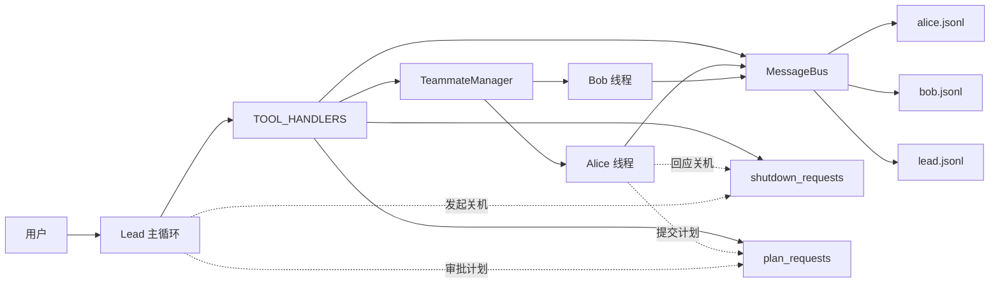
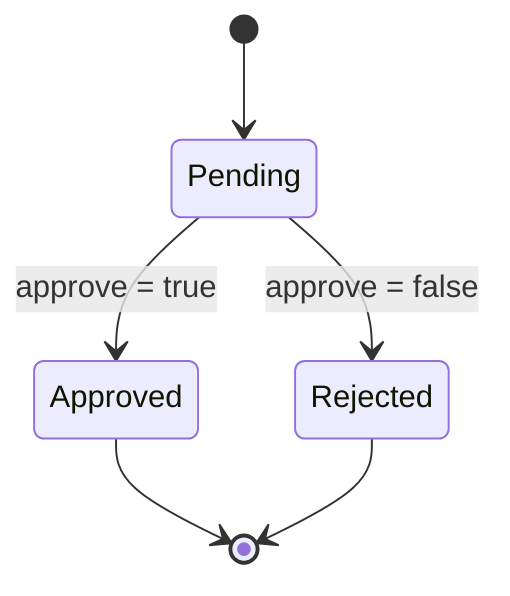
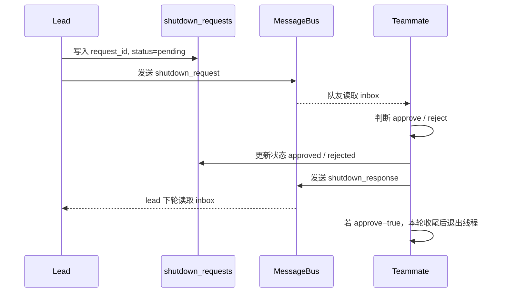
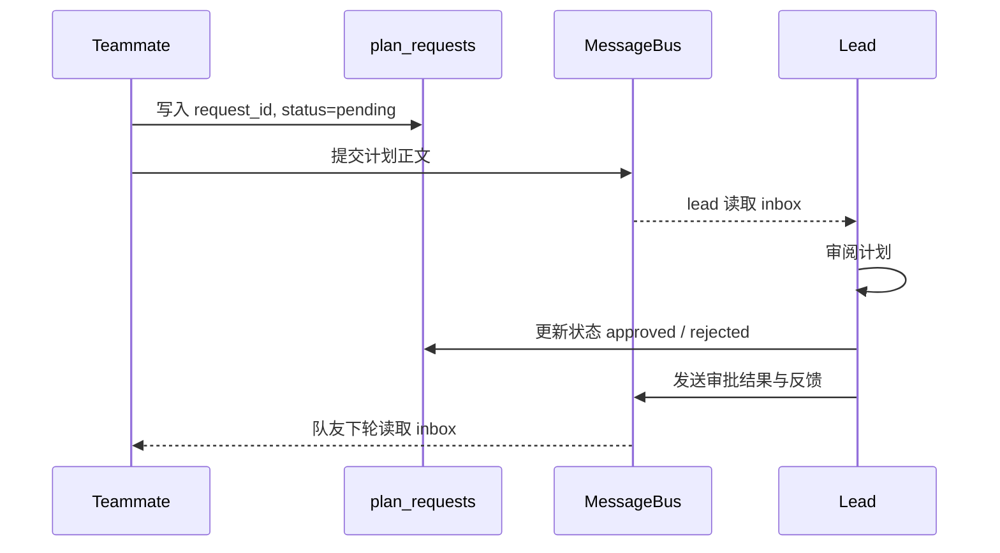

# 团队协议设计：为什么多智能体协作不能只靠发消息

很多人第一次做多智能体协作时，直觉都是：只要能让队友之间互相发消息，团队就算搭起来了。

这个想法不算错，但只对了一半。

`s09` 确实已经把“常驻队友 + 文件邮箱 + 线程执行”这套基础设施搭出来了。队友有名字、有状态、能收信、能回信，也能继续干活。可一旦任务开始变得更严肃一点，光有消息通道其实还不够。

比如：

- lead 想让某个队友优雅下线，不能只靠一句“你先停一下”
- 队友准备做大改动，不能上来就开干，最好先让 lead 过一遍计划
- 一次协商发出去之后，外部最好能看见它到底是在等待中、已经批准，还是已经被拒绝

`agents/s10_team_protocols.py` 补上的，正是这层“协作规矩”。

它让队友之间的沟通，从“能发消息”升级成了“带编号、带状态、带回执的结构化握手”。

链接： [s10_team_protocols.py](https://github.com/lichangke/to-learn-learn-claude-code/blob/main/agents/s10_team_protocols.py)

## 先说结论

如果让我用一句话概括 `s10`，我会这么说：

**团队协作真正难的不是把消息发出去，而是把约定变成可以追踪、可以确认、可以复用的协议。**

这节做得很克制：

- 没有引入复杂调度中心
- 没有上数据库
- 没有做一套很重的工作流引擎

它只是站在 `s09` 的基础上，再往前补了一层：

- 用 `request_id` 给每次协商编号
- 用 `pending / approved / rejected` 给协商建状态
- 用固定 handler 把协议流程收口到统一入口

就这一步，团队协作的味道一下子就出来了。

## 为什么有了邮箱还不够

`s09` 解决的是“谁给谁发消息”。

`s10` 解决的是“这条消息属于哪次协商，以及这次协商现在走到哪一步”。

这两个问题看起来接近，实际上完全不是一回事。

举个最直观的例子。

如果没有协议层，lead 想让 Alice 停下来，最自然的做法可能是给 Alice 发一句：

> 你先停一下，收个尾。

这句话人当然能看懂，但系统很难围绕它稳定地工作。因为它缺 3 个关键属性：

1. 没有唯一编号

同一时间如果发了两次类似请求，系统很难判断 Alice 回的是哪一次。

2. 没有明确状态

外部不知道这件事现在是还没看见、已经看到但没决定、已经同意，还是明确拒绝。

3. 没有统一回执格式

队友回一句“好”或者“稍等”，人能懂，程序却很难稳定处理。

所以我会把 `s10` 理解成这样一句话：

> `s09` 给团队补了通信层，`s10` 给团队补了协议层。

## 这节真正新增的，不是 3 个工具，而是一套公共骨架

从代码表面看，`s10` 比 `s09` 多出来的，主要是这几类能力：

- `shutdown_request`
- `shutdown_response`
- `plan_approval`

但如果只把它看成“又多了几个工具”，很容易错过重点。

这一节最值钱的，其实是下面这套统一骨架：

```python
shutdown_requests = {}
plan_requests = {}
_tracker_lock = threading.Lock()
```

再加上每次发起时都会生成的 `request_id`：

```python
req_id = str(uuid.uuid4())[:8]
```

这两样东西一拼起来，意思就完全不一样了。

现在系统不再只是“发了一条消息”，而是“发起了一次有编号的协商”。

之后所有回应、审批、状态查询，都会围着这个编号转。

我觉得这就是协议层和普通消息层真正的分水岭。

## 整体结构图：消息层没变，协议层加在它上面



这张图最关键的一点是：

`MessageBus` 仍然是底层通信通道，但真正让系统具备“协商能力”的，是上面的两个 tracker。

也就是说，消息负责送达，协议负责认账。

这两个角色分开以后，代码就变得很清楚：

- 谁收消息，看 inbox
- 谁管流程，看 tracker
- 谁执行决策，看各自 handler

## 两套协议虽然业务不同，但骨架完全一样

`s10` 里有两套协议：

- 关机协议：lead 发起，teammate 回应
- 计划审批：teammate 发起，lead 回应

方向不同，但骨架完全相同。



这张状态图看着很简单，但我觉得它正是这一节最有工程味道的地方。

因为它说明了一件事：

**协议不一定要先按业务拆，很多时候可以先按状态机拆。**

只要某类协商都满足下面这个模式：

- 一方发起请求
- 另一方给出批准或拒绝
- 整个过程需要可追踪

那它就可以先套进这套 `pending -> approved / rejected` 的骨架里。

这也是为什么 `shutdown` 和 `plan approval` 明明是两种不同业务，却可以共用一套思路。

## 关机协议：重点不是“停线程”，而是“优雅退出”

很多人第一次看到 `shutdown`，直觉会把重点放在“把队友关掉”。

但这段代码真正想解决的，不是“怎么停”，而是“怎么别停得太粗暴”。

因为如果一个队友正在：

- 改文件
- 写配置
- 跑工具调用
- 维护自己的上下文状态

这时直接粗暴结束线程，很容易留下半拉子现场。

所以 `handle_shutdown_request()` 的做法是：

1. lead 先生成 `request_id`
2. 把这次请求登记到 `shutdown_requests`
3. 通过收件箱给队友发一条 `shutdown_request`
4. 等队友自己调用 `shutdown_response`
5. 如果批准，则在本轮工具调用收尾后退出线程，并把状态改成 `shutdown`

关键代码片段可以看这里：

```python
def handle_shutdown_request(teammate: str) -> str:
    req_id = str(uuid.uuid4())[:8]
    with _tracker_lock:
        shutdown_requests[req_id] = {"target": teammate, "status": "pending"}
    BUS.send(
        "lead", teammate, "Please shut down gracefully.",
        "shutdown_request", {"request_id": req_id},
    )
    return f"Shutdown request {req_id} sent to '{teammate}' (status: pending)"
```

而队友侧真正批准关机时，也不是立刻强退，而是先把结果记录下来：

```python
if block.name == "shutdown_response" and block.input.get("approve"):
    should_exit = True
```

然后等这一轮工具结果都回写完，再在循环尾部把成员状态设成 `shutdown`。

这一点我觉得很值得记住：

**好的协议，不只是给出结论，还要给执行过程留出收尾空间。**

## 计划审批协议：重点不是“领导拍板”，而是“高风险动作先过闸”

`plan approval` 看起来像是给系统加了一层审批，但我更愿意把它理解成“重大动作前的闸门”。

队友不是不能干活，而是在做大动作前，先把计划正文交出来。

这段逻辑放在 teammate 侧的 `_exec()` 里：

```python
if tool_name == "plan_approval":
    plan_text = args.get("plan", "")
    req_id = str(uuid.uuid4())[:8]
    with _tracker_lock:
        plan_requests[req_id] = {"from": sender, "plan": plan_text, "status": "pending"}
    BUS.send(
        sender, "lead", plan_text, "plan_approval_response",
        {"request_id": req_id, "plan": plan_text},
    )
    return f"Plan submitted (request_id={req_id}). Waiting for lead approval."
```

这里有个我觉得很有意思的点。

从命名上看，`plan_approval_response` 稍微有点拧巴，因为它既承载了“提交计划”，也承载了“审批结果”。

但从教学角度看，这个命名反而提醒我们一件事：

**协议消息最重要的不是字面名字漂不漂亮，而是它有没有稳定的结构和固定的处理入口。**

真正关键的是这些协议字段一直都在：

- `request_id`
- `plan`
- `approve`
- `feedback`

只要这些结构是稳定的，系统就能围绕它稳稳地跑起来。

## 把两次握手放进时序图里，会更容易看懂

### 1. 关机协议时序图



### 2. 计划审批时序图



这两张图放一起看，会更容易体会到 `s10` 的设计取向：

它没有去追求“协议自动执行到头”，而是把“请求、追踪、回应”这 3 件关键事情先固定下来。

这很克制，但也很实用。

## 协议层和消息层之间，其实是“分工”关系

我觉得很多人第一次读这节时，最容易混淆的一点就是：

协议消息和普通消息，看起来都只是 JSONL 里的一行记录，那它们到底差在哪？

我的理解是这样的。

普通消息解决的是表达问题，比如：

- 我做完了什么
- 我还缺什么信息
- 你帮我看一下这个结果

协议消息解决的是流程问题，比如：

- 这是一条正式请求
- 这条请求的编号是什么
- 它现在处于什么状态
- 谁有权给出最终回应

所以协议层不是替代消息层，而是压在消息层之上。

这也是一个很实用的工程思路：

> 先把基础通道搭稳，再在通道上叠加规则，而不是每来一种流程就重做一套通信机制。

## 我觉得这一节最值得带走的 5 个判断

### 1. 团队能发消息，不等于团队有协议

消息解决的是送达，协议解决的是确认、回执和追踪。

没有协议，协作更多靠默契；有了协议，协作才开始变成系统能力。

### 2. `request_id` 比很多人想象中更重要

它不只是一个编号，而是一次协商的身份证。

没有它，系统很难在多轮往返里稳定对齐“谁回应了谁”。

### 3. 好的协议通常先长得像状态机，而不是先长得像业务表单

`s10` 最妙的地方，就是先抽出了 `pending -> approved / rejected` 这个公共骨架，再把 `shutdown` 和 `plan approval` 两种业务挂上去。

### 4. 协议层最有价值的地方，是把“口头约定”变成“外部可见状态”

一旦 `shutdown_requests` 和 `plan_requests` 存在，lead 就不只是“记得自己问过什么”，而是系统里真的有地方能查。

### 5. 这份实现仍然把最终决策留给模型，而不是把流程全写死

比如“重大工作前先提计划”这件事，当前主要还是靠 system prompt 和工具设计引导。

这说明它不是重工作流引擎，而是“轻协议 + 模型决策”的路线。

## 这份实现还有几个边界，反而很值得注意

### 1. tracker 还是内存态，不是持久化状态

`config.json` 和 `inbox/*.jsonl` 会落盘，但 `shutdown_requests` / `plan_requests` 还只是进程内字典。

这意味着它已经有了协议雏形，但还没变成完整的跨重启协议系统。

### 2. 没有 timeout、retry、仲裁这类高级机制

如果某个请求发出后一直没人回应，这里不会自动超时，也不会自动重试。

这让它保持了教学上的清晰，也说明协议层还有继续长大的空间。

### 3. 工具名是按角色定义的，不是全局语义完全对称

比如 lead 侧的 `shutdown_response` 工具其实是“查询状态”，teammate 侧的 `shutdown_response` 才是真的“发送回应”。

这看起来有一点绕，但它也提醒我们：

**工具名本质上是“某个角色看到的接口”，不一定是系统全局统一语义。**

### 4. 协议层没有替代消息层，而是压在消息层之上

`s10` 并没有废掉 `MessageBus`，而是继续复用它承载协议消息。

这说明一个很朴素但很实用的工程判断：

基础通道一旦成立，后续很多复杂能力都应该优先考虑“叠加规则”，而不是“重做底座”。

## 如果把 `s09` 和 `s10` 连起来看，会更容易看清这条演进线

我自己会这样理解这两节：

- `s09` 回答的是：多智能体怎样长期存在、彼此找到、互相发消息
- `s10` 回答的是：多智能体怎样围绕一件事达成有状态的协商

也可以把它理解成：

- `s09` 让团队“能对话”
- `s10` 让团队“有规矩”

这一步其实非常关键，因为很多系统做到能分工、能通信就停住了。

但真正稍微复杂一点的协作，最后都会走到协议层：

- 谁能发起什么请求
- 对方怎么回应
- 外部怎么追踪
- 状态怎么流转
- 被拒绝之后怎么处理

`s10` 虽然只做了两个很小的协议，但已经把这条路打开了。

## 最后总结

`agents/s10_team_protocols.py` 最值得学的，不是它又加了 3 个工具，也不是它画出两个流程就算完。

我觉得它真正讲明白的是：

**多智能体系统一旦开始走向协作，迟早要从“自由聊天”走到“结构化握手”。**

而这一步最小可以怎么做？

`s10` 给了一个很漂亮的答案：

- 底层继续用现成的消息通道
- 每次协商分配一个 `request_id`
- 用 tracker 记录状态
- 用固定 handler 收口流程
- 用简单状态机统一不同业务

这套实现很轻，但已经足够让团队协作从“能聊”升级到“能协商”。

## 致谢

学习主线受益于：

- [shareAI-lab/learn-claude-code](https://github.com/shareAI-lab/learn-claude-code)
