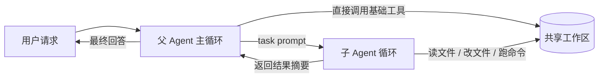
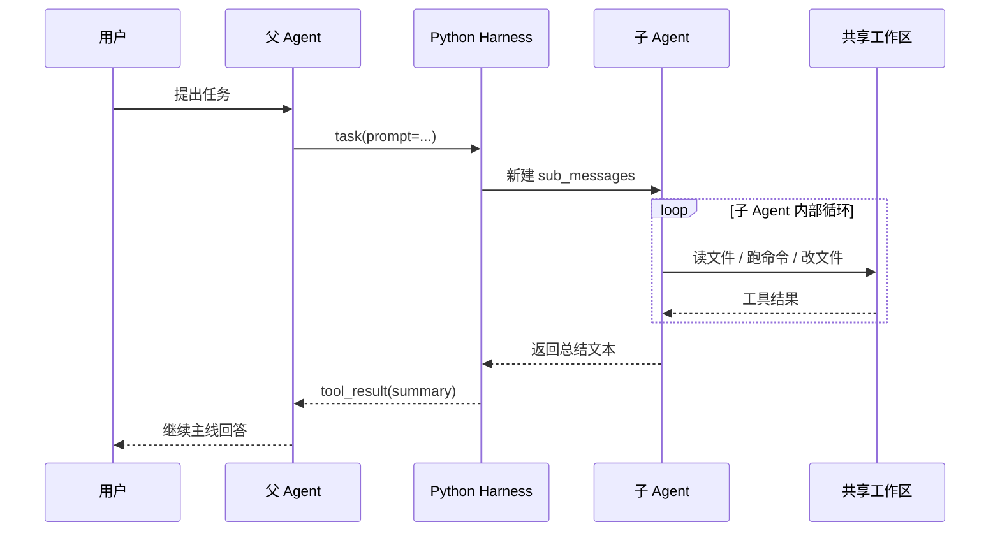

# 子代理拆分任务：为什么要用上下文隔离保护 Agent 的思路清晰

很多人第一次看到子代理，注意力会先落在“一个 Agent 还能再叫出另一个 Agent”这件事上。这个现象当然有意思，但如果只停在这里，很容易错过 `s04` 真正想解决的问题。

真正的问题是: **主 Agent 一旦做长任务，上下文会越来越臃肿，思路也会越来越容易被中间过程带偏。**

读几个文件、跑几次命令、试几轮编辑，这些动作本身没问题。问题在于，它们都会变成对话历史的一部分。时间一长，主 Agent 不但要记住任务目标，还要背着一大堆探索痕迹继续往前走，负担会越来越重。

`agents/s04_subagent.py` 给出的办法很直接:

> 把容易产生大量中间过程的子任务，拆到一个全新的上下文里去做，主 Agent 只接收最后的结果摘要。

这就是这篇文章想讲清楚的重点。

链接： [s04_subagent.py](https://github.com/lichangke/to-learn-learn-claude-code/blob/main/agents/s04_subagent.py)

## 先说结论

`s04` 最值得学的，不是多了一个 `task` 工具，而是下面这句话:

> 上下文隔离，不是为了炫技，而是为了保护模型的思路清晰度。

如果说 `s03` 解决的是“任务一复杂，怎么别丢计划”，那 `s04` 更像是在解决:

> 当某个子任务会制造很多噪音时，怎么别让这些噪音继续污染主线思考？

## 为什么主 Agent 越做越容易乱

只要 Agent 开始持续调用工具，这种问题几乎一定会出现。

第一，探索过程天然很啰嗦。

找测试框架这件事，最后答案可能只是“项目在用 `pytest`”。但模型为了得出这个结论，可能会读 `README.md`、扫目录、打开多个 `py` 文件、再跑一条 shell 命令。真正有价值的结论只有一句，中间痕迹却可能有十几段。

第二，主 Agent 不一定需要知道全部细节。

如果一个子任务只是“帮我摸清情况”，那主 Agent 往往只需要拿到结论，再决定下一步怎么做。把全部中间过程塞回主上下文，很多时候是在增加负担，而不是增加能力。

第三，长上下文会让模型越来越像“边翻聊天记录边工作”。

上下文越长，模型越容易被最近的工具结果吸住注意力。它不是突然不会做了，而是更难始终抓住主线。

所以 `s04` 的核心思路不是“多开一个助手”，而是**把探索过程和主线决策拆开**。

## `task` 真正带来的，不只是一个新工具

表面上看，父 Agent 比前一个版本多了一个 `task` 工具:

```python
PARENT_TOOLS = CHILD_TOOLS + [
    {
        "name": "task",
        "description": "Spawn a subagent with fresh context. It shares the filesystem but not conversation history.",
        "input_schema": {
            "type": "object",
            "properties": {
                "prompt": {"type": "string"},
                "description": {"type": "string"}
            },
            "required": ["prompt"]
        }
    },
]
```

但这一行背后，其实同时发生了三件事:

1. 父 Agent 多了一个“委派子任务”的动作。
2. 子 Agent 拿到的是全新消息上下文，不继承父 Agent 的对话历史。
3. 子 Agent 干完活后，只把摘要带回父 Agent，而不是把整段工作记录原样带回。

也就是说，`task` 的价值不在“能不能调用”，而在它重新定义了信息流。

## 整体结构图

先看整体关系，会比较容易抓住重点:



这张图里最关键的地方有两个。

- 父 Agent 和子 Agent 共享同一个工作区，所以它们看到的是同一批文件。
- 父 Agent 和子 Agent 不共享消息历史，所以子任务内部的探索过程不会回流到主上下文。

这也是 `s04` 最有意思的地方: **共享外部环境，隔离内部思路。**

## 哪些东西共享，哪些东西隔离

很多人会把“子代理”想成一个完全独立的新系统，其实这里更准确的理解是: 它像是给任务临时开了一个干净的工作脑区。

| 项目 | 父 Agent | 子 Agent | 含义 |
| --- | --- | --- | --- |
| 会话历史 | 保留完整主线 | 从一条任务提示开始 | 子任务不会继承主对话包袱 |
| 工作目录 | 共享 | 共享 | 两边都能读写同一批文件 |
| 工具集合 | 基础工具 + `task` | 只有基础工具 | 防止无限套娃 |
| 返回内容 | 继续主线决策 | 输出摘要 | 只把压缩后的结果带回去 |

这一点非常像团队协作中的分工方式:

- 主负责人保留整体目标和当前进度
- 被委派的人拿到一个清晰任务，自行探索
- 最后回来汇报结论，而不是把所有过程录音都交上来

## 子 Agent 是怎么“新开一个脑子”的

`run_subagent()` 这段实现非常关键，因为它把“上下文隔离”这件事写得很直白:

```python
def run_subagent(prompt: str) -> str:
    sub_messages = [{"role": "user", "content": prompt}]
    for _ in range(30):
        response = client.messages.create(
            model=MODEL,
            system=SUBAGENT_SYSTEM,
            messages=sub_messages,
            tools=CHILD_TOOLS,
            max_tokens=8000,
        )
```

这里最重要的不是 `for _ in range(30)` 这个循环，而是这一句:

```python
sub_messages = [{"role": "user", "content": prompt}]
```

它的意思很明确:

- 子 Agent 没有继承父 Agent 的聊天记录
- 子 Agent 只拿到一条任务说明
- 子 Agent 从自己的局部上下文开始思考和调用工具

这就是“上下文隔离”的真实落点。它不是抽象口号，而是**直接把消息历史重置为一条新任务**。

## 它不是并发，更像是同步委派

`s04` 还有一个很容易被忽略的点: 这里的子代理并不是并发运行的，它本质上还是主程序里的一次同步调用。

关键逻辑就在这里:

```python
if block.name == "task":
    output = run_subagent(block.input["prompt"])
```

也就是说，父 Agent 一旦决定委派，就会立刻进入 `run_subagent()`。子 Agent 在自己的循环里把事情做完，返回摘要之后，父 Agent 再继续。

所以这个例子强调的重点不是“并行提速”，而是“隔离思路”。这也是为什么我觉得它特别值得学: 它提醒我们，子代理首先是一种**上下文管理手段**，其次才是协作手段。

## 一次委派到底是怎么流转的

把这段流程画成时序图，会更容易看懂:



从这个时序里可以看出，父 Agent 眼里看到的其实只有两件事:

1. 我发起了一次 `task`
2. 我收到了一段 `tool_result`

至于子 Agent 中间读了几个文件、试了几轮命令、有没有走弯路，这些过程都被封装在子上下文里了。

## 为什么最后只返回摘要

`run_subagent()` 结尾这段代码，几乎就是 `s04` 的灵魂:

```python
return "".join(
    b.text for b in response.content if hasattr(b, "text")
) or "(no summary)"
```

这段实现说明了一件很重要的事:

> 子 Agent 的输出，不是完整历史，而是最后一轮文本结果。

这样设计有三个直接好处。

第一，主上下文更干净。

父 Agent 不需要反复咀嚼子任务里的试探过程，只需要接住结论继续往前走。

第二，信息密度更高。

原本几十段中间记录，最后被压缩成几句有用结论，主 Agent 的注意力更容易留在关键点上。

第三，委派边界更清晰。

父 Agent 决定“做什么”，子 Agent 负责“怎么摸清楚”，返回时再把“摸清楚了什么”交回来。

当然，这也意味着它不是万能方案。如果主 Agent 后面必须依赖子任务的完整推理轨迹，或者要审计子任务的每一步，那只返回摘要就不够了。换句话说，`s04` 适合的是**可以被压缩成结论的子任务**。

## 为什么子 Agent 不继续拥有 `task`

代码里专门把父子工具做了区分:

- 父 Agent 有 `task`
- 子 Agent 没有 `task`

这个限制很克制，但很合理。

如果子 Agent 也继续拥有 `task`，那它就可以再叫出新的子 Agent，系统很快就会变成无限套娃。教学示例里先把层级收住，只保留“一层委派”，更方便把核心问题讲透。

这也能看出 `s04` 的设计态度: 先把信息边界做稳，再谈更复杂的协作拓扑。

## 它和 `s03` 的关系，正好是两个方向

我很喜欢把 `s03` 和 `s04` 放在一起看，因为它们解决的是两种完全不同的失控风险。

- `s03` 处理的是“任务很多时，模型容易忘记做到哪了”
- `s04` 处理的是“探索很多时，主上下文容易越来越脏”

前者是在补“进度管理”，后者是在补“上下文管理”。

换句话说:

- `s03` 让 Agent 更会盯住计划
- `s04` 让 Agent 更会保护主线思考

这两个能力一前一后接起来，整个系统就开始有点像真正能长期工作的智能体了。

## 什么样的任务适合交给子 Agent

从这份实现出发，我觉得下面几类任务尤其适合拆出去:

- 需要读很多文件才能得出一句结论的任务
- 带有明显探索性质、可能会走几轮弯路的任务
- 只需要返回摘要，不需要完整过程回放的任务
- 主 Agent 当前只想保留决策主线，不想被细节淹没的任务

反过来说，如果任务本身非常短，或者主 Agent 后续必须直接依赖中间细节，那就没必要硬拆。

子代理不是默认更高级，而是在“上下文已经开始变脏”的时候，提供了一种很实用的减负方式。

## 最后总结

`s04_subagent.py` 看起来是在讲“怎么让 Agent 调用子 Agent”，但我觉得更本质的主题其实是:

> 当一个系统开始变复杂时，光让它会做事还不够，还要学会把不同层次的思考隔离开。

父 Agent 保留主线，子 Agent 负责探索；两边共享工作区，但不共享整段对话历史；子任务做完之后，只把压缩后的结论带回来。

这套设计不花哨，却非常像真实工程里的经验: **不是所有细节都应该进入主决策面，能局部消化的信息，就尽量局部消化。**

这也是我理解 `s04` 时最有价值的一点:

**子代理的价值，不只是“多一个帮手”，更是“给主 Agent 留出一块干净的思考空间”。**

## 致谢

学习主线参考并受益于：

- [shareAI-lab/learn-claude-code](https://github.com/shareAI-lab/learn-claude-code)