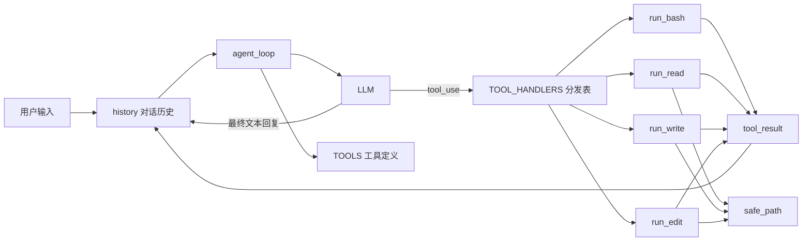
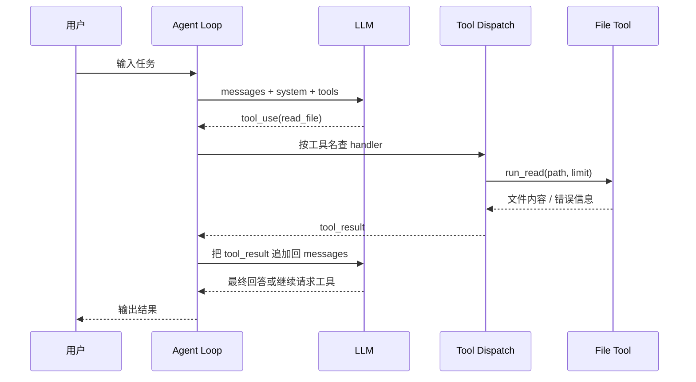

# 工具调用拆解：为什么给 Agent 加能力，不用重写循环

刚看完 [`agents/s02_tool_use.py`](../agents/s02_tool_use.py) 的时候，我有一个很强烈的感觉: 这个例子表面上是在“加工具”，本质上其实是在讲一件更重要的事: **一个 Agent 真正稳定的部分，往往不是它会多少工具，而是它有没有一个不用反复推倒重来的执行闭环。**

如果说 `s01_agent_loop.py` 解决的是“Agent 为什么能动起来”，那 `s02_tool_use.py` 解决的就是另一个非常实际的问题:

> 当模型已经会循环调用工具之后，怎么把新能力一项一项接进去，而且越加越稳？

仓库 [to-learn-learn-claude-code](https://github.com/lichangke/to-learn-learn-claude-code)

## 先说结论

`s02` 最值得学的，不是“Agent 有了 4 个工具”，而是下面这句话:

> 给 Agent 加能力，不一定要改循环本身，很多时候只需要补两样东西: 工具 schema 和工具分发 handler。

也就是说，循环还是那个循环:

1. 把上下文和工具列表发给模型
2. 看模型有没有发起 `tool_use`
3. 如果有，就执行工具
4. 把结果包装成 `tool_result` 喂回模型
5. 直到模型不再请求工具

真正变的是“模型能触达的外部动作”越来越多了。

## 为什么只有 Bash 还不够

在 `s01` 里，模型只有一个 `bash` 工具。这个设计足够让 Agent 跑起来，但如果继续往前做，很快就会遇到几个问题。

第一，什么事都走 shell，代价有点高。

读文件要靠 `cat`、改文件要靠 `sed`、写文件要靠重定向。这些命令当然能用，但它们对特殊字符、换行、转义和平台差异都比较敏感，模型一旦生成得不够严谨，就容易翻车。

第二，什么事都走 shell，边界不够清晰。

如果“读文件”只是一个 bash 命令，那系统层面很难提前表达清楚: 这个动作到底只允许读当前工作区，还是允许读整个机器？如果把“读文件”单独做成工具，很多限制就可以直接写进工具实现里。

第三，什么事都走 shell，返回结果也不够结构化。

模型虽然也能看懂 bash 输出，但和“这是读文件结果”“这是编辑是否成功”相比，shell 输出天然更杂、更噪，也更依赖模型自己猜语义。

所以 `s02` 的方向不是把 bash 去掉，而是把那些高频、可控、适合抽象的动作拆成专用工具:

- `bash`: 继续兜底，处理通用命令执行
- `read_file`: 专门读文件
- `write_file`: 专门写文件
- `edit_file`: 专门做精确文本替换

这一步其实很像软件工程里常说的那句话: **不是不要万能接口，而是要把高频能力从万能接口里提纯出来。**

## 这份代码真正新增了什么

如果只看“行为变化”，你会觉得 `s02` 比 `s01` 多了不少内容；但如果只看“架构变化”，它其实只新增了三层东西。

### 1. 新增了路径安全边界

最容易被忽略，但其实最重要的，是 `safe_path()`:

```python
def safe_path(p: str) -> Path:
    path = (WORKDIR / p).resolve()
    if not path.is_relative_to(WORKDIR):
        raise ValueError(f"Path escapes workspace: {p}")
    return path
```

这个函数做的事很朴素: 把外部传进来的路径解析成绝对路径，然后确认它还在当前工作区里。

它的意义不在于“代码复杂”，而在于它明确划出了一条边界:

- 模型可以读写文件
- 但只能读写工作区里的文件
- 一旦路径逃逸，就直接报错

这是我觉得 `s02` 比 `s01` 更像“真正工程代码”的地方。因为从这里开始，工具不再只是功能入口，也开始承担约束职责了。

### 2. 新增了专用工具实现

`s02` 把常见文件操作拆成了几个独立函数:

```python
def run_read(path: str, limit: int = None) -> str:
    text = safe_path(path).read_text()
    lines = text.splitlines()
    if limit and limit < len(lines):
        lines = lines[:limit] + [f"... ({len(lines) - limit} more lines)"]
    return "\n".join(lines)[:50000]
```

```python
def run_write(path: str, content: str) -> str:
    fp = safe_path(path)
    fp.parent.mkdir(parents=True, exist_ok=True)
    fp.write_text(content)
    return f"Wrote {len(content)} bytes to {path}"
```

```python
def run_edit(path: str, old_text: str, new_text: str) -> str:
    fp = safe_path(path)
    content = fp.read_text()
    if old_text not in content:
        return f"Error: Text not found in {path}"
    fp.write_text(content.replace(old_text, new_text, 1))
    return f"Edited {path}"
```

这几个函数有两个共同特点:

1. 都先经过 `safe_path()`，先管边界，再谈能力
2. 都把结果收敛成简单字符串，方便回传给模型

尤其 `run_edit()` 很值得注意。它没有做 AST 级别编辑，也没有做复杂 patch，只是“找到旧文本，替换一次”。这种设计看起来不高级，但非常适合教学，因为它把工具行为定义得足够简单，模型也更容易学会正确调用。

### 3. 新增了一个工具分发表

这部分是 `s02` 最核心的抽象:

```python
TOOL_HANDLERS = {
    "bash":       lambda **kw: run_bash(kw["command"]),
    "read_file":  lambda **kw: run_read(kw["path"], kw.get("limit")),
    "write_file": lambda **kw: run_write(kw["path"], kw["content"]),
    "edit_file":  lambda **kw: run_edit(kw["path"], kw["old_text"], kw["new_text"]),
}
```

这张表的作用很直接:

- 模型返回工具名
- 程序按工具名查字典
- 找到对应的 Python 函数执行

它看起来像个小细节，但实际上帮我们避开了两个问题。

第一个问题是，避免 `if/elif` 越写越长。

第二个问题是，新增工具的成本变得非常稳定。以后要加一个新工具，通常只要做三件事:

1. 写一个处理函数
2. 把它注册到 `TOOL_HANDLERS`
3. 把对应 schema 注册到 `TOOLS`

只要这三步做好，主循环大概率不用动。

## 整体结构图: s02 到底怎么跑起来

先看一眼整体结构，会更容易抓住重点:



这个图里，我觉得最值得盯住的不是“工具变多了”，而是两条主线:

- 一条是从 `tool_use` 到 `TOOL_HANDLERS` 的“分发线”
- 一条是从 `tool_result` 回到 `history` 的“闭环线”

前者决定系统怎么执行动作，后者决定系统怎么继续思考。

## Agent Loop 其实几乎没变

这是整个 `s02` 最有启发性的地方。

很多人第一次做 Agent，会下意识把“能力变多”理解成“主循环要变复杂”。但这份代码恰恰说明了，**好的主循环，应该尽量稳定；能力扩展应该往工具层去长。**

`agent_loop()` 的关键部分其实还是那几步:

```python
for block in response.content:
    if block.type == "tool_use":
        handler = TOOL_HANDLERS.get(block.name)
        output = handler(**block.input) if handler else f"Unknown tool: {block.name}"
        results.append({
            "type": "tool_result",
            "tool_use_id": block.id,
            "content": output,
        })
```

这里真正新加的，只有一句:

```python
handler = TOOL_HANDLERS.get(block.name)
```

也就是说，`s01` 里“看到工具调用就执行 bash”的位置，在 `s02` 里被替换成了“先查工具名，再路由到对应实现”。

这个变化虽然小，但设计味道完全不一样了:

- `s01` 更像一个单功能 demo
- `s02` 开始具备“可扩展工具平台”的雏形

## 一次完整请求的时序图

如果把一次“读文件再回答”的过程画成时序图，大概是这样:



这个过程里，我有一个自己的理解:

> Agent 的关键不是“模型会不会主动调用工具”，而是“工具执行以后，模型能不能继续站在结果上推理”。

所以 `tool_result` 不是附属品，它就是 Agent 的第二条生命线。

## `TOOLS` 和 `TOOL_HANDLERS`，一个对模型，一个对程序

`s02` 里有一组很容易混淆，但必须分开的概念: `TOOLS` 和 `TOOL_HANDLERS`。

它们看起来都和“工具”有关，但职责完全不同。

| 组件 | 面向谁 | 作用 |
| --- | --- | --- |
| `TOOLS` | 面向模型 | 告诉模型有哪些工具可用、每个工具的参数长什么样 |
| `TOOL_HANDLERS` | 面向宿主程序 | 告诉 Python 收到某个工具名后，真正该执行哪个函数 |

你可以把它们理解成:

- `TOOLS` 是“工具菜单”
- `TOOL_HANDLERS` 是“后厨调度表”

菜单是给顾客看的，调度表是给厨房看的。少一个都不行。

如果只有 `TOOLS` 没有 `TOOL_HANDLERS`，模型知道能点菜，但后厨没人做。

如果只有 `TOOL_HANDLERS` 没有 `TOOLS`，后厨虽然会做，但模型根本不知道可以点什么。

## 我从这个例子里真正记住的 4 件事

### 1. 循环是骨架，工具是插件

`s02` 最打动我的地方，是它让我更明确地把 Agent 分成两层来看:

- 上层是稳定的执行闭环
- 下层是可持续扩展的工具能力

这两层分开以后，系统就不容易“每加一个功能，就重写一次主流程”。

### 2. 专用工具比万能 Bash 更适合做可控系统

不是说 bash 不好，而是 bash 太宽了。教学和工程里都一样，高频动作最好做成专用接口，因为那样更容易:

- 做边界限制
- 做参数校验
- 做结果收敛
- 做错误反馈

### 3. 打印给人看，不等于喂给模型看

代码里有一行:

```python
print(f"> {block.name}: {output[:200]}")
```

这只是给终端里的人类一个预览。真正让 Agent 继续推进任务的，不是这行输出，而是后面的 `tool_result` 回写。

这个区别非常重要。很多初学者第一次写 Agent，容易把“终端里看到了结果”误认为“模型也已经把结果纳入思考”。其实不是，只有结果进了 `messages`，模型才算真的“看见了”。

### 4. 安全边界应该前置到工具层

`safe_path()` 让我意识到一个很实用的原则:

> 不要把安全寄希望于模型永远听话，最好把安全写进工具本身。

模型再聪明，也可能犯错；但工具层的约束一旦写死，系统整体就会稳很多。

## 和 s01 对比，s02 到底多了什么

| 维度 | s01 | s02 |
| --- | --- | --- |
| 工具数量 | 只有 `bash` | `bash + read_file + write_file + edit_file` |
| 工具调用方式 | 写死调用 bash | 通过分发表动态路由 |
| 文件边界控制 | 基本没有 | `safe_path()` 限制工作区 |
| 主循环结构 | 已经成立 | 基本不变 |
| 可扩展性 | 演示级 | 开始具备工程化味道 |

这张表里最关键的一行其实是“主循环结构: 基本不变”。

因为这说明了一个很有价值的工程方向:

**把主循环写稳，把新增能力做成可注册的工具。**

## 最后总结

`s02_tool_use.py` 真正让我学到的，不是“如何一次性堆很多工具”，而是“如何用一种很克制的方式，让 Agent 的能力自然长出来”。

它没有把主循环写得越来越臃肿，而是把新增复杂度放到了更合适的位置:

- 用 `TOOLS` 告诉模型“你能做什么”
- 用 `TOOL_HANDLERS` 告诉程序“你该怎么做”
- 用 `safe_path()` 告诉系统“你最多做到哪一步”

从这个角度看，`s02` 其实是一个很标准的 Agent 工程入门示例:

> 循环负责稳定，工具负责扩展，结果回写负责闭环。

这三件事一旦分清楚，后面再往上加 Todo、子代理、上下文压缩，思路都会顺很多。


## 致谢

学习主线参考并受益于：
- [shareAI-lab/learn-claude-code](https://github.com/shareAI-lab/learn-claude-code)
