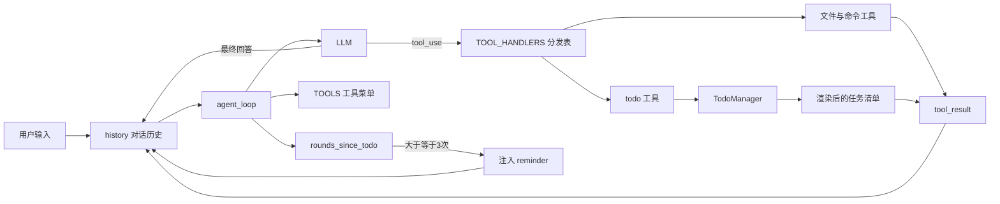
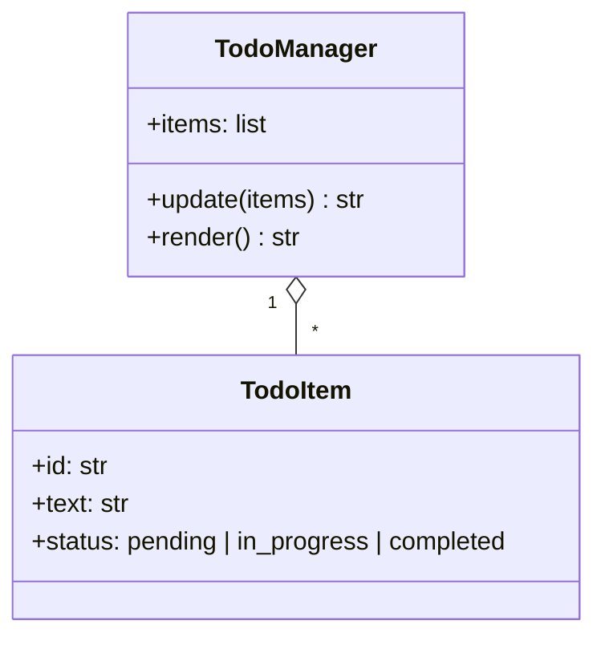
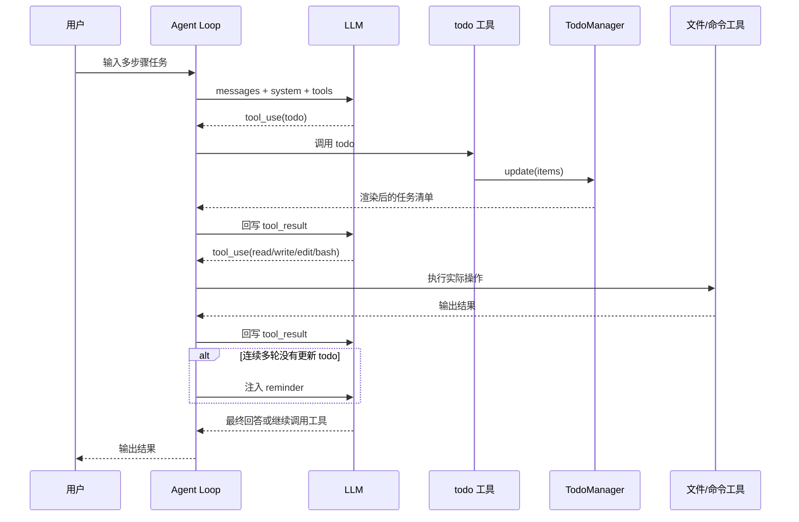

# 待办清单驱动执行：为什么 Agent 做复杂任务时需要持续更新计划

很多人刚开始看 Agent，会先盯着“会不会调工具”这件事。工具当然重要，但一旦任务变成 5 步、8 步、10 步，另一个问题很快就会冒出来:

**模型不是不会做，而是很容易做着做着就跑偏。**

它可能会重复已经完成的动作，也可能会跳过中间步骤，还可能在某个局部卡住之后，忘了自己原本打算做什么。`agents/s03_todo_write.py` 这份代码，解决的正是这个问题。

如果说前一阶段是在回答“怎么让 Agent 动起来”，那这里更像是在回答:

> 当任务开始变复杂时，怎么让 Agent 在动起来之后，依然不丢主线？

看完这份代码后，我最大的感受是，`s03` 并没有粗暴地把“规划逻辑”写死在程序里，而是做了一件更聪明的事:

**给模型一份可以自己维护的待办清单，再用很轻的约束，提醒它持续更新。**

这就是这篇文章想讲清楚的核心。

链接： [s03_todo_write.py](https://github.com/lichangke/to-learn-learn-claude-code/blob/main/agents/s03_todo_write.py)

## 先用一句话说明白

`s03_todo_write.py` 做的事，可以压缩成一句话:

> 它不是替模型规划路线，而是要求模型把自己的路线写下来，并在执行过程中持续同步进度。

这句话很关键，因为它解释了 `s03` 和“程序员手写固定流程”的本质区别。

- 固定流程是程序替模型决定每一步
- `s03` 是模型自己决定每一步，但必须把当前计划显式写进待办清单

这两种方式看起来都带“计划”，但系统气质完全不同。

## 为什么多步骤任务会越来越不稳

模型在短任务里通常很灵活，但任务一长，稳定性就会变差，原因大致有三个。

第一，它的注意力会被最近的上下文拉着走。

比如前面明明列过一个 6 步计划，但后面工具结果越来越多，新的报错、新的输出不断涌进来，最早那份计划对模型的约束力就会慢慢变弱。

第二，它很容易只盯着眼前动作，不盯整体进度。

这一步该不该先做？上一项到底完成没有？接下来还差哪几项？如果没有一个明确的外部状态，模型只能依赖自然语言上下文“隐约记得”，这时候就很容易乱。

第三，它缺少一个持续可见的“工作面板”。

普通对话里，计划和执行往往混在一起。但真正做复杂任务的时候，人类自己也会开一个 Todo 列表、白板或者任务卡片，因为只靠脑子记步骤，本来就不稳。`s03` 本质上是在给模型补这块能力。

## s03 比 s02 多出来的，不只是一个工具

表面上看，`s03` 只是比 `s02` 多了一个 `todo` 工具。可如果只看到这一层，很容易低估它。

我更愿意把 `s03` 理解成三层变化同时发生了:

1. 多了一个结构化状态容器 `TodoManager`
2. 多了一个专门更新这个状态的 `todo` 工具
3. 多了一条“忘了更新就提醒”的节奏纠偏机制

也就是说，这里不只是“工具数量 +1”，而是 Agent 从“只会行动”进一步变成了“会行动，也会管理自己的进行中状态”。

## 整体结构图

先看整体结构，会比较容易抓住重点:



这个图里最值得注意的有两条线。

- 一条是“工具执行线”，也就是和 `s02` 一样的调用与回写闭环
- 一条是“任务状态线”，也就是 `todo -> TodoManager -> reminder` 这条新增链路

前者负责把事情做出来，后者负责让模型知道自己做到哪了。

## TodoManager 到底解决了什么

`s03` 里最关键的新角色，其实不是 `todo` 这个工具名，而是 `TodoManager` 这个状态容器。

它负责保存一份结构化的任务列表，每一项都长这样:

```python
{"id": "...", "text": "...", "status": "..."}
```

其中 `status` 只能是三种状态之一:

- `pending`
- `in_progress`
- `completed`

这看起来很简单，但简单恰恰是它的价值所在。因为只有结构够简单，模型才更容易稳定地用好它。

### TodoManager 的结构关系



这个设计有一个很重要的特点: **状态是结构化的，但输出给模型和人看的结果仍然是自然可读的文本。**

也就是说，内部是规整的数据，外部是清晰的展示，这样程序和模型都舒服。

## `update()` 不是简单存数据，而是在做“流程守门”

`TodoManager.update()` 这段代码非常值得看，因为它做的不是“随便接收模型传来的列表”，而是在给规划行为上规则。

核心片段大致是这样:

```python
def update(self, items: list) -> str:
    if len(items) > 20:
        raise ValueError("Max 20 todos allowed")

    validated = []
    in_progress_count = 0

    for i, item in enumerate(items):
        text = str(item.get("text", "")).strip()
        status = str(item.get("status", "pending")).lower()
        item_id = str(item.get("id", str(i + 1)))

        if not text:
            raise ValueError(f"Item {item_id}: text required")
        if status not in ("pending", "in_progress", "completed"):
            raise ValueError(f"Item {item_id}: invalid status '{status}'")
        if status == "in_progress":
            in_progress_count += 1

        validated.append({"id": item_id, "text": text, "status": status})

    if in_progress_count > 1:
        raise ValueError("Only one task can be in_progress at a time")

    self.items = validated
    return self.render()
```

我觉得这里最有意思的，不是“有校验”，而是**这些校验刚好在替模型维持一个靠谱的工作节奏。**

比如:

- 最多 20 条，避免模型把任务拆得又碎又乱
- `text` 不能为空，避免出现没有意义的空任务
- 状态只能在固定枚举里选，避免模型自己发明规则
- 同时只能有一个 `in_progress`，避免“一口气进行 4 项”的假性忙碌

其中最后一条尤其关键。

> 只允许一个 `in_progress`，本质上是在逼模型聚焦当前步骤。

这和很多人类团队的项目管理习惯很像。你可以同时有很多待办，但真正进入执行态的，最好始终只有当前最重要的一项。这样系统才不容易飘。

## `render()` 的作用，不只是好看

更新完任务状态之后，`TodoManager` 不会直接把原始列表扔回去，而是先渲染成一段可读文本。

渲染逻辑大致是这样:

```python
marker = {
    "pending": "[ ]",
    "in_progress": "[>]",
    "completed": "[x]",
}[item["status"]]
```

最后会得到类似这样的结果:

```text
[x] #1: 查看项目结构
[>] #2: 修改主函数
[ ] #3: 运行测试

(1/3 completed)
```

这一层我很喜欢，因为它把“程序内部状态”翻译成了“模型和人都容易重新理解的进度面板”。

这不是装饰，而是在降低理解成本。模型下轮再读到这段内容时，不需要重新解析复杂 JSON，也能很快抓住当前局面。

## `todo` 工具，真正打开了“自我汇报”通道

`s03` 里最直接的新变化，是把 `todo` 工具加入了工具分发表:

```python
TOOL_HANDLERS = {
    "bash":       lambda **kw: run_bash(kw["command"]),
    "read_file":  lambda **kw: run_read(kw["path"], kw.get("limit")),
    "write_file": lambda **kw: run_write(kw["path"], kw["content"]),
    "edit_file":  lambda **kw: run_edit(kw["path"], kw["old_text"], kw["new_text"]),
    "todo":       lambda **kw: TODO.update(kw["items"]),
}
```

从程序角度看，这只是一行注册；但从系统能力看，这相当于给模型打开了一个新的动作类型:

- 以前它只能操作外部环境
- 现在它还能操作自己的任务状态

这件事很重要，因为它意味着 Agent 不再只是“做事的人”，也开始兼顾“报进度的人”。

而且这个报进度不是嘴上说说，而是通过结构化工具调用完成的，所以程序端可以校验、约束、展示，整个过程会比纯自然语言稳得多。

## 工具菜单为什么也要同步扩展

光有 `TOOL_HANDLERS` 还不够，`TOOLS` 里也得新增 `todo` 的 schema。

这里的关键点不是语法，而是设计意图:

```python
{
    "name": "todo",
    "description": "Update task list. Track progress on multi-step tasks.",
    "input_schema": {
        "type": "object",
        "properties": {
            "items": {
                "type": "array",
                "items": {
                    "type": "object",
                    "properties": {
                        "id": {"type": "string"},
                        "text": {"type": "string"},
                        "status": {
                            "type": "string",
                            "enum": ["pending", "in_progress", "completed"]
                        }
                    },
                    "required": ["id", "text", "status"]
                }
            }
        },
        "required": ["items"]
    }
}
```

这段定义在告诉模型一件非常明确的事:

> 你的计划不是随便写一段“接下来我准备做什么”，而是必须按照固定结构提交。

这是 `s03` 比较漂亮的一点。它没有要求模型“必须说某种话”，而是要求模型“必须通过某种结构更新状态”。这比写很多提示词去反复提醒，通常更稳。

## agent_loop 真正新加的，不是 planning，而是“盯进度”

`s03` 的主循环看起来和 `s02` 很像，但里面多了一个非常有意思的变量:

```python
rounds_since_todo = 0
```

这个变量记录的是:

**距离上一次调用 `todo` 工具，已经过去了多少轮。**

只要本轮调用过 `todo`，它就会清零；如果没有调用，就会累加。这个设计非常朴素，但特别实用，因为它给了宿主程序一种轻量的“节奏感知能力”。

## reminder 机制，像一个轻提醒而不是硬控制

`s03` 最像产品设计的地方，就是 reminder 机制。

核心逻辑是这样:

```python
rounds_since_todo = 0 if used_todo else rounds_since_todo + 1

if rounds_since_todo >= 3:
    results.insert(0, {
        "type": "text",
        "text": "<reminder>Update your todos.</reminder>"
    })
```

这段逻辑很值得细品，因为它的姿态非常克制。

程序没有做下面这些事情:

- 没有强制替模型生成 todo
- 没有中断当前任务
- 没有写死“下一步必须做什么”

它只是插入一句提醒:

> 你已经连续几轮没同步进度了，该更新待办清单了。

这就像一个靠谱的协作者，不会替你工作，但会在你明显偏离节奏的时候拉你一把。

我很喜欢这种设计，因为它不是“接管模型”，而是“给模型一点约束，让它更像一个稳定的执行者”。

## 一次完整过程的时序图

把它画成时序图，会更直观:



这个流程里，我最想强调的是:

**todo 并不是开场白，它应该是执行过程中的持续动作。**

很多人理解“计划”时，容易把它想成任务开始前做一次就结束的事情。但 `s03` 的思路更接近真实工作:

- 开始前列计划
- 做第一项前标记 `in_progress`
- 做完后标记 `completed`
- 进入下一项前再切换状态

也就是说，计划不是一张静态清单，而是一块会跟着执行不断变化的面板。

## 这和“程序自己安排步骤”有什么不同

这个问题很值得单独说一下。

有些人会觉得，既然多步骤任务容易乱，那干脆程序自己写死“先做 A，再做 B，再做 C”不就行了？

这种做法当然能解决一部分问题，但它和 `s03` 不是同一类设计。

程序写死顺序的好处是更可控，坏处是灵活性差。一旦任务类型变化，或者中间出现意外，就要不断改程序。

`s03` 采取的是另一条路:

- 程序不负责替模型思考全部路径
- 程序只负责提供状态容器和最小约束
- 模型自己规划、自行调整，但必须留下清晰轨迹

这让我觉得它更像“带护栏的自主执行”，而不是“脚本化流程”。

## 和 s02 对比，真正进化的地方在哪里

| 维度 | s02 | s03 |
| --- | --- | --- |
| 核心关注点 | 给 Agent 增加更多可执行工具 | 让 Agent 在复杂任务里持续维护进度 |
| 新增工具 | 文件工具为主 | 在原有工具上增加 `todo` |
| 新增状态 | 几乎没有显式任务状态 | `TodoManager` 保存结构化待办清单 |
| 新增约束 | 主要是路径安全和工具分发 | 限制单一 `in_progress`，限制状态枚举 |
| 新增控制 | 无 | `rounds_since_todo` + reminder 注入 |

我自己的理解是:

- `s02` 解决的是“能力扩展”
- `s03` 解决的是“执行稳定性”

前者让 Agent 有更多手，后者让 Agent 在手变多之后，不至于越做越乱。

## 我从这份代码里真正记住的 4 件事

### 1. 复杂任务要有独立的外部状态

只靠聊天上下文记进度，迟早会乱。待办清单一旦变成独立状态，模型对当前进展的把握就会稳很多。

### 2. 规划不该只出现在任务开始时

真正有效的规划，不是一开始列一个大纲，而是执行过程中不断同步状态。

### 3. 轻提醒比硬接管更适合 Agent

reminder 的设计很妙，因为它不是替模型做决定，而是在模型开始漂的时候，把它拉回主线。

### 4. 约束越简单，越容易长期稳定

三个状态、最多一个 `in_progress`、最多 20 条任务，这些限制听起来朴素，但非常有力量。系统能长期稳定，往往靠的不是花哨逻辑，而是少而硬的规则。

## 最后总结

`agents/s03_todo_write.py` 真正让我印象深的，不是它多了一个待办工具，而是它把“计划”从一段容易被冲淡的自然语言，变成了一份会持续更新的结构化状态。

从这个角度看，`s03` 做的其实是三件事:

- 给模型一块明确的进度面板
- 给进度更新加上简单但有效的规则
- 在模型忘记同步进度时，适度提醒它回到主线

所以这份代码最值得记住的结论不是“Agent 要会列 Todo”，而是:

> 当任务变复杂时，真正让 Agent 稳下来的，往往不是更强的工具，而是一份持续可见、持续更新、持续受约束的计划状态。

这也是我理解 `s03` 的一句话总结:

**它让 Agent 不只是会干活，还知道自己现在干到哪了。**

## 致谢

学习主线参考并受益于：

- [shareAI-lab/learn-claude-code](https://github.com/shareAI-lab/learn-claude-code)
