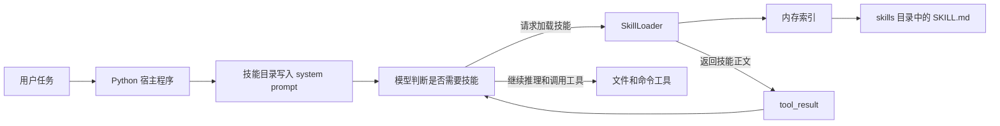
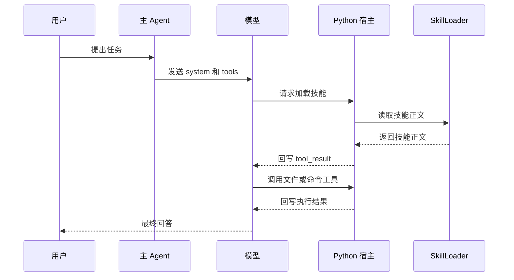

# 技能按需加载：为什么不要把所有知识都塞进 system prompt

很多人刚接触技能系统时，第一反应通常是：既然这些知识迟早都可能用到，那不如一次性全放进 system prompt，省得后面再折腾。

这个想法很自然，但 `agents/s05_skill_loading.py` 恰恰在提醒我们，**知识放得越全，不代表 Agent 就越聪明，很多时候只是上下文越重、注意力越散、成本越高。**

这一节真正想解决的问题，不是“怎么给 Agent 加一个新工具”，而是：

> 当系统里已经积累了很多领域知识时，怎样只在需要的时候把正确那一份交给模型，而不是每次开场都把整本说明书塞过去？

我读完 `s05` 后，觉得它最值得学的地方是这句思路：

> 先告诉模型“有什么技能可用”，再让它在需要时主动加载正文。

这篇文章就围绕这件事展开。

链接： [s05_skill_loading.py](https://github.com/lichangke/to-learn-learn-claude-code/blob/main/agents/s05_skill_loading.py)

## 先说结论

`s05_skill_loading.py` 的核心，不是多了一个 `load_skill` 工具，而是把知识注入拆成了两层：

- 第一层只放技能名称、简介、标签，成本低，用来给模型一个“技能目录”
- 第二层只在模型主动请求时，才把对应技能正文通过 `tool_result` 注入当前对话

这套设计解决的不是“知识存在哪里”，而是“知识什么时候进入上下文”。

如果把这个思路说得更通俗一点：

- 第一层像菜单，先告诉你店里有什么
- 第二层像后厨手册，只有真的点了这道菜，才把完整做法拿出来

真正贵的，不是“系统里有多少知识”，而是“当前轮对话里背了多少无关知识”。

## 为什么把知识全塞进 system prompt 不划算

很多人会觉得，system prompt 既然最稳定，那就把规则、流程、领域说明都放进去。短期看确实省事，但任务一复杂，问题很快就会冒出来。

第一，token 成本会持续上涨。

一个技能正文如果有 1500 到 2000 token，10 个技能就是一大段固定开销。哪怕当前任务只需要其中 1 个，剩下 9 个也会跟着一起进入上下文。

第二，模型的注意力会被无关说明稀释。

system prompt 不是仓库，进去的内容不是“存着就好”，而是每一轮都要跟着模型一起处理。无关内容越多，真正重要的部分越容易被淹掉。

第三，知识和任务的匹配关系会越来越模糊。

如果所有技能都长期常驻，模型就更难分清“当前该依赖哪一套工作流”，也更容易在不同技能之间来回摇摆。

所以 `s05` 的重点不是压缩知识本身，而是**控制知识进入当前会话的时机**。

## s05 到底做了什么

`s05_skill_loading.py` 做的事情可以压缩成一句话：

> 它先把技能做成一份可检索的目录，再把正文变成一个可以按需调用的工具结果。

先看整体结构图，会更容易抓住重点：



这张图里最关键的不是 `SkillLoader`，而是中间那条分界线：

- 技能简介属于“默认可见的信息”
- 技能正文属于“按需拉取的信息”

这个区别看起来只是多了一次工具调用，实际上是在重新设计上下文的进入方式。

## `SkillLoader` 真正做的，不只是扫描目录

`s05` 里最核心的新角色是 `SkillLoader`。表面上看，它只是去 `skills/` 下面找 `SKILL.md` 文件，但真正重要的是，它把技能拆成了两部分：

- `meta`：技能名称、描述、标签
- `body`：技能正文，也就是后续真正要注入模型的详细说明

关键代码很直白：

```python
for f in sorted(self.skills_dir.rglob("SKILL.md")):
    text = f.read_text()
    meta, body = self._parse_frontmatter(text)
    name = meta.get("name", f.parent.name)
    self.skills[name] = {"meta": meta, "body": body, "path": str(f)}
```

这段代码体现了三个很实用的设计点。

第一，技能在启动时一次性建好索引。

也就是说，运行过程中模型调用 `load_skill("xxx")` 时，不需要重新到磁盘上做一轮复杂扫描，而是直接查内存里的 `self.skills`。对示例来说，这个做法简单、稳定，也容易理解。

第二，技能文件有默认命名兜底。

如果 frontmatter 里没有显式写 `name`，那就退回到目录名。这让技能文件的组织方式很自然，不至于因为少写一个字段就完全失效。

第三，目录和正文是分开的。

模型最开始拿到的不是整份 `body`，而只是 `meta` 里的摘要信息。这一步很关键，因为它意味着：

> `SkillLoader` 不是单纯把文件读出来，而是在替系统做“分层供给”。

## frontmatter 的价值，不只是好看

源码里用的是一个极简 frontmatter 解析器，只支持最基础的 `key: value` 形式：

```python
match = re.match(r"^---\n(.*?)\n---\n(.*)", text, re.DOTALL)
```

它不是完整 YAML 解析器，不支持复杂嵌套，也不支持高级语法。看起来有点“简陋”，但我反而觉得这正是这份示例的优点。

因为 `s05` 想讲清楚的重点，本来就不是 YAML 技巧，而是下面这件事：

- 技能元数据要足够轻
- 技能正文要和元数据分离
- 模型需要先看到目录，后看到正文

所以这里故意把解析逻辑收得很窄，反而让主线更清楚。

其中 `description` 和 `tags` 尤其重要。

- `description` 负责告诉模型“这个技能大概能解决什么问题”
- `tags` 负责补充关键词，帮助模型更快判断当前任务是否值得加载它

也就是说，frontmatter 在这里承担的角色，不是装饰，而是“检索入口”。

## 第一层注入：先把技能目录挂进 system prompt

技能加载最容易被忽略的一点，是模型一开始并不知道有哪些技能可用，所以系统得先给它一份“菜单”。

这就是 `get_descriptions()` 的作用：

```python
def get_descriptions(self) -> str:
    if not self.skills:
        return "(no skills available)"
    lines = []
    for name, skill in self.skills.items():
        desc = skill["meta"].get("description", "No description")
        tags = skill["meta"].get("tags", "")
        line = f"  - {name}: {desc}"
        if tags:
            line += f" [{tags}]"
        lines.append(line)
    return "\n".join(lines)
```

随后这份目录会被拼进 `SYSTEM`：

```python
SYSTEM = f"""You are a coding agent at {WORKDIR}.
Use load_skill to access specialized knowledge before tackling unfamiliar topics.

Skills available:
{SKILL_LOADER.get_descriptions()}"""
```

这一步的意义不是让模型立刻学会所有技能，而是给它一个判断依据：

> 如果我遇到陌生问题，当前环境里有哪些专业能力是可以调出来用的？

所以第一层注入解决的是“可发现性”，不是“完整理解”。

## 第二层注入：真正的正文，是通过 `tool_result` 临时进入会话的

我觉得 `s05` 最值得反复琢磨的地方就在这里。

很多人看到 `load_skill` 之后，会下意识以为它是在“修改 system prompt”。但从代码实现看，事情根本不是这样。

工具分发表只是多了一项：

```python
TOOL_HANDLERS = {
    "bash":       lambda **kw: run_bash(kw["command"]),
    "read_file":  lambda **kw: run_read(kw["path"], kw.get("limit")),
    "write_file": lambda **kw: run_write(kw["path"], kw["content"]),
    "edit_file":  lambda **kw: run_edit(kw["path"], kw["old_text"], kw["new_text"]),
    "load_skill": lambda **kw: SKILL_LOADER.get_content(kw["name"]),
}
```

而 `get_content()` 返回的也只是一个带标签的正文块：

```python
return f"<skill name=\"{name}\">\n{skill['body']}\n</skill>"
```

随后，这段内容会像其他工具结果一样，被封装成 `tool_result` 回写给模型：

```python
results.append({
    "type": "tool_result",
    "tool_use_id": block.id,
    "content": str(output),
})
```

这说明了一件特别关键的事：

> `load_skill` 的本质不是改写系统提示词，而是把一段外部知识临时注入到当前对话轮次里。

这两个动作看起来很像，但工程含义完全不同。

- 改 system prompt，意味着知识从一开始就常驻
- 走 `tool_result`，意味着知识是按需拉取、按轮注入

这也是为什么我觉得 `s05` 真正隔离的不是“知识内容”，而是“知识出现的时机”。

## 一次完整调用是怎么流转的

画成时序图会更清楚：



从这个时序里可以看出来，模型真正拿到技能正文，发生在它已经看过技能目录、并且自己判断“现在需要这份知识”之后。

这件事非常像人类工作：

- 先知道公司里有哪些制度和模板
- 确认这次任务需要哪一份
- 再把完整说明拿来细看

而不是每次开会前先把全部制度手册从头到尾念一遍。

## 这一节和 `s04` 的区别，其实很有意思

如果把 `s04` 和 `s05` 放在一起看，会更容易理解这条学习主线为什么顺。

| 节点 | 主要解决的问题 | 核心隔离对象 |
| --- | --- | --- |
| `s04` | 子任务探索过程太吵，主上下文容易变脏 | 任务执行过程 |
| `s05` | 技能说明太多，system prompt 容易膨胀 | 知识注入时机 |

所以：

- `s04` 是把“做事的过程”拆出去
- `s05` 是把“知识的正文”延后注入

我很喜欢这两个章节连起来的感觉，因为它们都不是在单纯加功能，而是在做一件更底层的事：

> 控制什么信息该进入主上下文，什么时候进入，以及以什么形式进入。

这其实就是 Agent 工程里很核心的一门功夫。

## 这份实现里，我觉得最值钱的 5 个细节

### 1. 技能正文默认不常驻

这是整个设计的前提。只有这样，“按需加载”才不是一句口号，而是真正能省上下文。

### 2. 标签不是可有可无

`tags` 看起来只是附加信息，但它能帮模型更快把任务和技能对应起来。技能越多，这一点越重要。

### 3. 技能索引在启动时构建

这让 `load_skill` 的调用路径足够短，也让示例更容易看懂。不过代价也很明确：默认没有热更新能力。

源码里已经把这个限制写得很清楚了，进程启动后如果新增或修改技能文件，通常需要重启脚本才能生效。

### 4. frontmatter 解析器故意做得很简单

这不是偷懒，而是在强调示例重点。示例真正关心的是“元数据和正文分层”，不是 YAML 花样。

### 5. `load_skill` 返回的是带结构标签的文本块

`<skill name="...">...</skill>` 这层包装虽然不复杂，但很实用。它等于在告诉模型：

> 这不是普通聊天内容，而是一段带明确身份的技能文档。

这能帮助模型更稳定地区分“对话内容”和“外部知识块”。

## 什么情况下，这套方案特别适合

我觉得下面几类场景很适合用 `s05` 这种方式：

- 技能种类很多，但单次任务通常只会用到其中少数几项
- 技能正文比较长，直接常驻会明显推高上下文成本
- 技能之间边界相对清晰，适合通过名称和标签做初步路由
- 你希望模型先判断“要不要加载”，而不是默认把所有知识都吞进去

反过来说，如果某些规则是无论做什么任务都必须遵守的底线约束，那它们还是更适合留在 system prompt 里，而不是也做成按需技能。

这说明 `s05` 不是“所有知识都要技能化”，而是在提醒我们：

> 常驻信息和按需信息，最好分开管理。

## 最后总结

`agents/s05_skill_loading.py` 看起来像是在讲“怎么给 Agent 加一个技能系统”，但我觉得更本质的主题其实是：

> 不要把知识管理理解成“存得越多越好”，而要理解成“让对的知识在对的时间进入上下文”。

它先用一层很轻的技能目录告诉模型“有哪些能力可用”，再通过 `load_skill` 把完整正文作为 `tool_result` 临时注入当前会话。这样做既保留了知识的可发现性，也避免了把 system prompt 变成一个越来越重的大仓库。

所以这节最值得记住的一句话，我会写成：

**技能加载的重点，不是把知识塞给模型，而是把知识交给模型的时机管好。**

## 致谢

学习主线受益于：

- [shareAI-lab/learn-claude-code](https://github.com/shareAI-lab/learn-claude-code)
