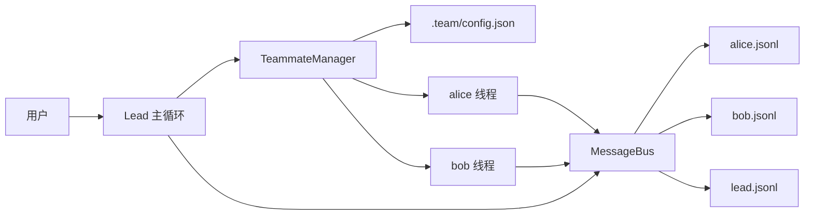
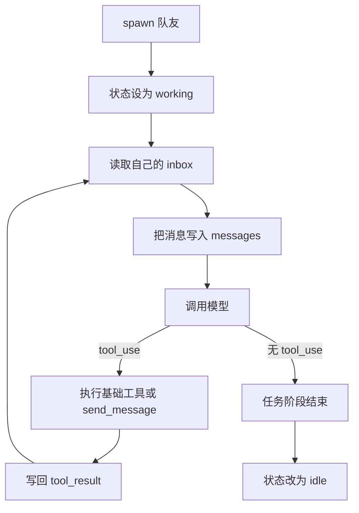
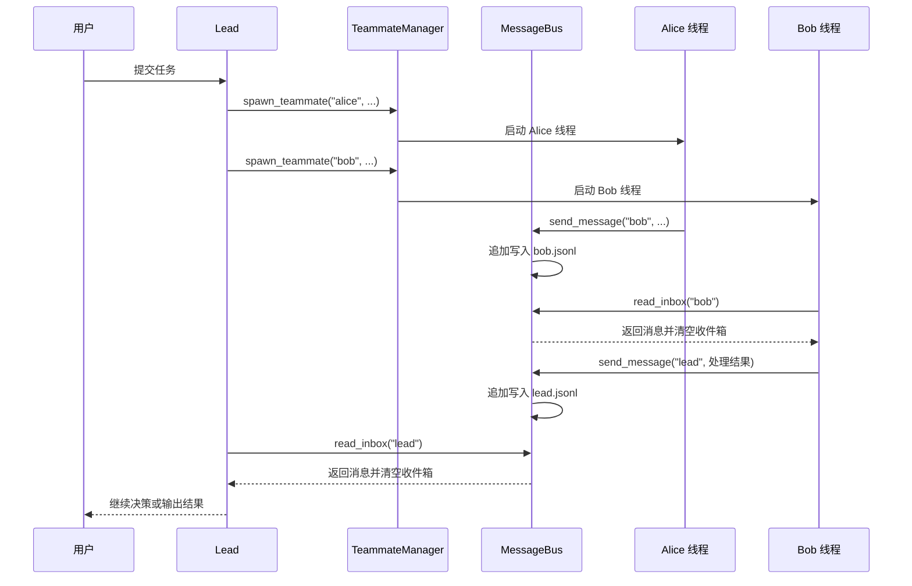

# 智能体团队协作设计：为什么 Agent 真正像团队一样工作，离不开持久队友和文件邮箱

很多人第一次看到“多智能体”这个词时，脑子里冒出来的画面，往往是“多开几个模型一起跑”。

这当然不算错，但如果只停在这一步，通常很快就会撞墙。

因为真正的团队协作，不只是多几个人干活，而是要回答下面这几个问题：

- 谁是谁
- 谁现在在忙，谁现在空闲
- 谁给谁发了消息
- 消息有没有被收到
- 一个成员这轮做完后，下轮还能不能继续接活

`agents/s09_agent_teams.py` 这一节真正补上的，就是这层“团队基础设施”。

它没有把系统做成很重的调度平台，而是用了一个非常克制、也非常有启发性的做法：

> 给每个队友一个名字、一个状态、一条线程、一个 JSONL 收件箱，让多模型协作先真正跑起来。

我觉得这是整个学习路径里很关键的一步，因为从这里开始，Agent 不再只是“一个会调工具的模型”，而开始有了“团队成员”这层组织结构。

链接： [s09_agent_teams.py](https://github.com/lichangke/to-learn-learn-claude-code/blob/main/agents/s09_agent_teams.py)

## 先说结论

如果让我用一句话概括 `s09`，我会这样说：

**这节最重要的，不是多开几个模型，而是把协作关系从一次性调用，升级成了带身份、带状态、带通信通道的常驻队友。**

这句话里有三个重点：

第一，队友有固定名字，不再只是临时拉起、做完就丢的匿名执行单元。

第二，队友有生命周期，至少能区分 `working`、`idle`、`shutdown` 这些状态。

第三，队友之间终于有了一个明确的通信通道，而不是只能通过主 Agent 间接传话。

这三件事一旦凑齐，“团队”这件事才算真正开始成立。

## 为什么 s04 的子代理还不算团队

前面的 `s04_subagent.py` 已经能把任务拆出去做了，但它更像是“临时外包”，还不是“固定队友”。

原因很简单。

在 `s04` 里，子代理的典型生命周期是：

1. 被创建
2. 拿到一段 prompt
3. 在自己的上下文里完成任务
4. 返回一段摘要
5. 立刻消失

这套机制很适合做探索型子任务，因为它能隔离上下文噪音，但它不擅长团队协作。

因为团队协作至少需要两种额外能力：

- 成员要能被再次找到
- 成员之间要能交换消息

而 `s09` 做的，就是把“临时子代理”推进成“可持续存在的队友”。

如果把两者并排看，会很清楚：

| 维度 | s04 子代理 | s09 队友 |
| --- | --- | --- |
| 生命周期 | 一次性 | 可反复被唤醒 |
| 身份 | 临时 | 固定名字 |
| 状态 | 几乎没有 | working / idle / shutdown |
| 通信 | 返回摘要给主循环 | 队友之间可收发消息 |
| 组织方式 | 任务拆分 | 团队协作 |

所以我更愿意把 `s09` 理解成：

> Agent 系统第一次不只是在“拆任务”，而是在“组织人”。

## 这份实现的骨架，其实只有三层

别看文件稍微长了一点，真正新的骨架并不复杂。

整个团队协作靠下面三层撑起来：

1. `config.json` 保存成员名册和状态
2. `inbox/<name>.jsonl` 作为每个成员的收件箱
3. 每个成员用独立线程跑自己的 agent loop

如果画成结构图，会非常直观：



这张图里最值得注意的地方，是它没有引入复杂消息队列，也没有上数据库。

它只是把“成员状态”和“成员通信”各自找了一个最小可行的落点：

- 状态放到 `config.json`
- 消息放到 JSONL 文件

这就是这份实现很有教学价值的地方：**它用最低成本，把团队协作最核心的两个外部状态先立住了。**

## `MessageBus` 为什么值得单独理解

很多人读 `s09` 时，注意力会先放在 `threading.Thread` 上，但我觉得真正让“团队”成立的，其实是 `MessageBus`。

因为只要没有一条稳定的消息通道，多线程也只是多个孤立执行单元，并不能算协作。

`MessageBus` 的设计非常朴素：

- 发消息：往目标成员的 `jsonl` 文件末尾追加一行
- 收消息：把整个收件箱读出来，然后立刻清空

关键片段是这样的：

```python
def send(self, sender: str, to: str, content: str,
         msg_type: str = "message", extra: dict = None) -> str:
    msg = {
        "type": msg_type,
        "from": sender,
        "content": content,
        "timestamp": time.time(),
    }
    inbox_path = self.dir / f"{to}.jsonl"
    with open(inbox_path, "a") as f:
        f.write(json.dumps(msg) + "\n")
```

```python
def read_inbox(self, name: str) -> list:
    inbox_path = self.dir / f"{name}.jsonl"
    if not inbox_path.exists():
        return []
    messages = []
    for line in inbox_path.read_text().strip().splitlines():
        if line:
            messages.append(json.loads(line))
    inbox_path.write_text("")
    return messages
```

这里有两个设计点特别重要。

第一，它是 append-only 的。

发消息不改历史，不做复杂覆盖，只负责往后追加。这让写入逻辑非常简单，也更容易排查问题。

第二，它是 drain-on-read 的。

一旦某个成员调用 `read_inbox()`，就会把当前收件箱里的消息全部取走，并立刻清空文件。

这意味着收件箱更像“待处理队列”，而不是“永久聊天记录”。

我觉得这一步非常聪明，因为对 Agent 来说，最重要的是“这批消息有没有被消费”，而不是“消息必须永远堆在同一个地方”。

## 为什么这里选 JSONL 邮箱，而不是更花哨的方案

如果从工程上继续往前想，当然还可以用很多别的方案：

- SQLite
- Redis
- 共享内存
- HTTP 服务
- 真正的消息队列

但对这份示例来说，JSONL 邮箱反而是很合适的。

原因主要有四个。

### 1. 它足够直观

打开 `.team/inbox/alice.jsonl`，你就能直接看到消息长什么样。

这对教学特别友好，因为很多“系统设计”一旦不可见，理解成本会陡增。

### 2. 它天然可持久化

消息是文件，不是纯内存结构。程序没有来得及读走之前，它就留在磁盘上。

### 3. 它把写入和读取的职责切得很干净

- 写入方只管追加
- 读取方只管取走并清空

这让接口非常容易理解。

### 4. 它很符合这节的目标

这节想讲清楚的是“团队协作的最小骨架”，不是“生产级消息系统怎么做”。

所以这里的重点不是追求最强，而是追求最清楚。

## `TeammateManager` 真正管的，不只是拉起线程

`TeammateManager` 这个名字很容易让人以为它只是线程管理器，但它其实同时在做三件事：

- 管成员名册
- 管成员状态
- 管成员线程

初始化部分已经把这三件事写得很明确：

```python
class TeammateManager:
    def __init__(self, team_dir: Path):
        self.dir = team_dir
        self.dir.mkdir(exist_ok=True)
        self.config_path = self.dir / "config.json"
        self.config = self._load_config()
        self.threads = {}
```

这里我觉得最值得记住的一点是：

**线程对象和成员名册是分开的。**

- `threads` 只存在于当前 Python 进程里
- `config.json` 则是落盘的团队状态

这意味着这份实现真正持久化下来的，主要是“名字、角色、状态、邮箱文件”这些外部协作信息，而不是完整运行时上下文。

这正好也是我对这份实现最重要的一个判断：

> s09 持久化的首先是团队结构，不是完整思维过程。

这点非常关键，因为很多人一看到“persistent teammate”，会下意识理解成“队友的全部上下文都永久保存了”。但从这份代码来看，事实并不是这样。

更准确地说，它持久化的是：

- 成员身份
- 成员角色
- 成员状态
- 未消费的消息

而队友线程内部那份 `messages` 历史，依然主要活在当前进程内存里。

## 一个队友是怎么被拉起来的

`spawn()` 是整个团队生命周期的入口。

它做的事情并不多，但顺序非常讲究：

1. 先在名册里找成员是否已存在
2. 如果成员已存在且处于 `idle` 或 `shutdown`，就重新进入 `working`
3. 如果成员不存在，就创建新的成员记录
4. 立即写回 `config.json`
5. 启动对应线程，进入 `_teammate_loop()`

对应代码是：

```python
def spawn(self, name: str, role: str, prompt: str) -> str:
    member = self._find_member(name)
    if member:
        if member["status"] not in ("idle", "shutdown"):
            return f"Error: '{name}' is currently {member['status']}"
        member["status"] = "working"
        member["role"] = role
    else:
        member = {"name": name, "role": role, "status": "working"}
        self.config["members"].append(member)
    self._save_config()
    thread = threading.Thread(
        target=self._teammate_loop,
        args=(name, role, prompt),
        daemon=True,
    )
    self.threads[name] = thread
    thread.start()
```

我很喜欢这里“先写状态，再起线程”的顺序。

因为这样做之后，就算线程刚启动，系统外部也已经能看到这个成员处于 `working` 状态了，不会出现“线程已经跑了，但名册还没更新”的断层。

## 每个队友本质上都有自己的小主循环

真正让“队友”有生命感的，是 `_teammate_loop()`。

它不是一次性执行器，而是一个简化版的 agent loop。

它做的事情可以概括成下面这条循环：

1. 先读自己的收件箱
2. 把新消息追加进自己的上下文
3. 调用模型
4. 如果模型要用工具，就执行工具
5. 把工具结果写回自己的消息历史
6. 当前任务阶段结束后，状态回到 `idle`

如果画成流程图，会比单看代码更容易读：



这里最关键的一点，不是“它有循环”，而是：

**每个队友都有自己的上下文，而不是共享 lead 的上下文。**

这意味着 Alice 收到的消息，只会进入 Alice 的 `messages`；Bob 做过的工具调用，也不会直接污染 Alice 的思路。

这个设计和 `s04` 的上下文隔离一脉相承，但比 `s04` 更进一步，因为它变成了“多个长期存在的小脑子并排工作”。

## lead 和 teammate 的职责边界，代码里划得很清楚

`s09` 很妙的一点，是它没有把所有能力都发给所有成员。

lead 和 teammate 的工具集合是不同的。

lead 有 9 个工具，队友只有 6 个。

差别主要在这里：

| 能力 | lead | teammate |
| --- | --- | --- |
| 读文件 / 写文件 / 改文件 / 跑命令 | 有 | 有 |
| `spawn_teammate` | 有 | 没有 |
| `list_teammates` | 有 | 没有 |
| `broadcast` | 有 | 没有 |
| `send_message` | 有 | 有 |
| `read_inbox` | 有 | 有，但只读自己的 |

这背后体现的是一种很清晰的分工：

- lead 负责组织和调度
- teammate 负责执行和沟通

也正因为这样，系统不会一上来就变成“每个人都能无限再拉人”的失控结构。

这种克制非常重要，因为教学示例最怕一开始就把权限边界做乱。

## 把整条协作链路放到时序图里看

如果把一次完整的协作过程画成时序图，s09 的运行逻辑会非常清楚：



这张图里最有意思的一点是，消息不是“直接打到另一个模型身上”的。

所有通信都先落到文件，再由对方在合适的时候主动取走。

这让系统行为变得非常可预测：

- 谁发了消息，看文件就知道
- 谁收了消息，看文件是否被 drain 就知道
- lead 也和队友一样，是消息系统的一个参与者

## 这份实现真正带来的升级，不只是“能聊天”

如果只看表面，`s09` 好像只是多了 `send_message()`、`read_inbox()`、`broadcast()` 这些接口。

但我觉得它真正带来的升级至少有四层。

### 1. 从“任务拆分”升级到“组织协作”

以前更像是主 Agent 发起一次临时委派，现在开始变成“谁适合长期负责哪类工作”。

### 2. 从“只有主循环有上下文”升级到“每个队友都有自己的上下文”

这会让系统更接近真实团队，而不是一个大脑加几个临时手脚。

### 3. 从“所有状态都在聊天记录里”升级到“团队状态开始落到对话外部”

`config.json` 和 `inbox/*.jsonl` 都属于对话外部状态，这一步非常关键。

### 4. 从“工具调用闭环”升级到“带组织层的闭环”

主循环不只是决定用什么工具，还开始决定“谁来做”。

## 我觉得这份实现最值得带走的 5 个判断

### 1. 团队协作的第一步不是多模型，而是身份

没有固定名字，就没有稳定分工，也没有可追踪的责任边界。

### 2. 只靠主 Agent 转述，不算真正的团队通信

当队友之间能直接通过邮箱互发消息时，协作才开始从“单核调度”走向“多点协同”。

### 3. 持久化最先该落地的是结构，不是完整上下文

这份实现优先保存名册、状态和消息通道，这比一开始就追求完整记忆系统更务实。

### 4. 文件邮箱虽然简单，但非常适合讲清楚协作本质

它把消息从抽象概念变成了可查看、可验证、可排查的实体。

### 5. 真正的常驻队友，不是永远在线，而是可以被再次唤醒

`working -> idle -> working` 这个循环，比“一直忙着”更接近真实协作系统。

## 这份代码也有几个边界，反而很值得记住

我觉得好的学习示例，不是把所有问题都解决，而是把边界留得足够清楚。

`s09` 就是这样。

### 1. 持久化的是团队结构，不是完整记忆

这一点前面提过，但值得再强调一次。

成员名册和收件箱会落盘，但线程内部那份完整 `messages` 历史并没有真正做跨进程持久化。

所以更准确地说，这里持久化的是“协作外壳”，不是“完整脑内状态”。

### 2. 消息类型先声明了很多，但这里只完整用上了一部分

代码里有 5 类消息：

- `message`
- `broadcast`
- `shutdown_request`
- `shutdown_response`
- `plan_approval_response`

但后面几类更多是在给下一节协议层铺路。

这也说明 `s09` 的重心不是把所有团队规则做完，而是先把收发和生命周期搭起来。

### 3. 这还是一个很轻量的线程模型

每个队友就是一个守护线程，没有复杂调度、没有任务恢复、没有线程池治理。

这让它不算生产级方案，但特别适合拿来理解“一个团队到底最少需要哪些基础设施”。

### 4. `read_inbox()` 采用的是“读完即清空”语义

这个语义很适合演示和最小闭环，但如果以后要做更强的可追溯性、重放、确认机制，通常还会继续往上加协议。

## 如果把它放回整个学习路径里，它补上的是什么

前面几节更多在补“单个 Agent 怎么工作得更稳”：

- `s03` 让计划不容易丢
- `s04` 让探索不污染主线
- `s07` 让长期任务状态不只存在于聊天记录里
- `s08` 让慢命令别卡住主循环

到了 `s09`，问题已经不是“单个 Agent 能不能继续做事”，而是：

> 当事情变复杂后，系统能不能像一个团队那样分工、传话、等待和接力？

所以我会把 `s09` 理解成对“组织能力”的一次补强。

从这里开始，Agent 系统第一次不只是会做事，也开始会“安排谁做事”。

## 最后总结

`s09_agent_teams.py` 最值得学的，不是 JSONL、不是线程 API，也不是又多了几个工具。

真正值得带走的，是它背后的那个工程判断：

**当系统开始走向多智能体时，最先要补的不是更强模型，而是稳定的协作骨架。**

这个骨架至少要有三样东西：

- 可识别的成员身份
- 对话外部可见的团队状态
- 足够简单但稳定的通信通道

而 `s09` 用 `config.json + JSONL inbox + per-thread agent loop`，把这三样东西非常干净地摆了出来。

它不是终点，但它让“多智能体团队”第一次从概念，变成了一个能摸得到、看得见、讲得清的最小实现。

## 致谢

学习主线受益于：

- [shareAI-lab/learn-claude-code](https://github.com/shareAI-lab/learn-claude-code)
