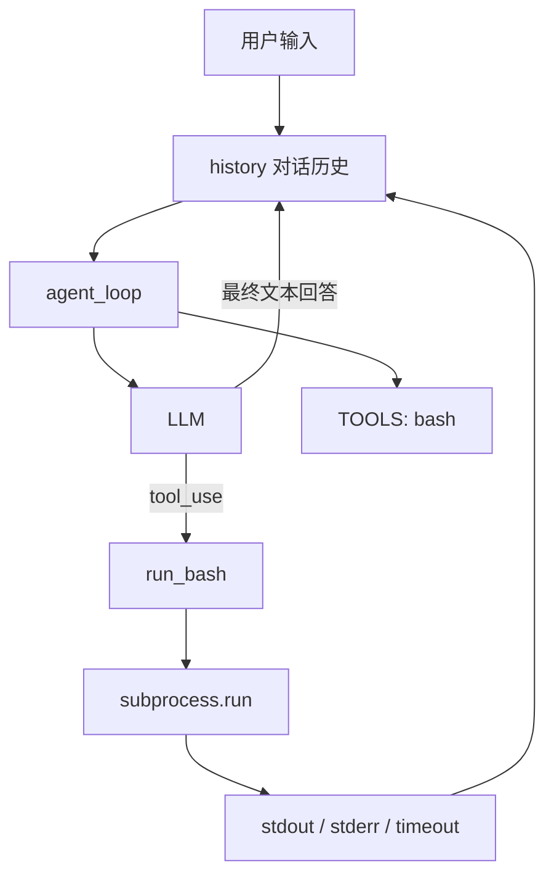
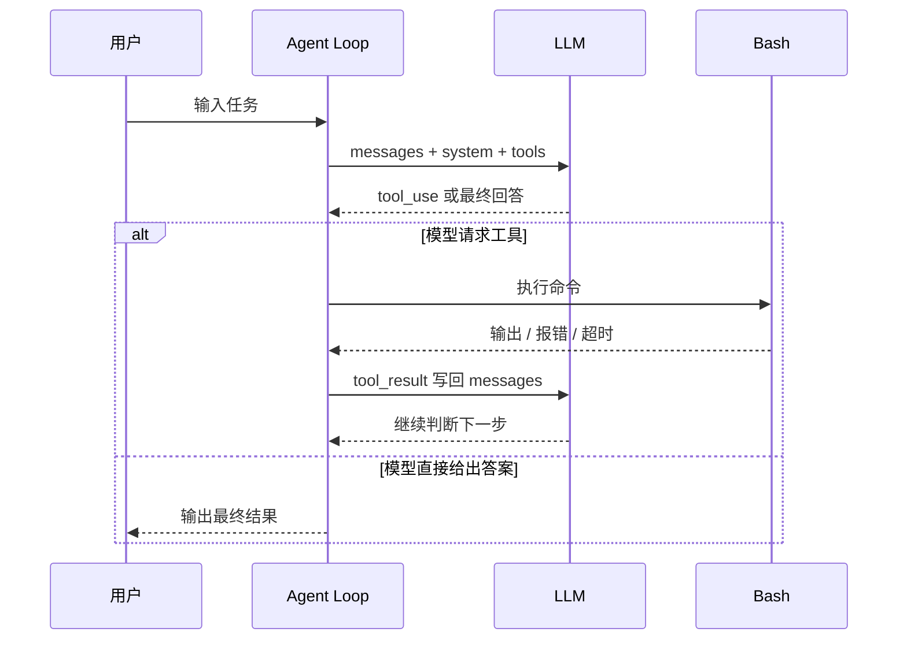

# 智能体循环入门：为什么一个 while 循环就能让 AI 真正开始干活

刚开始接触 Agent 时，很多人会先盯着“大模型”和“工具调用”看，觉得只要模型足够强、工具足够多，智能体自然就成立了。

但看完 [`agents/s01_agent_loop.py`](../agents/s01_agent_loop.py) 之后，我反而更确定了一件事：**Agent 真正的关键，不是它“会不会调工具”，而是它能不能在调完工具之后，根据结果继续往下做。**

这件事听起来很简单，落到代码里，其实就是一个循环。也正是这个循环，让模型从“会回答问题”变成了“会动手做事”。

## 先用一句话说明白

如果把大模型看成大脑，把 Bash 看成手，那么 Agent Loop 就是这套系统里的“神经回路”。

大脑先发出动作指令，手去执行；执行完之后，结果再反馈回大脑，大脑据此决定下一步。没有这层反馈，模型再聪明，也更像是在纸上谈兵。有了这层反馈，它才真正开始接触外部世界。

## 这份示例代码到底在做什么

`s01_agent_loop.py` 其实非常克制，几乎没有多余设计。它只做了一件事：**让模型、工具和对话历史形成一个闭环。**

这段代码里，核心角色只有 3 个：

- 大模型：负责理解任务、判断是否调用工具，并在合适的时候给出最终回答。
- Bash 工具：负责真正和本地环境打交道，比如读文件、列目录、执行命令、接收报错。
- 消息历史：把用户输入、模型响应、工具结果串成一条连续上下文，让模型知道自己刚刚做过什么。

先看结构图，会更容易形成整体印象：



很多人会先注意到图里的 `bash`，但真正决定系统能不能跑起来的，其实是右边那条“结果重新回到 `history`”的路径。只要这条路打通，闭环就成立了。

## 为什么说循环才是 Agent 的灵魂

普通问答模型的工作方式通常是这样的：

1. 用户提问。
2. 模型给出回答。
3. 本轮结束。

但 Agent 不一样。Agent 需要的不只是“回答”，而是“回答之后还能行动，行动之后还能继续判断”。

`s01_agent_loop.py` 做的，正是把这个过程变成一个稳定的程序结构：

```python
while True:
    让模型根据当前上下文做判断
    如果模型要调用工具，就去执行
    把执行结果写回上下文
    再让模型继续判断
    直到模型决定停止
```

说白了，Agent Loop 干的就是一件事：

> 把“思考 -> 动手 -> 看结果 -> 再思考”变成可以自动重复的流程。

## 从代码角度拆开来看

### 1. 先告诉模型：你是谁，你能做什么

程序启动后，首先准备了两类信息：

- `SYSTEM`：告诉模型它现在扮演的是当前目录下的 coding agent，遇到问题优先用 Bash 解决。
- `TOOLS`：告诉模型可用工具有哪些、每个工具长什么样、调用时要传什么参数。

这里有个很重要的认知要先建立起来：**模型不会真的执行工具。**

它能做的是根据你给的 schema，返回一个结构化请求，意思类似于：“我下一步想调用 `bash`，命令是这个。”

真正去运行命令的，是本地 Python 代码。也就是说，工具调用本质上是两步：

1. 模型提出动作意图。
2. 宿主程序代为执行，并把结果返回给模型。

只有这两步都接上，工具才算真的被“用起来”。

### 2. `run_bash()`：模型和真实环境之间的桥

`run_bash()` 这个函数不长，但它的位置非常关键。因为模型再会规划，也必须通过它，才能把“想做什么”变成“系统里真的发生了什么”。

这个函数主要做了 4 件事：

- 拦截明显危险的命令，比如 `sudo`、`shutdown`。
- 用 `subprocess.run(...)` 在当前工作目录执行命令。
- 同时收集 `stdout` 和 `stderr`，不管成功还是失败，都把结果带回来。
- 对输出做截断，并处理超时，避免单次工具结果把上下文塞爆。

这里我特别想强调一点：**对 Agent 来说，报错信息不是噪声，而是反馈。**

比如模型执行了一个命令，如果终端返回“文件不存在”或者“测试失败”，这并不意味着这一步毫无价值。相反，这些信息正是模型决定下一步要不要换路径、要不要修复、要不要重试的依据。

所以从 Agent 视角看，成功输出和失败输出同样重要。

### 3. `agent_loop()`：真正驱动整个系统的核心

如果整份代码只看一个函数，那一定是 `agent_loop()`。

它的主线其实很简单：

1. 把当前完整消息历史、系统提示词和工具列表发给模型。
2. 把模型原始返回追加到 `messages` 里。
3. 判断这次返回是不是还要继续调用工具。
4. 如果要，就执行工具，把结果写回消息历史。
5. 再来一轮，直到模型不再请求工具。

这个过程用时序图表示会更直观：



如果非要把 `agent_loop()` 压缩成一句话，我会这样说：

> 它让模型不再只说“应该怎么做”，而是能边做边看、边看边改，直到任务收尾。

### 4. 两个容易被忽略，但非常关键的细节

第一，代码会先把 `assistant` 的原始响应完整追加进 `messages`。

这一步不能省。因为一次响应里，可能既有文本解释，也有 `tool_use` 块。如果你只摘出其中一部分，后续上下文就会不完整，模型可能也会“失忆”。

第二，循环退出条件写的是：

```python
if response.stop_reason != "tool_use":
    return
```

这意味着什么时候结束，不是程序员提前写死轮数，而是由模型当前这一步的返回结果来决定。只要模型还想继续调工具，循环就继续；模型改为输出普通文本，循环才结束。

这就是一个很典型的 Agent 控制思路：**宿主程序负责搭框架，模型负责决定当前动作。**

### 5. 为什么 `tool_result` 要重新塞回消息历史

这是整份代码里最精髓的一步。

很多初学者会下意识觉得：“命令都执行完了，打印一下结果不就行了吗？”  
但在 Agent 里，打印给人看和喂回给模型，是两件完全不同的事。

代码里做的是：

- 给每个结果带上对应的 `tool_use_id`
- 把这些结果包装成 `tool_result`
- 再作为一条新的 `user` 内容追加到 `messages`

这样做的意义在于：

- 模型能准确知道，这个结果对应的是哪一次工具调用。
- 模型能把这份结果当成新的输入继续推理。
- 整个过程会沉淀成一条完整、连续、可追踪的操作历史。

也就是说，Agent 不是靠“我记得我刚才调过工具”在工作，而是靠“我重新看到了工具返回的结果”在工作。

这两者的差别非常大。前者更像凭印象，后者才是真正基于反馈做决策。

### 6. `history` 不只是聊天记录，更像工作记忆

在 `__main__` 里，程序维护了一份持续增长的 `history`，每次用户输入都会先写进去，然后把整份历史交给 `agent_loop(history)`。

这样设计有一个直接好处：同一轮 REPL 会话里的上下文不会丢。

它带来的效果包括：

- 模型知道前面已经做过什么。
- 用户可以基于上一轮结果继续追问。
- 一系列连续操作能建立起“任务连续性”。

比如这一轮先让它创建目录，下一轮再让它检查目录内容，本质上就是在同一个工作记忆上继续往下做，而不是每次都从零开始。

所以 `history` 在这里更像 Agent 的短期记忆，而不只是普通意义上的聊天记录。

## 我的理解：这段代码真正讲明白了什么

参考文档里有一句话很有力量：“一个循环 + 一个 Bash 工具就够了。”  
这句话如果只看表面，容易理解成“做 Agent 很简单”；但结合代码，我觉得它真正想强调的是下面这几件事。

### 1. Agent 的最小单位不是模型，而是闭环

如果模型只能生成建议，不能根据动作结果继续调整，那它本质上还是问答系统。

只有当“动作结果”能回流到模型，上下文才能真正形成闭环，系统才开始具备执行能力。

所以，定义 Agent 的关键不在于模型有多强，而在于反馈回路有没有打通。

### 2. 工具不是越多越好，先把反馈链路跑通更重要

这个示例只有一个 `bash` 工具，但已经足够说明原理。原因不是 Bash 有多神奇，而是它本身就是一个通向真实环境的高自由度入口。

对早期原型来说，比起一上来堆很多工具，更重要的是先确认三件事：

- 模型能不能正确发起工具调用。
- 工具结果能不能稳定回流给模型。
- 模型拿到结果后，会不会据此调整下一步。

这三件事打通了，再去扩展更多工具，才有意义。

### 3. 安全、超时、截断，不是边角料，而是闭环的一部分

很多人看到 `run_bash()` 里的黑名单、超时和输出截断，会觉得这些只是工程细节。

但如果站在 Agent 的角度看，这些其实都直接关系到闭环是否稳定：

- 没有超时，循环可能直接卡住。
- 没有输出截断，上下文可能被大段噪声撑爆。
- 没有最基本的危险命令拦截，系统就可能从“能执行”滑向“乱执行”。

所以 Agent Loop 从一开始就不只是推理问题，它同时也是执行控制问题。

### 4. 这份代码很小，但它已经把后续章节的方向指明了

这份示例已经足够清楚，但它当然还远远不是生产级 Agent。

目前它的明显限制包括：

- 工具很单一，只有 Bash。
- 安全策略还比较粗糙，只是简单关键词拦截。
- 上下文只会累积，没有压缩和整理机制。
- 没有任务拆解、重试、计划、回滚等更高层能力。
- 没有对不同错误做更细的分类和处理。

不过也正因为它足够小，我们才能更容易看清楚：后面那些高级能力，本质上都是在这个循环外面一层一层加上去的。

## 如果你想自己写一个最小 Agent，记住这 5 步就够了

1. 维护一份持续增长的 `messages` 历史。
2. 给模型明确的角色设定和可用工具列表。
3. 当模型返回 `tool_use` 时，由宿主程序真正执行工具。
4. 把工具结果包装成 `tool_result` 再送回模型。
5. 一直循环，直到模型不再请求工具。

这 5 步看起来并不复杂，但已经足够搭起一个最小可运行的 Agent 骨架。

## 总结

`s01_agent_loop.py` 最打动我的地方，不是它展示了一个多复杂的系统，而是它把 Agent 的核心压缩到了非常小的一段代码里，而且仍然足够完整。

如果让我用一句更接地气的话来概括这份示例，那就是：

**智能体之所以开始像“会做事”，不是因为它突然变得更聪明了，而是因为它终于能看到自己刚刚做出来的结果，并据此继续往前走。**

这，就是 Agent Loop 最核心的价值。后面所有更复杂的能力，几乎都建立在这层闭环之上。
