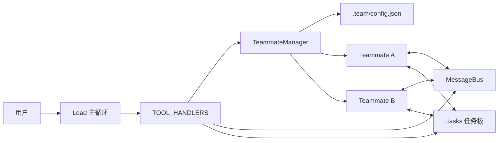
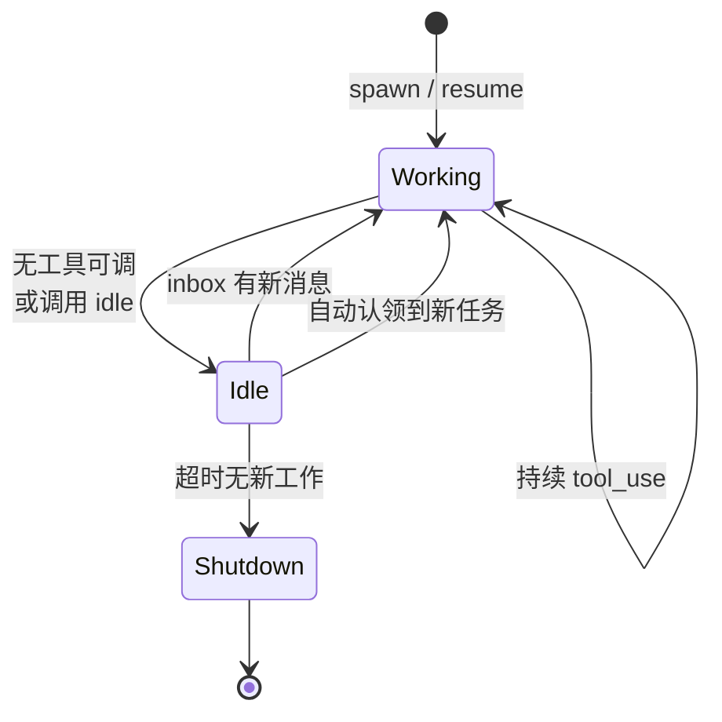
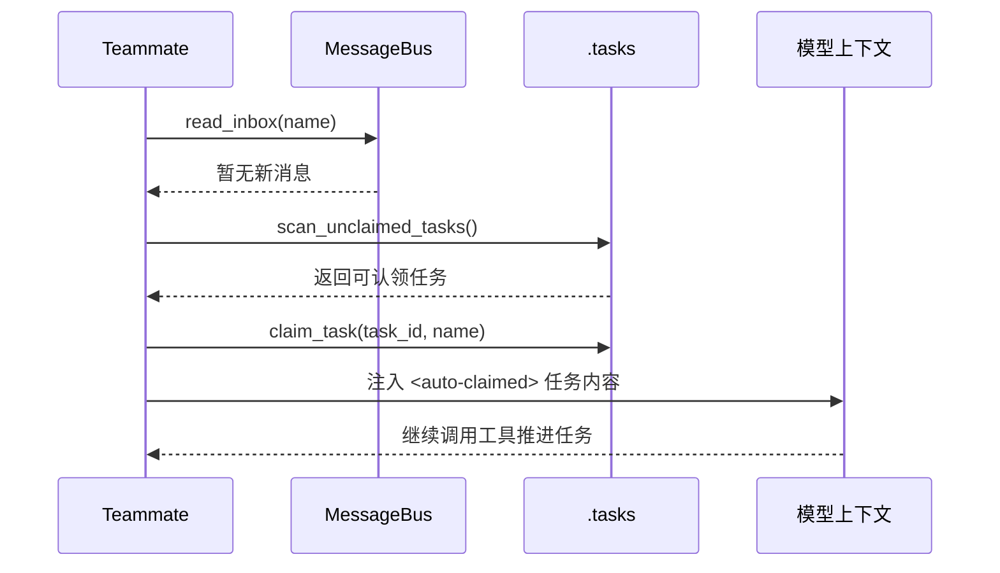

# 自主代理设计：为什么 Agent 空闲时不该只是等下一条指令

很多人第一次做多智能体系统时，默认采用的都是“派工制”。

也就是说，lead 负责看全局、拆任务、发消息，每个 teammate 只在被明确点名时才开始动。

这个模式能跑起来，但有一个很快就会暴露的问题：

**只要所有工作都得等 lead 逐个分配，团队规模一变大，lead 自己就会变成瓶颈。**

`agents/s11_autonomous_agents.py` 往前推进的一步，正是把这个问题拆开处理。

它没有一上来做复杂调度器，也没有引入数据库或消息队列，而是用一种很克制的方式，让 teammate 在暂时没活的时候：

- 自己看 inbox 有没有新消息
- 自己扫 `.tasks` 里有没有没人接手的任务
- 自己认领能做的下一项工作
- 如果长时间什么都没有，再自己退出

我会把这一节理解成一句话：

**前面的章节让队友“能协作”，这一节让队友开始“会自驱”。**

链接： [s11_autonomous_agents.py](https://github.com/lichangke/to-learn-learn-claude-code/blob/main/agents/s11_autonomous_agents.py)

## 先说结论

如果只看表面，`s11` 像是多了两个工具：

- `idle`
- `claim_task`

但真正重要的变化并不在工具数量上，而在运行方式上。

这节代码把 teammate 的生命过程从“工作完一轮就等着别人再叫我”，推进成了“工作完一轮后，先自己去找下一份工作”。

这件事听起来像一个小优化，实际上很关键。

因为它改变的不是某个函数，而是团队的组织方式：

- lead 不必再负责每一次微观派工
- teammate 不再只是被动执行者
- `.tasks` 不再只是记事本，而开始变成外部工作源

## 为什么光有协作还不够

如果把前几节连起来看，会更容易理解 `s11` 的位置：

- `s09` 解决的是“队友能长期存在，并且能互相发消息”
- `s10` 解决的是“队友之间的关键协作要有协议和回执”
- `s11` 解决的是“队友没被点名时，也知道下一步怎么找事做”

这三步其实对应了团队成长的三个阶段：

1. 先能联系上彼此
2. 再让协作变得有规矩
3. 最后才是减少对单一调度者的依赖

从工程角度看，自治不等于“没人管理”，而是**把低价值、重复性的派工动作，从 lead 身上卸下来**。

lead 仍然存在，只是它不必一直盯着“谁现在空着、下一单派给谁”这种细碎调度。

## 和上一节相比，真正新增了什么

如果把 `s10` 和 `s11` 放在一起看，变化会更清楚：

| 维度 | `s10` | `s11` |
| --- | --- | --- |
| 队友拿任务的方式 | 主要靠 lead 明确派活 | 可以在空闲时自己找活 |
| 空闲后的行为 | 更多是等待下一次唤醒 | 进入 `idle` 轮询 |
| 工作来源 | 以 inbox 为主 | inbox + `.tasks` 任务板 |
| 长期运行稳定性 | 主要靠现有上下文维持 | 增加身份重注入 |
| 新增能力重点 | 协议与握手 | 自治与自我调度 |

所以 `s11` 不是把上一节推倒重来，而是在已有协作能力上，补了一层“没有人安排时，我自己怎么办”。

## 整体架构图：多了一个外部任务板，也多了一种空闲后的行为



这张图里最值得注意的，不是又多了一个目录，而是多了一条工作来源：

- 过去主要靠 inbox 接收别人分派的工作
- 现在还可以靠 `.tasks` 主动发现没人接手的工作

这意味着 teammate 的“下一步”不再只来自别人发来的消息，也可能来自它自己对外部状态的扫描。

## teammate 生命周期：从单阶段执行变成双阶段循环

这一节最核心的设计，其实藏在 `TeammateManager._loop()` 里。

它把 teammate 的运行分成了两个阶段：

- `WORK`：正常调用模型、执行工具、推进任务
- `IDLE`：暂时无事可做时，进入轮询，等待消息或自动认领任务

用状态图来看会很清楚：



这张图里有一个很容易被低估的点：

`idle` 不是“什么都不做”，而是一个**显式的调度信号**。

也就是说，模型不是简单地停下来，而是在告诉宿主程序：

> 我这一轮先做到这里，请把我切换到一个更适合等待和找活的状态。

在这份实现里，idle 阶段的策略也写得很明确：

- 每隔 5 秒检查一次
- 最多等待 60 秒
- 只要收到了新消息或认领到新任务，就立刻恢复工作
- 如果整个窗口内都没有新工作，就自动进入 `shutdown`

关键逻辑可以概括成下面这样：

```python
while True:
    # 工作阶段
    for _ in range(50):
        response = client.messages.create(...)
        if response.stop_reason != "tool_use":
            break
        if idle_requested:
            break

    # 空闲阶段
    self._set_status(name, "idle")
    ...
    if not resume:
        self._set_status(name, "shutdown")
        return
    self._set_status(name, "working")
```

这段结构最妙的地方在于，它没有把“空闲”理解成结束，而是理解成**一种可恢复的中间状态**。

这比“没工具可调就直接退出”更接近真实团队的工作方式。

## 自动认领任务：让 `.tasks` 从记账处变成找活入口

这节代码里，我最喜欢的一点，是它没有额外做一套很重的调度中心，而是直接复用了 `.tasks/task_*.json`。

只要满足下面三个条件，任务就会被认为是可以认领的：

- `status == "pending"`
- 没有 `owner`
- 没有 `blockedBy`

对应逻辑很直接：

```python
def scan_unclaimed_tasks() -> list:
    unclaimed = []
    for f in sorted(TASKS_DIR.glob("task_*.json")):
        task = json.loads(f.read_text())
        if (task.get("status") == "pending"
                and not task.get("owner")
                and not task.get("blockedBy")):
            unclaimed.append(task)
    return unclaimed
```

这个设计有两个很实用的优点。

第一，它把“还有哪些活没做”放到了对话上下文之外。

这意味着就算某个 teammate 的历史消息被压缩了，任务板本身仍然在，系统依然知道有哪些活存在。

第二，它让任务发现这件事变得统一。

不管是 lead 还是 teammate，只要读同一份 `.tasks`，看到的待办世界就是一致的。

我会把这一步理解成：

**任务板不再只是给人看的清单，而是开始成为 agent 可以直接消费的工作接口。**

## 自动认领的完整时序，比“会不会扫描目录”更重要

单看 `scan_unclaimed_tasks()`，你可能会觉得这不过就是扫一下文件夹。

但真正完整的一次自动认领，其实包含 4 个动作：



这里真正关键的是最后两步。

teammate 不是只把任务文件改一下就算完，而是会把新认领到的任务重新塞回自己的 `messages` 里，让模型把它当成当前上下文中的“下一件要做的事”。

这才是“自动认领”真正闭环的地方。

如果只有认领，没有重新注入上下文，那任务所有权虽然变了，模型却不一定知道自己现在该干什么。

## `claim_task()` 的意义，不只是改状态，还有把任务所有权显式化

认领动作在代码里很短：

```python
def claim_task(task_id: int, owner: str) -> str:
    with _claim_lock:
        path = TASKS_DIR / f"task_{task_id}.json"
        task = json.loads(path.read_text())
        task["owner"] = owner
        task["status"] = "in_progress"
        path.write_text(json.dumps(task, indent=2))
    return f"Claimed task #{task_id} for {owner}"
```

但它带来的效果非常实在：

- 外部能看见任务当前归谁负责
- 其他 teammate 再扫任务板时，可以跳过已被占用的任务
- `/tasks` 这样的命令可以直接把任务状态展示出来

也就是说，自动认领不是一种“心里知道我接了这个活”，而是一次**落盘的、对全团队可见的状态变更**。

不过这段实现也留了一个值得继续收紧的地方。

虽然代码用了 `_claim_lock` 来串行化写入，但 `claim_task()` 里面并没有再次确认当前任务是否仍然满足“未认领”条件。

这意味着如果两个 teammate 几乎同时扫到了同一个任务，理论上仍然可能发生“后写覆盖先写”。

所以这里的锁更准确地说，是把冲突窗口缩小了，但还没有把竞争彻底消掉。

这也是很有学习价值的地方：

**自治系统一旦开始共享任务源，竞争条件就会自然浮现。**

## 身份重注入：让 agent 长跑时别忘了自己是谁

这一节除了“自己找任务”之外，另一个很值得注意的设计，是身份重注入。

原因很现实。

一旦系统支持长期运行、上下文压缩、多轮恢复，模型就可能逐渐丢失一些最基础但又非常关键的信息：

- 我是谁
- 我现在扮演什么角色
- 我属于哪个团队

所以代码在某些恢复工作的重要时刻，会补一段身份说明：

```python
if len(messages) <= 3:
    messages.insert(0, make_identity_block(name, role, team_name))
    messages.insert(1, {
        "role": "assistant",
        "content": f"I am {name}. Continuing."
    })
```

而 `make_identity_block()` 本身做的事情也很简单：

```python
def make_identity_block(name: str, role: str, team_name: str) -> dict:
    return {
        "role": "user",
        "content": (
            f"<identity>You are '{name}', role: {role}, "
            f"team: {team_name}. Continue your work.</identity>"
        ),
    }
```

这个机制我觉得特别像在长跑中时不时提醒一句：

> 你是后端，你还在这个团队里，你现在不是重新开始，而是在接着上一次往下做。

它不复杂，但特别重要。

因为很多时候，真正让长期运行系统失稳的，不是“大问题”，而是这种角色感慢慢漂移的小问题。

当然，`len(messages) <= 3` 本身只是一个启发式判断，不是严格检测。

它表达的意思更像是：

“如果上下文已经短到不像一次正常持续工作会话了，那就把身份再讲一遍。”

## `idle` 工具看起来很小，实际上是自治的开关

很多人第一次看到 `idle` 可能会觉得它只是一个过渡工具。

但在我看来，它是这一节最有代表性的设计之一。

因为它把“我现在没有明确下一步”从一种含糊状态，变成了一个清晰可处理的系统事件。

代码里对应的判断非常直白：

```python
if block.name == "idle":
    idle_requested = True
    output = "Entering idle phase. Will poll for new tasks."
```

一旦模型调用了 `idle`，宿主程序就知道接下来不该继续把它留在普通工作循环里，而是应该把它送到空闲轮询逻辑。

这一步很像现实团队里的“报空闲”。

队友不是失联了，也不是下线了，而是在说：

> 我手头这一单做完了，接下来如果有新活，请按你定义好的机制把我接回去。

所以 `idle` 的价值不在于“暂停”，而在于**让系统知道该怎么暂停，以及暂停后如何恢复。**

## lead 并没有消失，只是从派工者变成了管理者

看到“自主代理”这几个字，很多人会误以为 lead 的作用被削弱了。

其实不是。

lead 在这节里依然负责很多关键事情：

- 拉起 teammate
- 读取团队 inbox
- 处理关机和计划审批协议
- 必要时直接认领任务

变化只是：lead 不再需要事无巨细地做每一次微观派工。

从组织形态上看，它更像从“调度所有细节的人”，变成了“定方向、看例外、处理关键决策的人”。

我觉得这正是自治设计最健康的样子。

不是把 lead 去掉，而是让 lead 从低价值重复劳动里解放出来。

## 这节最值得带走的 6 个判断

### 1. 自治不是让 agent 一直忙，而是让它在没活时也有明确行为

如果空闲时没有规则，系统就只能在“原地傻等”和“直接退出”之间二选一。

`s11` 选择的是第三条路：进入可恢复的 idle 状态。

### 2. `.tasks` 的真正价值，不只是存任务，而是给 agent 提供统一的外部工作源

只要任务状态不被锁死在聊天记录里，agent 才有机会在压缩、恢复、重启之后继续推进工作。

### 3. `idle` 是调度信号，不是摆设工具

它把“暂时没有下一步”变成了明确状态迁移，让宿主程序知道该切换运行模式。

### 4. 自动认领真正难的不是扫描目录，而是保证状态闭环

要扫描、要落盘、要回写上下文，这三步少一步，自治都会变得不完整。

### 5. 长期运行系统迟早会遇到身份漂移问题

身份重注入看起来像一个小补丁，但它解决的是长期会话里很容易被忽视的稳定性问题。

### 6. 一旦多个 agent 共享任务源，就必须正视竞争条件

`_claim_lock` 已经是很好的开始，但更严格的二次校验、原子更新甚至事务化认领，都会是后续自然会走到的方向。

## 这份实现还有哪些边界

从示例的角度看，这份代码已经把“自治”最小闭环讲清楚了，但它也保留了几个很值得记住的边界。

### 1. 现在是轮询，不是事件驱动

idle 阶段每 5 秒检查一次 inbox 和任务板，简单直观，但不算特别实时。

它的好处是容易理解、容易实现。

代价是：

- 有固定轮询延迟
- 空闲时仍然会有周期性检查开销

### 2. 任务认领还不是严格原子操作

前面提到过，当前实现把写入串行化了，但还没有在锁内再次确认任务仍未被认领。

如果继续往生产方向收紧，这里会是一个很自然的增强点。

### 3. 身份重注入使用的是启发式判断

`len(messages) <= 3` 很实用，但并不等于“系统准确知道自己刚发生了上下文压缩”。

它更像是一种低成本补救。

### 4. 协议追踪表仍然主要是进程内状态

关机请求和计划审批的 tracker 继承了上一节的做法，主要还在内存里。

这意味着这套自治系统已经能跑，但还没有完全进化成跨重启也稳态可追踪的完整调度系统。

## 最后总结

`agents/s11_autonomous_agents.py` 最值得学的，不是“又多了两个工具”，也不是“让 teammate 闲着时扫一下文件夹”这么简单。

我觉得它真正讲明白的是：

**一个团队如果想从“会协作”走向“更像真实团队”，就不能让所有下一步都依赖上级逐个派工。**

这节代码用很轻的方式，把这件事拆成了三个可落地的动作：

- 用 `idle` 把空闲显式化
- 用 `.tasks` 给队友提供外部工作源
- 用身份重注入保证长期运行时角色不漂

这三步都不重，但一旦连起来，系统气质就变了。

它不再只是“有人问就答、有人叫就干”的 agent 集合，而开始有一点“自己能接上下一棒”的味道了。

## 致谢

学习主线受益于：

- [shareAI-lab/learn-claude-code](https://github.com/shareAI-lab/learn-claude-code)
